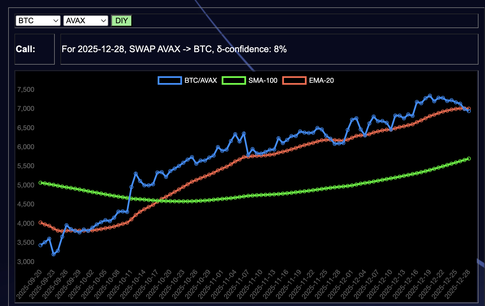

# PIVOTS

`dusk` reports no close pivots today, but also ... 

... `dusk` is not able to handle synthetic nor wrapped tokens. 

So: I need to backpropagate aliases from `assets` to `dusk`. 

# TODOs

* continue working on open-pivot automation
* relocate assets from @avax to @hedera 

and:

There may be a way to transliterate BTC+AVAX to BTC+HBAR if $AVAX and $HBAR 
share ratio-characteristics when the pivots were opened: I'll investigate this 
possibility.

# AUTOMATION ANNOUNCEMENT

I've released a new revision of 
[`dusk`](https://github.com/pivoteur/protocol/tree/main/dapps/dusk), 
version 1.08:

* it now aliases tokens, meaning that it handles synthetics and wrapped tokens
* it compacts no-close-calls pivot pools, reducing the size of the report. 

