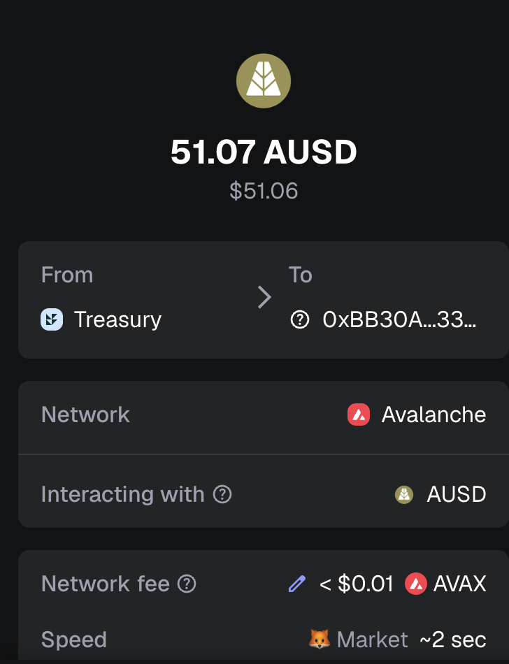

# Happy New Year!

G'day, pivoteurs!

Happy New Year, 2026.

Let's start the year OFT! with a BANG! 💥

# PIVOTS

... leastways, that's what `dusk` reports for the BTC+AVAX pivot pool on @avax. 

Let's do this!

# PIVOTS 

## BTC+AVAX 

 

Automation calls to close 1 BTC-on-AVAX pivot (which I manually confirm) for gains of: 

* actual ROI: 10.37% / 252.24% APR projected 
* or: 0.045 $BTC -> $AVAX -> 0.050 $BTC 
* or: $425.18 gain on a pivot totalling $3,978.47 

 
 

I reinvest and distribute the gains. 

