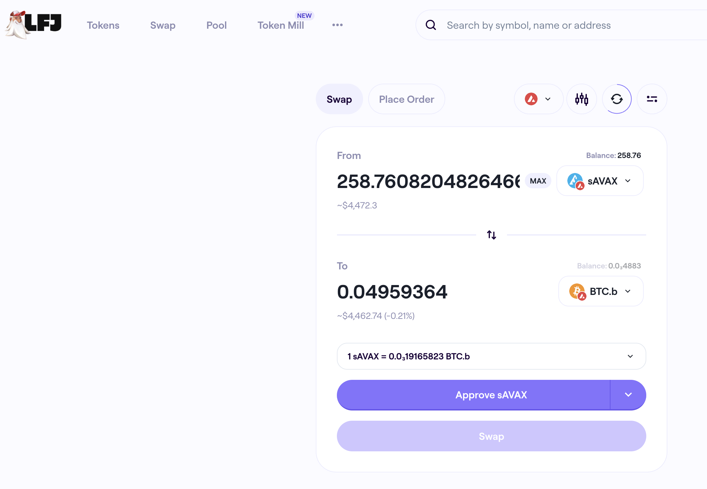
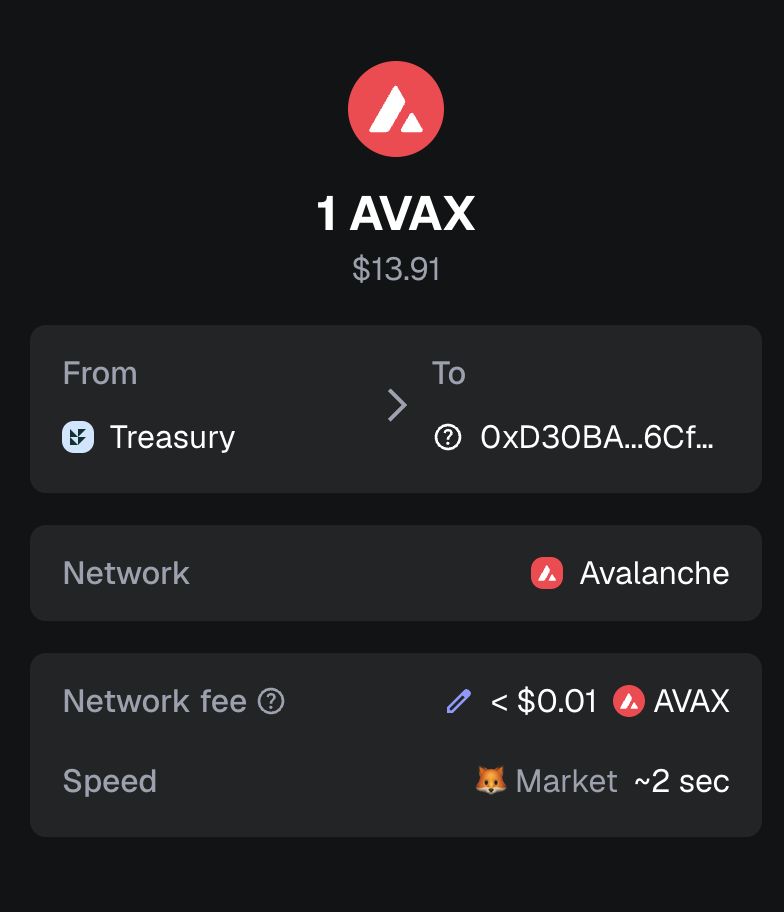
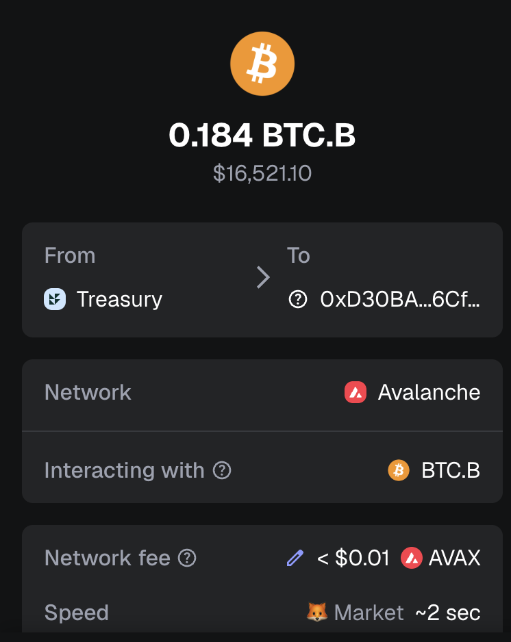
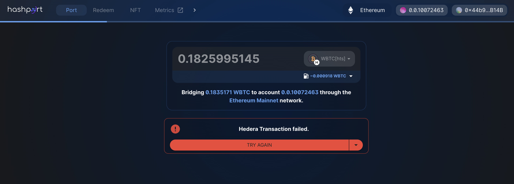
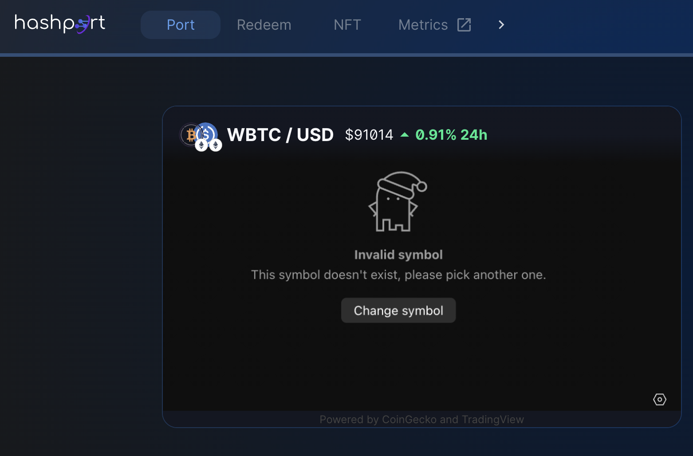

# Happy New Year!

G'day, pivoteurs!

Happy New Year, 2026.

Let's start the year OFT! with a BANG! 💥

# PIVOTS

... leastways, that's what `dusk` reports for the BTC+AVAX pivot pool on @avax. 

Let's do this!

# PIVOTS 

## BTC+AVAX 

 

Automation calls to close 1 BTC-on-AVAX pivot (which I manually confirm) for gains of: 

* actual ROI: 10.37% / 252.24% APR projected 
* or: 0.045 $BTC -> $AVAX -> 0.050 $BTC 
* or: $425.18 gain on a pivot totalling $3,978.47 

 
 

I reinvest and distribute the gains. 

# Bridge BTC

Instead of opening new BTC+AVAX pivots, I take the uncommitted $BTC for this pool, create an @avax core wallet, send 1 $AVAX and the $BTC to it.

I bridge $BTC to Bitcoin, with an eye to bridge that $BTC to @hedera.

See you when the bridge is confirmed in 8-or-so hours.

# No Joy bridging BTC using hashport

Dear @HashportNetwork,

I'm trying to bridge $WBTC from @ethereum to @hedera.

Your UX shows my $WBTC balance correctly, but it says $WBTC does not exist. So, I enter the contract address. Still no joy.

How do I bridge my $WBTC from @ethereum to @hedera?

Much obliged. 

For context @HashportNetwork, your own metrics have $WBTC with the same contract address 0x2260FAC5E5542a773Aa44fBCfeDf7C193bc2C599 listed as one of the tokens you have. 

What gives? 

