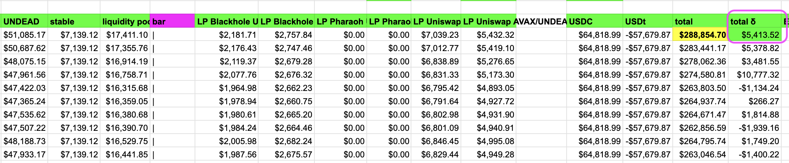
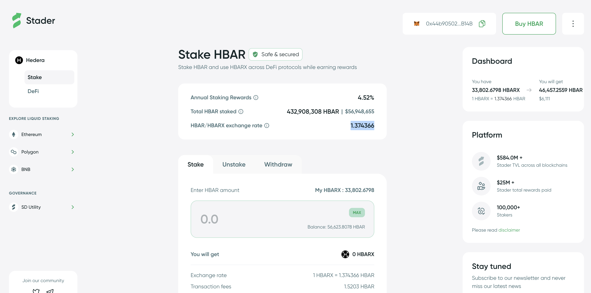
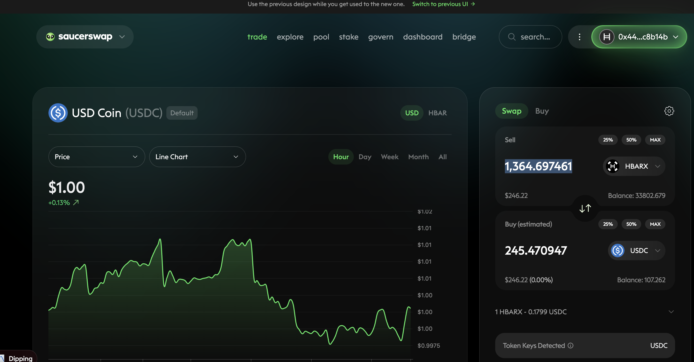
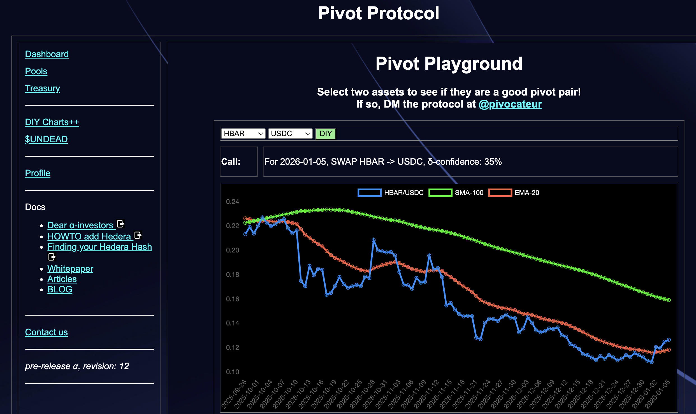
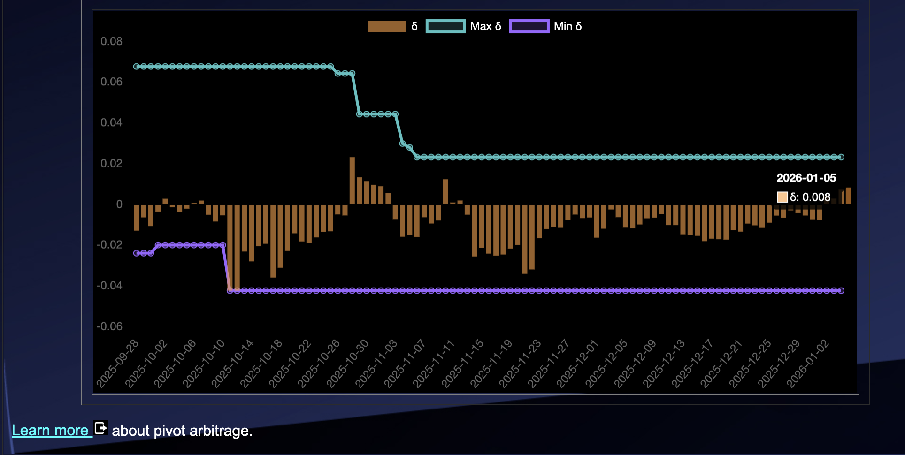
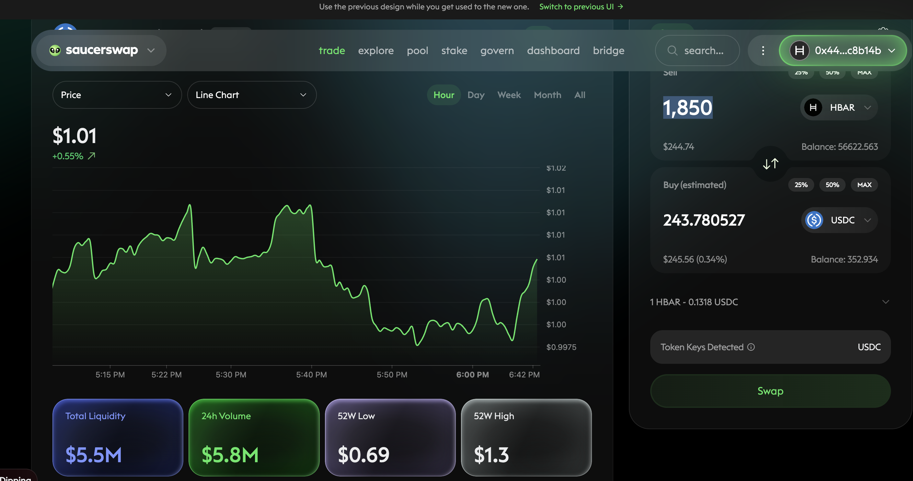
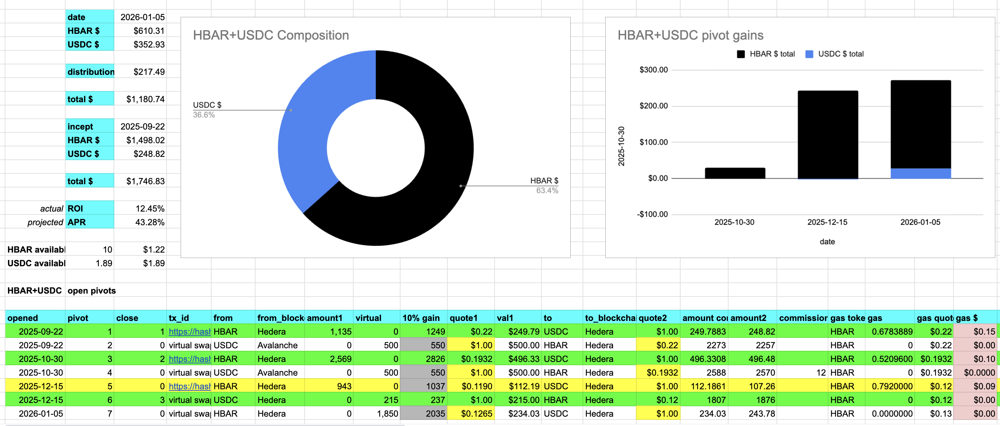
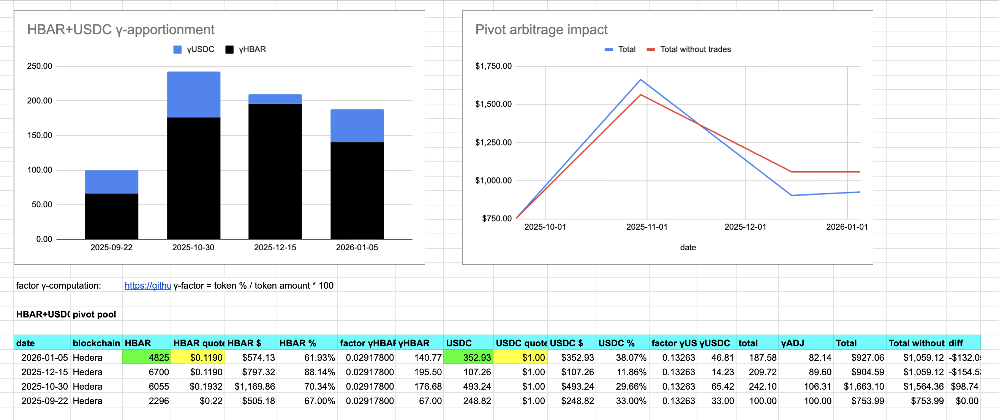

# UNDEAD

I don't know why the price of $UNDEAD took a leap. An investors mentioned he's buying up $UNDEAD in anticipation of the Pivot protocol launch, but the 24-hour volume doesn't speak to a huge buy.

At any rate, the price-jump of $UNDEAD today materialized $5k for the protocol. 💥💥

# PIVOTS

`dusk` has a call for a close USDC-on-HBAR pivot.

The pivot is good, so I execute it, using $HBARX from @staderlabs to close this pivot.

* actual ROI: 14.27% / 247.96% APR projected

I reinvested all gains.

## Open HBAR+USDC pivots 

 
 

The positive δ calls to open an -on- pivot, which I do. 

 

All HBAR+USDC assets are now committed to pivots. 

The HBAR+USDC pivot pool composition and γ-apportionment are as charted. 

 
 

