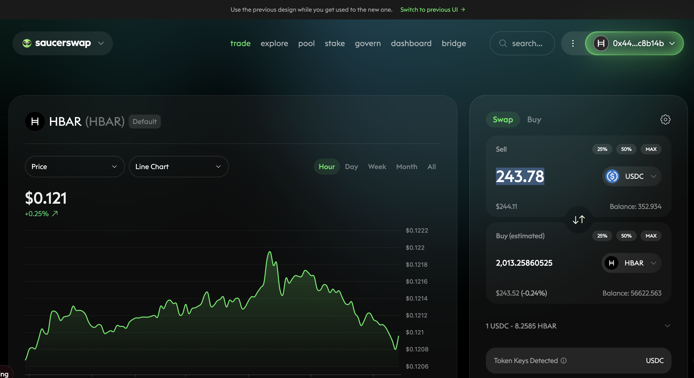

PIVOTS

`dusk` calls to close a USDC-on-HBAR pivot, however, ...

... when I simulated the trade, the gain was not (quite) 10%, so we won't be 
closing this pivot today.

THE. END. ... as I continue to work on open-pivot automation.

