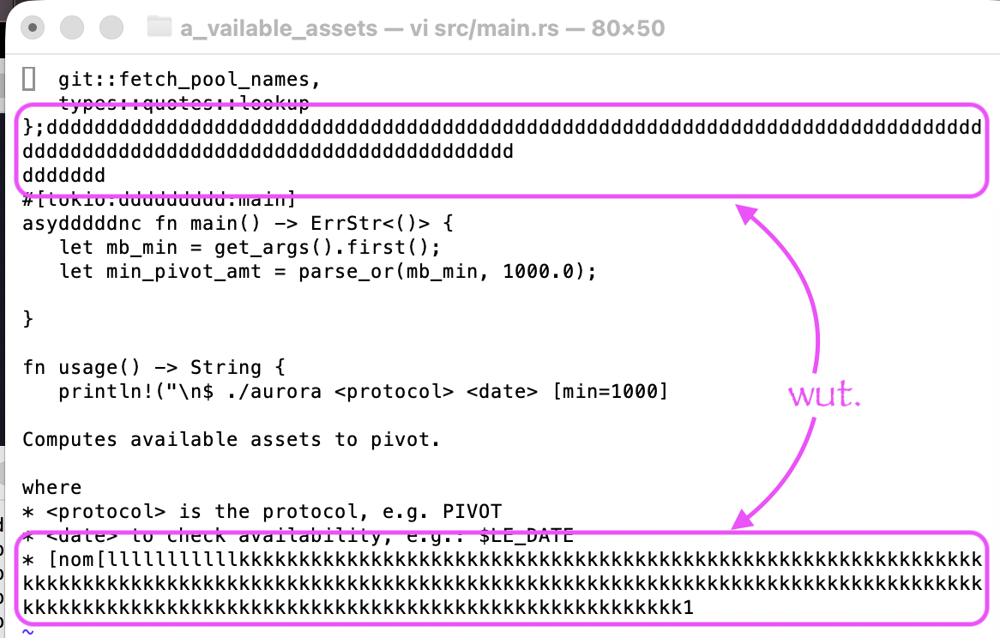
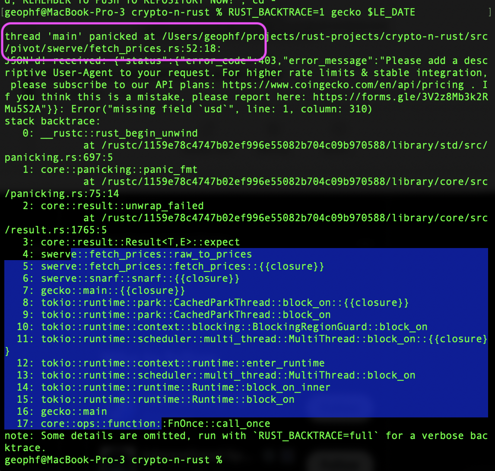

G'day, pivoteurs!

# PROGRESS REPORT

## Automation

### Open Pivots

So: I've been making "progress" on my open-pivot automation.

Here you see me waking up to this screen at 2 am this morning. #progress 🙄

### quotes

AND THEN! When I ran the quotes-fetcher this morning, I got a "buzz off until 
you fix your JSON request"-message back from my source, @coingecko.

So now I've got to fix my system that has been running like clockwork for two 
years now!

*le sigh*

#progress 

### bae fixed

Fortunately for me, I factored my code so that adding the user-agent header to the REST request was simple enough to do.

bae fixed: ✅ 

