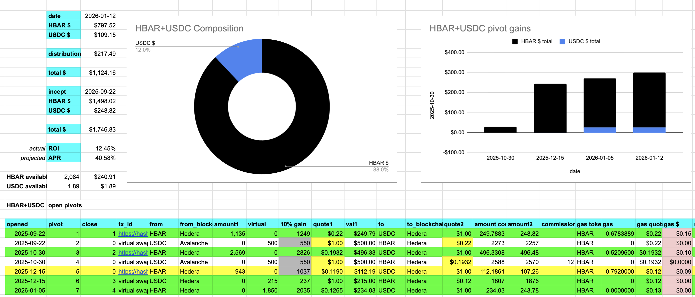
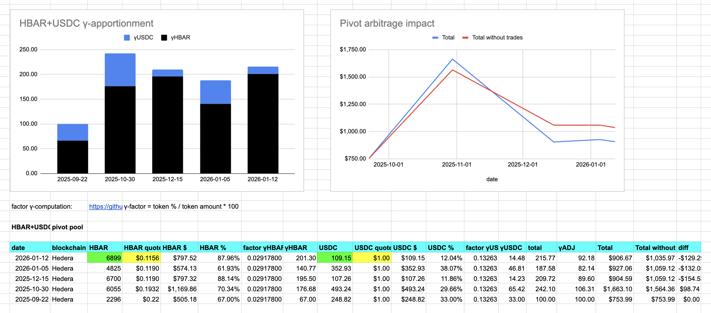

# PIVOTS 

## HBAR+USDC 

 

Automation calls to close 1 HBAR-on-USDC pivot (which I manually confirm) for gains of: 

* actual ROI: 13.78% / 718.54% APR projected 
* or: 1850.000 $HBAR -> $USDC -> 2104.932 $HBAR 
* or: $29.47 gain on a pivot totalling $243.78 

 

I reinvest and distribute the gains. 

The HBAR/USDC ratio vs the EMA 20 is meh, so we rest. 

The HBAR+USDC pivot pool composition and γ-apportionment are as charted. 
 
 
