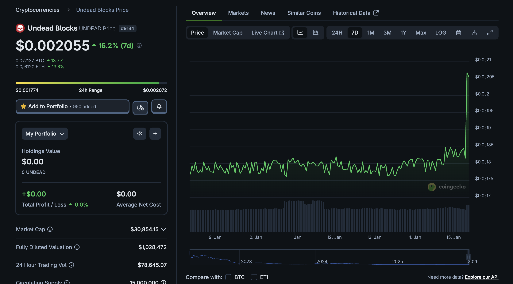
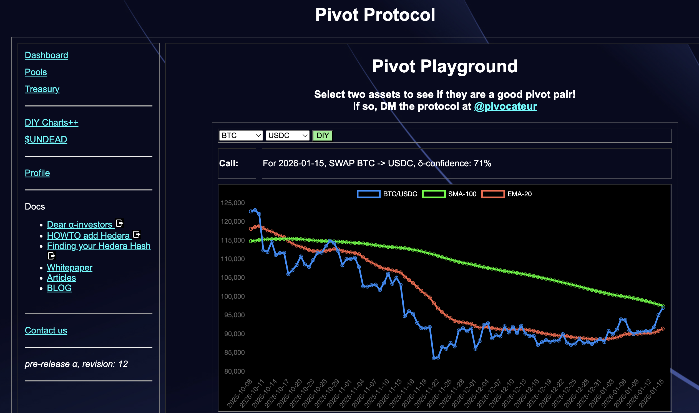
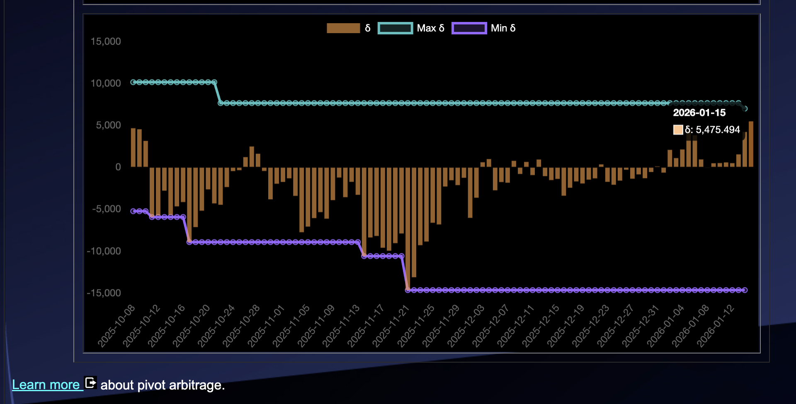
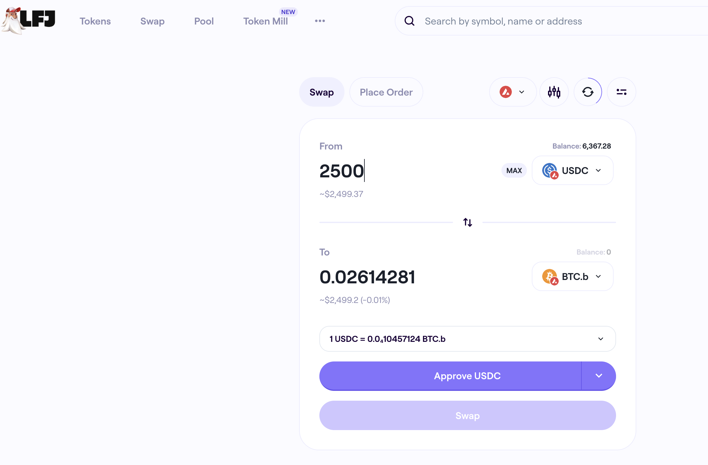
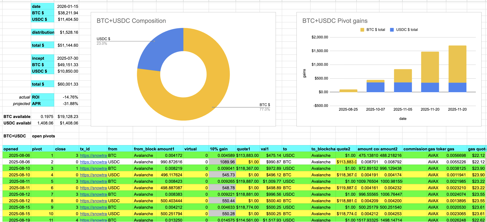
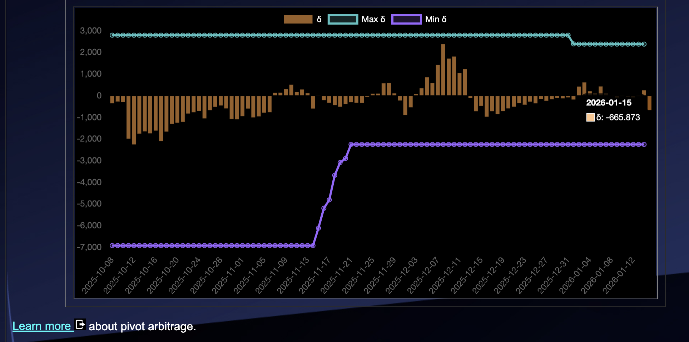
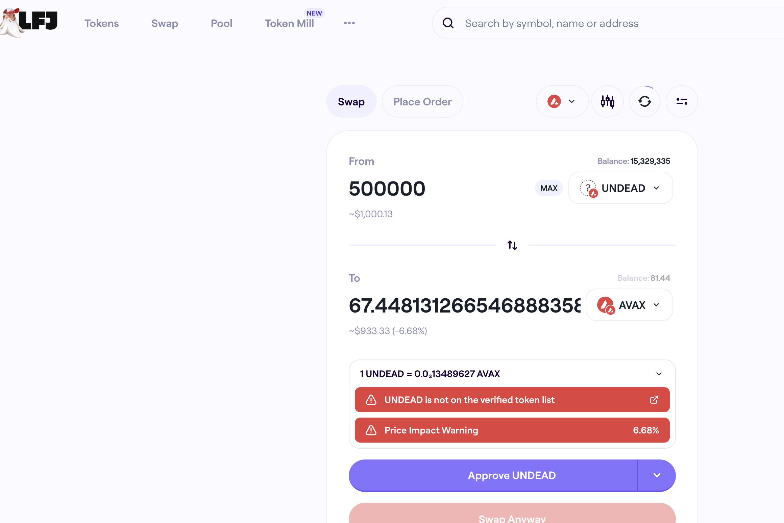
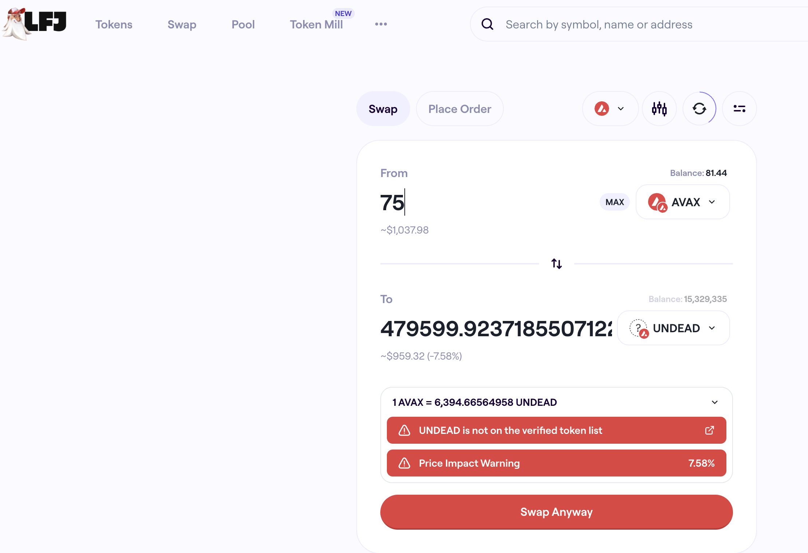
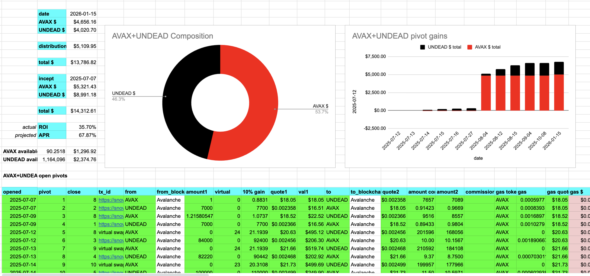
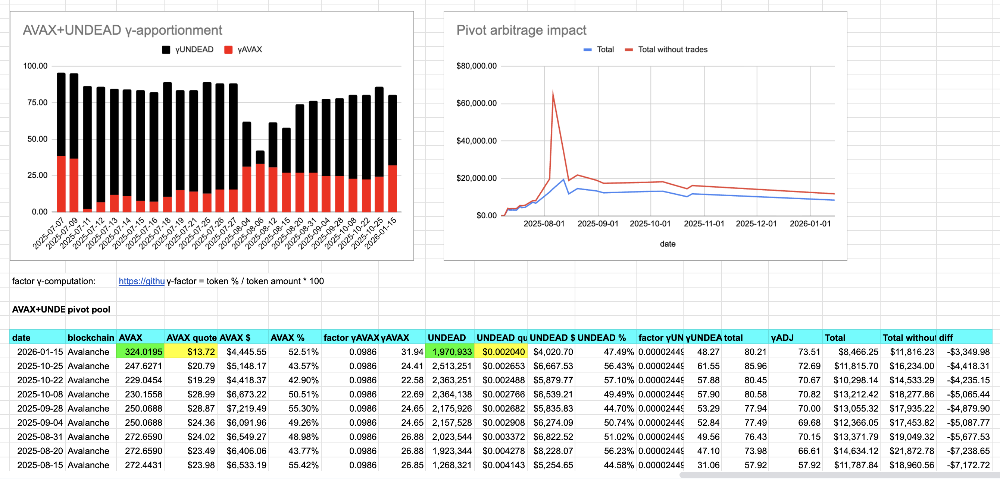

# UNDEAD

G'day, pivoteurs!

On the @UndeadBlocks-side, $UNDEAD's price took a leap! ... basically doubling in price in one day. 

> Correction! Not 'double' in price, but a 10% gain, much less than my first look showed me, but still not an insignificant price-gain for $UNDEAD.

# PIVOTS

`dusk` recommends two close-pivots. Let's take a look.

## BTC+USDC

The USDC-on-BTC close doesn't make the cut. Oh, well. $BTC did take a dip after this morning. 

## Open BTC+USDC pivots 

 
 

The positive δ calls to open an BTC-on-USDC pivot, which I do. 

 

I also open an USDC-on-BTC hedge. 

 

The BTC+USDC pivot pool composition and γ-apportionment are as charted. 

 
 

## Open AVAX+UNDEAD pivots 

 
 

The negative δ calls to open an UNDEAD-on-AVAX pivot, which I do. 

 

I also open an AVAX-on-UNDEAD hedge. 

 

The AVAX+UNDEAD pivot pool composition and γ-apportionment are as charted. 

 
 

