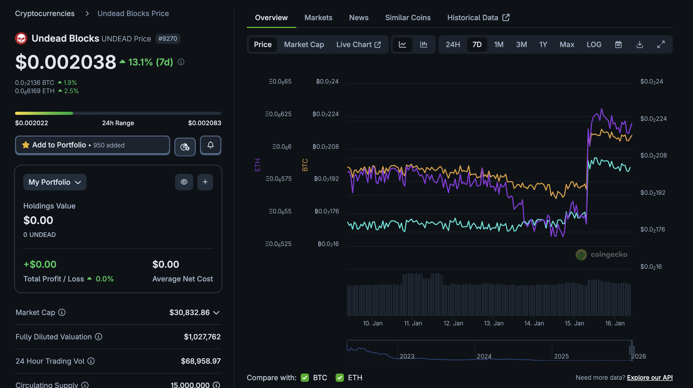
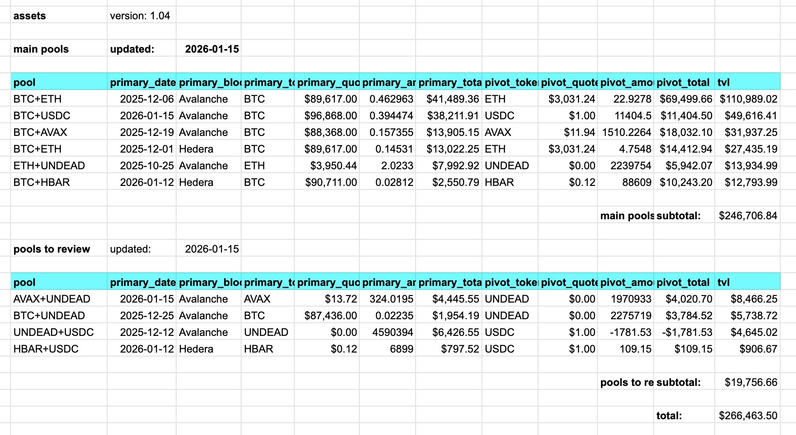
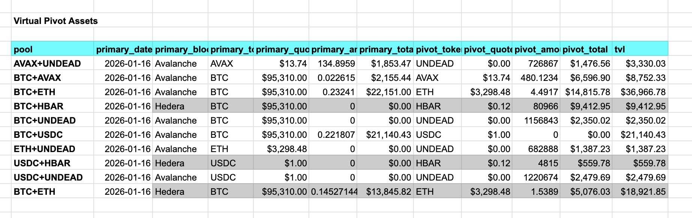

# UNDEAD

G'day, pivoteurs and @UndeadBlocks'rs.

$UNDEAD is maintaining its increase, and, not only has the price risen (relative to the USD), but, as pivoteurs, you must ask: how's it doing against the Blue Chips?

Answer: against $BTC AND $ETH, $UNDEAD has risen in value.

# PIVOTS

`dusk` reports no close pivots today.

I continue to work on open-pivot automation.

# Protocol Status

