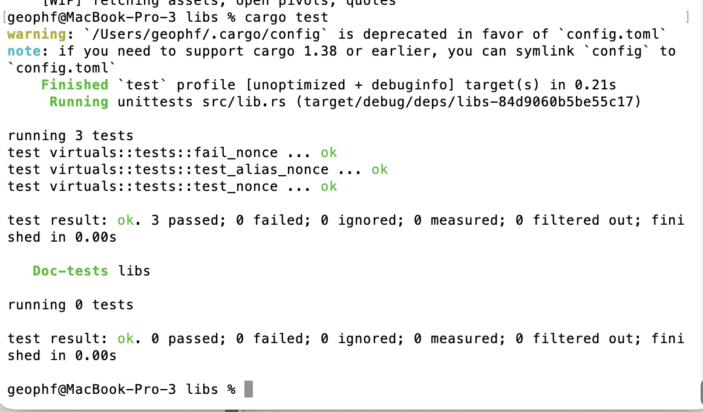

# PIVOTS and backend-automation

G'day, pivoteurs!

`dusk` reports no close pivots today.

'No close pivots today' does not translate into 'no activity,' as I'm actively 
developing backend infrastructure. You'll see it when it débuts.

I'm continuing to stack $UNDEAD in anticipation of staking into the protocol.

# Automation development

I moved the virtual pivot computation (and its aggregate) to library functions, 
allowing new applications to use this functionality.

I've also begun testing functionality, using Rusts standard test-suite. 

