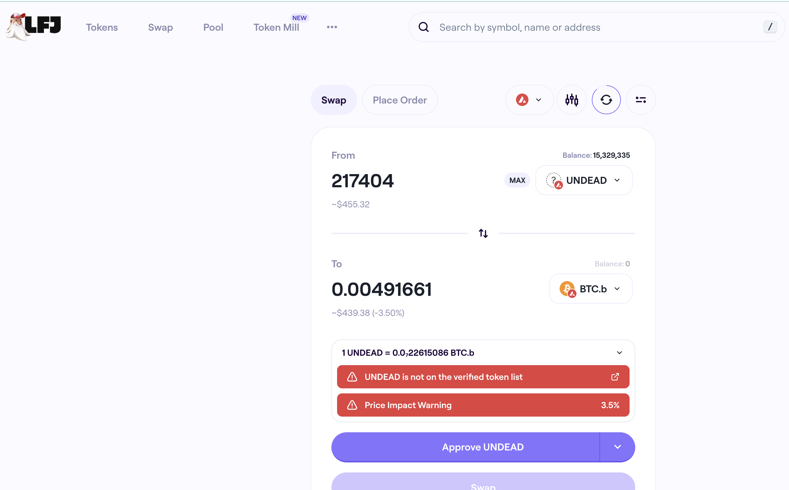

# PIVOTS

G'day, pivoteurs!

`dusk` reports no close pivots today, buttttt .... 

## Automation

In the last `dusk`-report I ran, on 2026-01-22, did call to close a 
BTC-on-UNDEAD pivot, WHICH I DID! AHA! 

Howmsoever, ... 

Doing the distribution calculations and report of the close pivot has turned 
into this whole 'thing.' 面倒!

So, I'll do the distribution calculation and close-pivot report here, 
step-by-step, and, while I'm doing that, look at ways to automate these steps 
better.

Let's do it!

