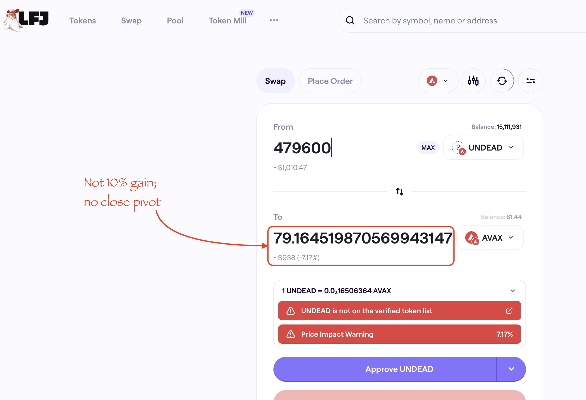
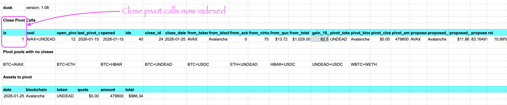
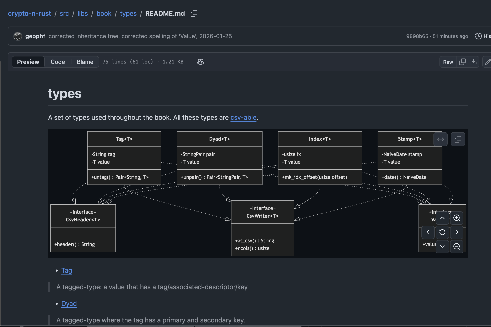

# PIVOTS

G'day, pivoteurs.

`dusk` reports a close AVAX-on-UNDEAD hedge on $AVAX price-drop; 

...however, when I simulated the trade, it was not a 10% gain, so this 
close-pivot call is a no-go. 

This happens from time-to-time: the prices change since the analysis, or 
slippage becomes too-large a factor. For whatever reason, if I'm not making 
10% gain in the close-pivot trade, I'm not going to execute on the call.

# Development

This does not mean I'm sitting on my hands, however. 

You see that `dusk` close pivot calls are now indexed.

This is due in thanks to the ['common set of 
types'](https://github.com/logicalgraphs/crypto-n-rust/blob/main/src/libs/book/types/README.md) I've developed for general use (particularly the Index-type).  

> Next step in development:

* read the close-pivot calls, so that I can build systems around 
trade-execution and reportage.

## unit tests

I also am now using the Rust test suite, for all the good, yummy stuff that 
unit tests provide toward system consistency and stability. 

I'll be adding tests to the automation toolset as I add functionality.

