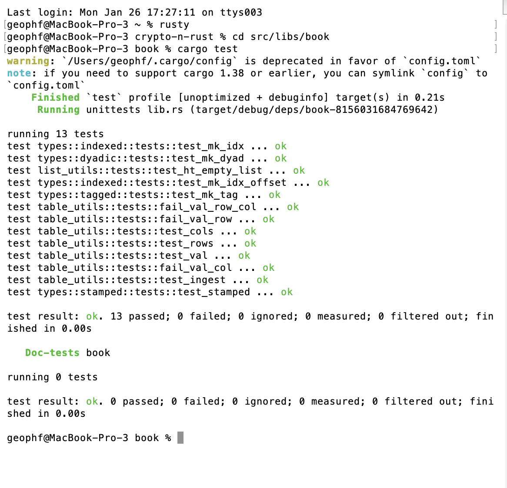

# Slippage

G'day, pivoteurs!

`dusk` calls, again, for a close AVAX-on-UNDEAD pivot, however the slippage on 
LFJ is ~8%, erasing the gains, and the slippage elsewhere is worse.

I'm going to have to look at ways to reduce slippage. 

# Development

Meanwhile, on the development-side for automation, the Rust unit tests are ... 
I'd like to say 'coming along,' but that's far from true, so I'll say: 
"starting to come along."

![Protocol unit tests[(imgs/02a-protocol-unit-tests.png)

I'm thinking through developing a separate functional/integration test suite. 

