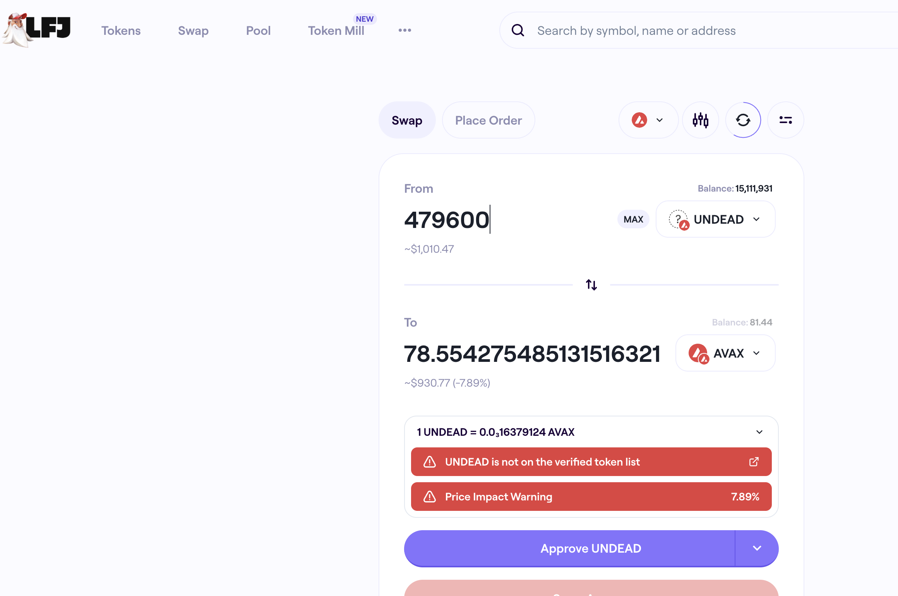

# Slippage

G'day, pivoteurs!

`dusk` calls, again, for a close AVAX-on-UNDEAD pivot, however the slippage on 
LFJ is ~8%, erasing the gains, and the slippage elsewhere is worse.

I'm going to have to look at ways to reduce slippage. 
