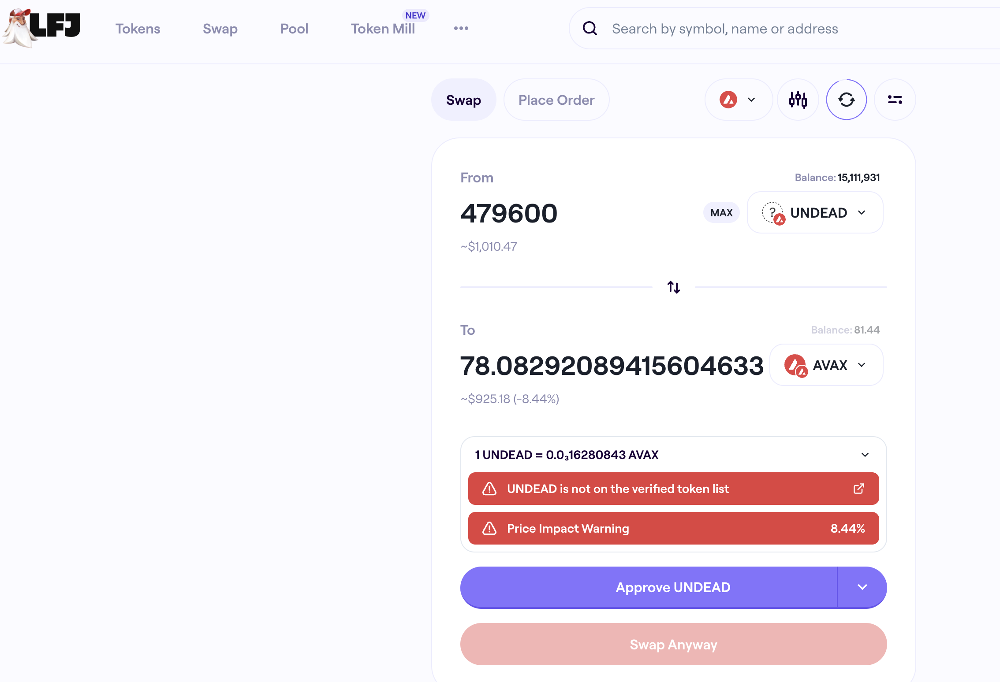
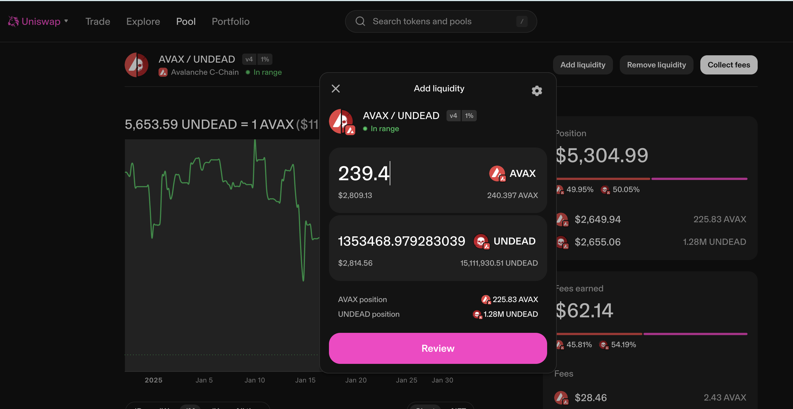
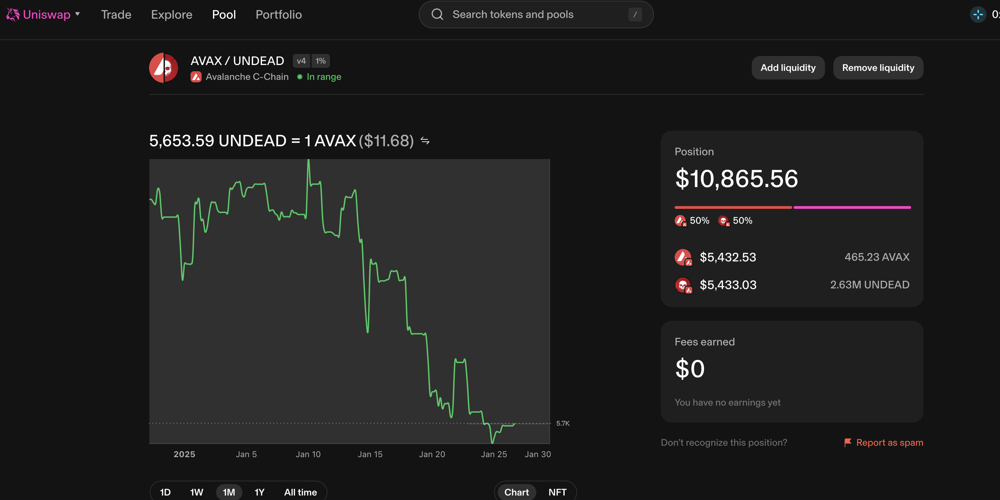
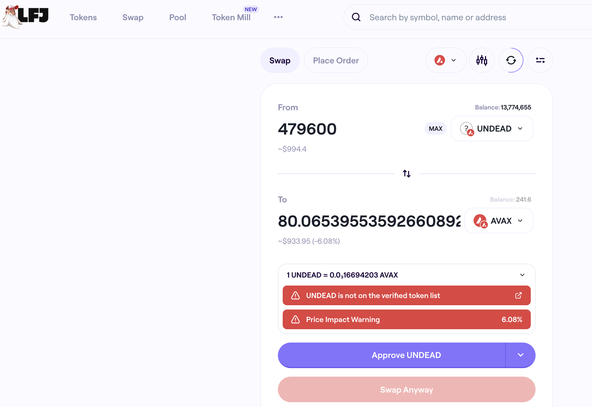

# Slippage

G'day, pivoteurs

`dusk` still calls for a close AVAX-on-UNDEAD pivot, but, as you see, slippage 
is still too high on LFJ, being at 8.4%, eradicating the gain that was supposed 
to come from the close pivot. 

# LP

I said I would look into this, so, let's see what providing liquidity to 
the @Uniswap AVAX/UNDEAD LP does. 

This provided liquidity doubles the size of the LP, however, the LP has been 
reduced to 1/4 its ATH (at $20k) due to this Bear market.

## providing liquidity reduces slippage

Providing liquidity does reduce the slippage.

I observed slippage at 6.4% right after I provided the liquidity, then, 10 
minutes later, the slippage is down to 6%.

That's still too high to close the pivot, so I'll wait one day and see what 
the slippage settles to tomorrow.
