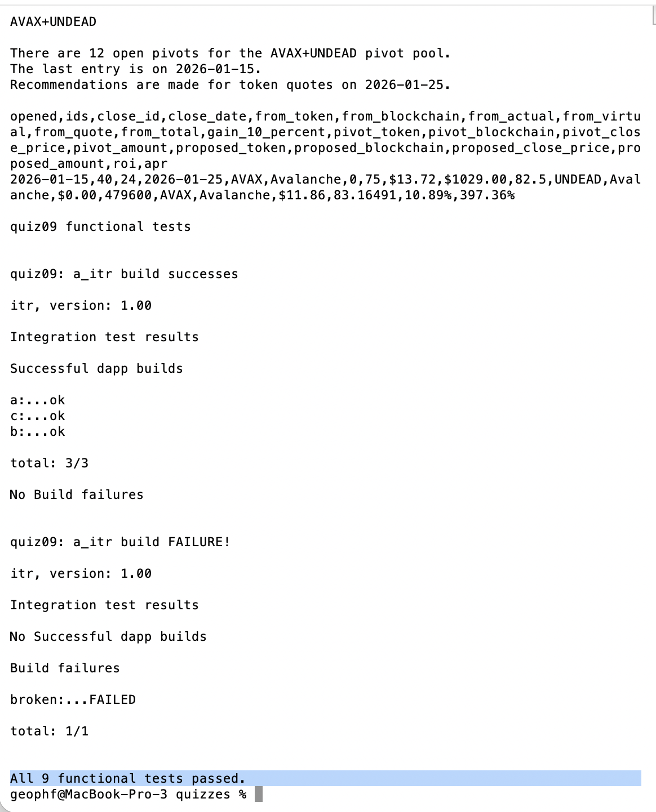

# Testing-suites

## Integration testing

💥💥💥ANNOUNCEMENT💥💥💥

`itr`

Separate integration test-suite for Rust dapps that executes `cargo build` in 
all subdirectories of `<dir>`.

Rust unit testing integrates integration testing and doesn't have functional 
tests.

I need all three kinds: unit, functional, integration.

## Functional testing

Furthermore, `itr` allows me to run integration tests separately from unit 
tests (and I have a separate ad-hoc functional test-suite – called `main()` 
(eheh 😅) – at module- and library-levels).

These separate testing-suites will allow me to deliver to production more 
rapidly.

