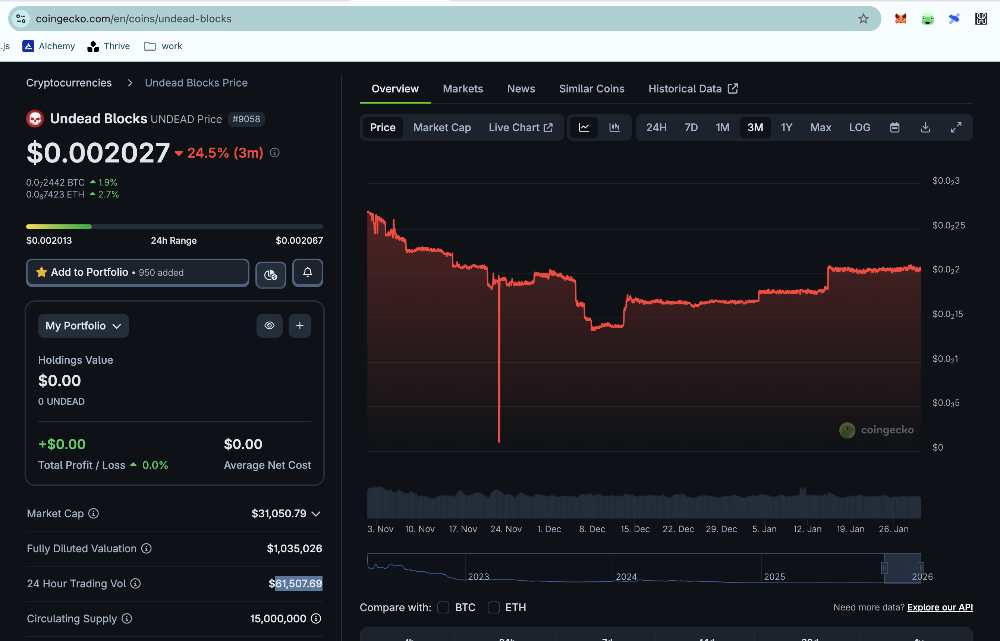

# UNDEAD

G'day, pivoteurs.

$BTC drops 1%, not what I'd qualify as a crash, ... irrespective of what other people are screaming right now.

But $UNDEAD's position in the market has strengthened (slightly). Again, a 1% change. Did you notice that?

Coincidence? ... or correspondence?

