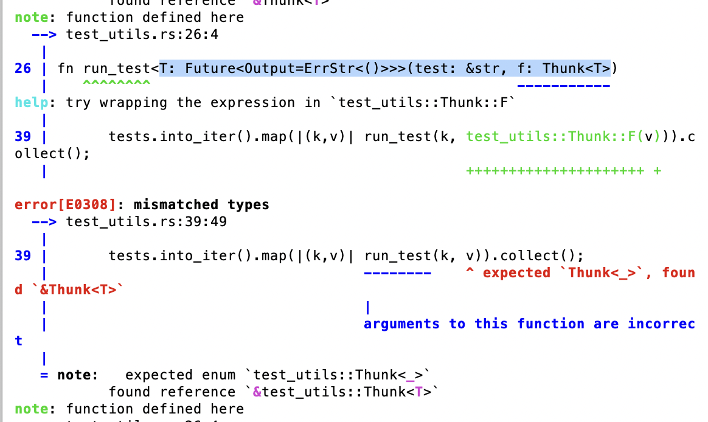
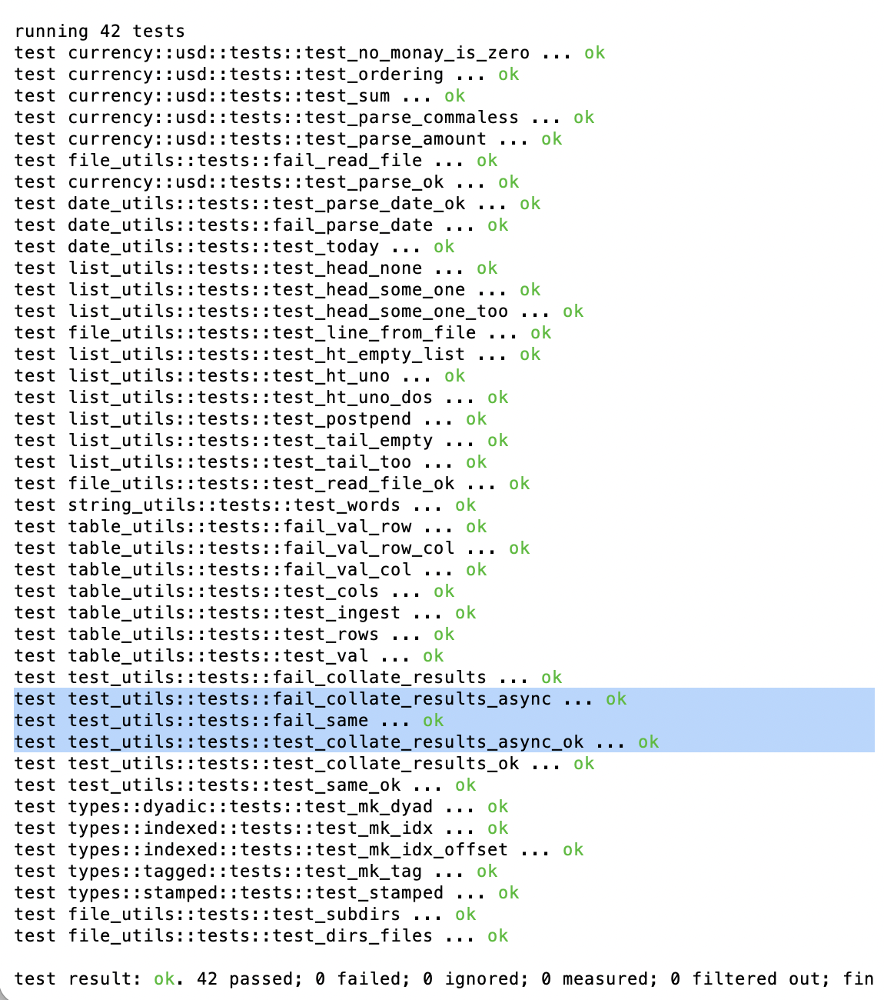
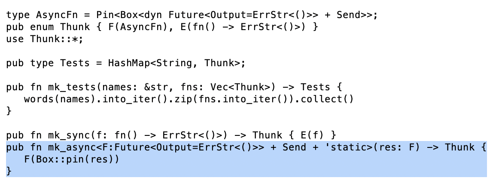

# Development and Testing

So, how do I create an an enumerated type in Rust that captures a 
`future <F: Future<Output=Result<(), String>>` and a function-type 
`fn() -> Result<(), String>`.

You see how those two types are exactly the same after the future is met?

Tell the Rust compiler that, though.

## Pinned Box

Okay. Got it.

In case anybody's interested, the type of

`async fn() -> ErrStr<()>`

is 

`Pin<Box<dyn Future<Output=ErrStr<()>> + Send>>`

but only after the future is activated (that is the asynchronous call is called asynchronously and pinned)

...because that's super-obvious. 🙄

## AI

That only took two days fighting with the compiler and with AI to figure out.

AI is neat. It gives you exactly the answers you ask. If you're stupid and ask 
stupid questions, it gives you stupid answers.

I think I'm getting smarter, or at least getting better at asking better 
questions, with AI.

