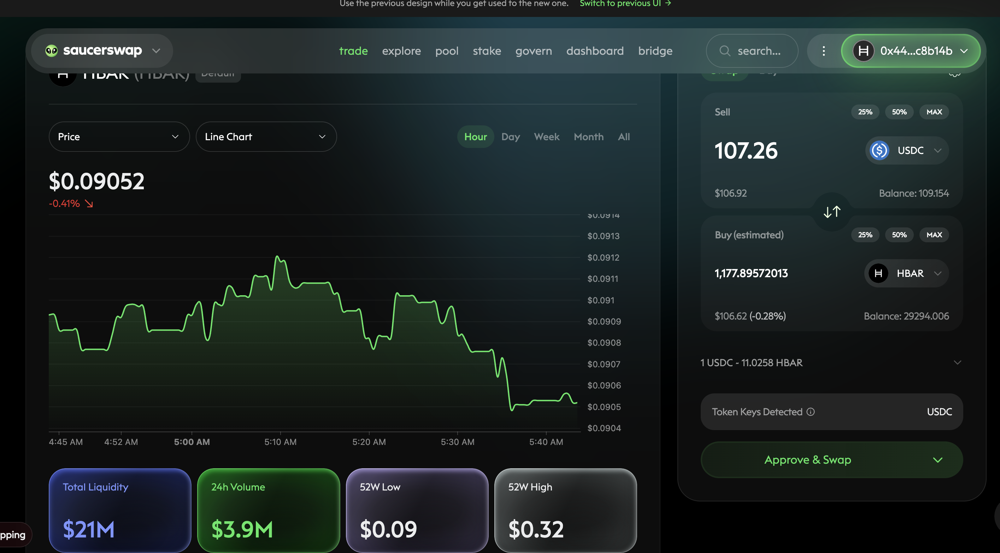
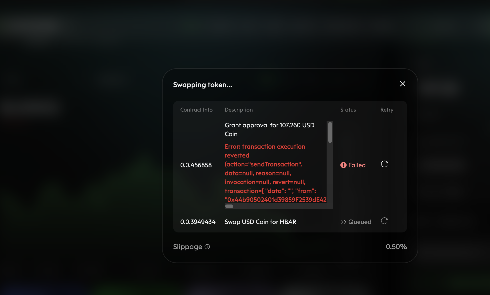

# Admin

G'day, pivoteurs!

Yesterday, two things happened:

1. I gathered protocol data to help alliance partners
2. My functional test framework went kablooie!

Apparently, storing 7 applications in boxed Future types can bring a laptop to 
its knees. Lessoned learned: don't do that. 🙄

# Tests

So, I spent all yesterday ... until this morning and afternoon collating stats 
and fixing my test-framework.

Good news: tests are working again, test code-base and coverage is up! 

# PIVOTS

And, fortunately, the market-conditions have remained the same as yesterday, 
and so are the close-pivot recommendations. 

# Blockchain woes

## Approval for $USDC-spending denied

Dear @SaucerSwapLabs,

I tried to swap 107.26 $USDC for ~1177 $HBAR. I received an error message that 
you are refusing to approve my $USDC-spending.

Please fix this.

## 12% Slippage on $4.3k $BTC -> $ETH swap

Also, when I tried to swap $BTC for $ETH, a trade of ~ $4.3k, slippage was more 
than 12%, making the trade a loss for me.

$BTC and $ETH trades are important to me. Can you improve the trade quality of 
these trades? 

