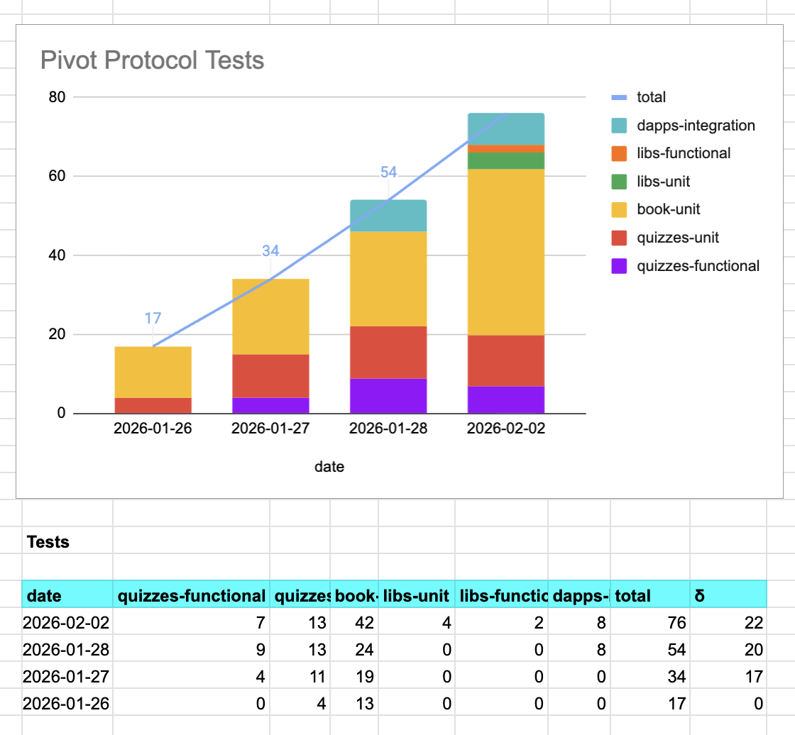
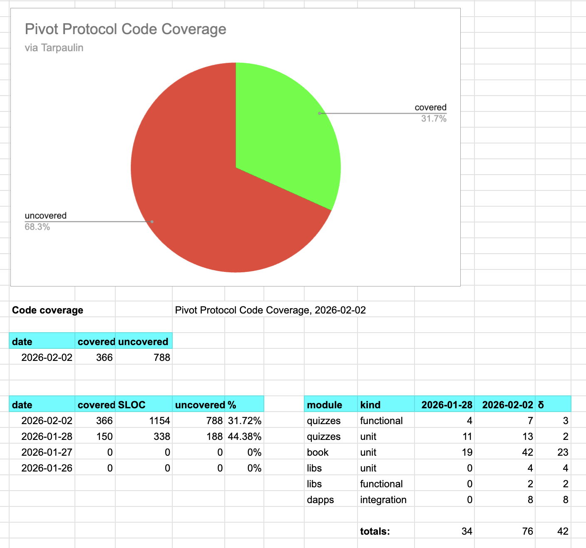

# Admin

G'day, pivoteurs!

Yesterday, two things happened:

1. I gathered protocol data to help alliance partners
2. My functional test framework went kablooie!

Apparently, storing 7 applications in boxed Future types can bring a laptop to 
its knees. Lessoned learned: don't do that. 🙄

# Tests

So, I spent all yesterday ... until this morning and afternoon collating stats 
and fixing my test-framework.

Good news: tests are working again, test code-base and coverage is up! 

# PIVOTS

And, fortunately, the market-conditions have remained the same as yesterday, 
and so are the close-pivot recommendations. 

