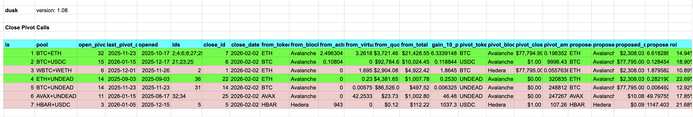
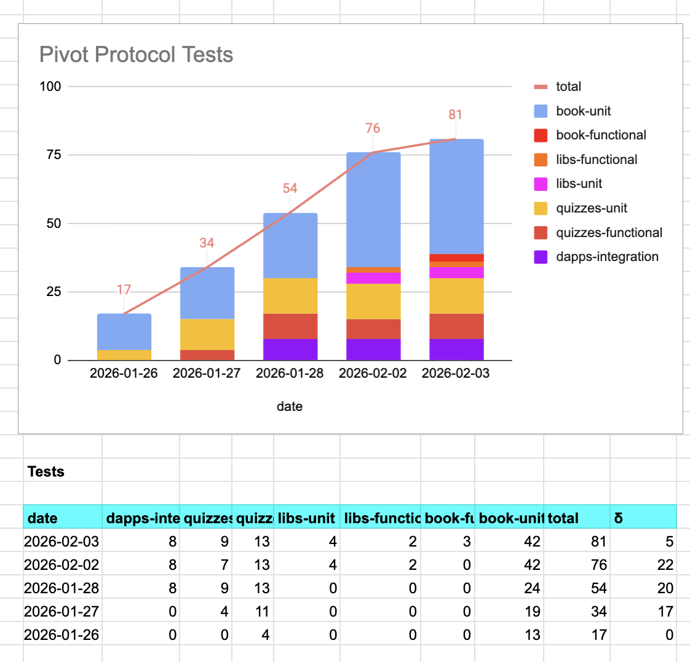
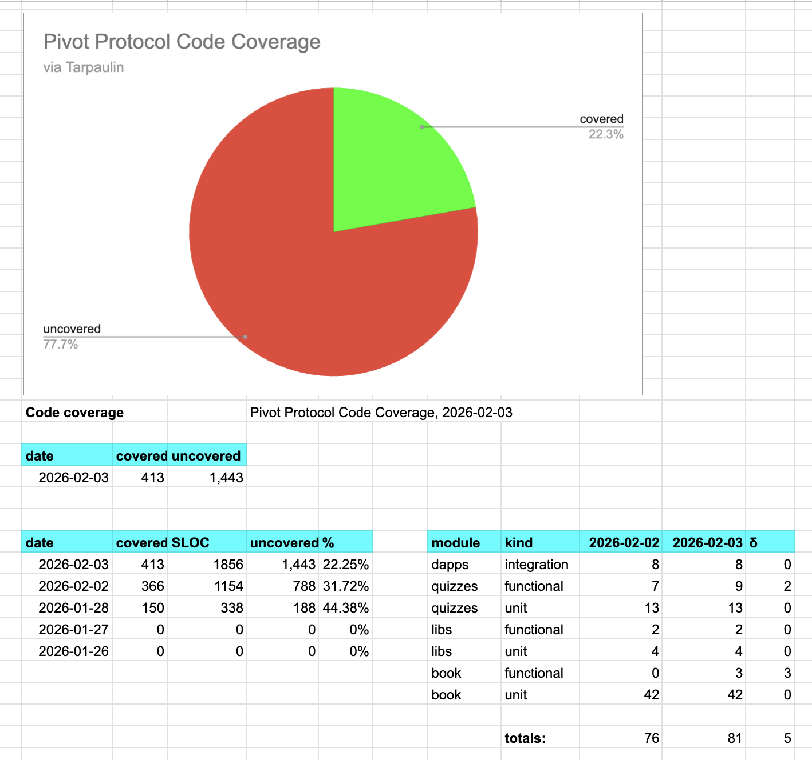
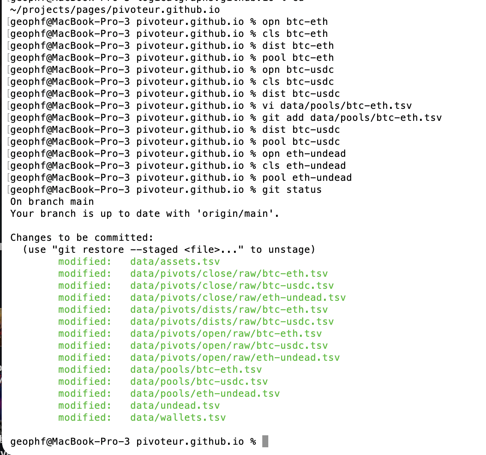
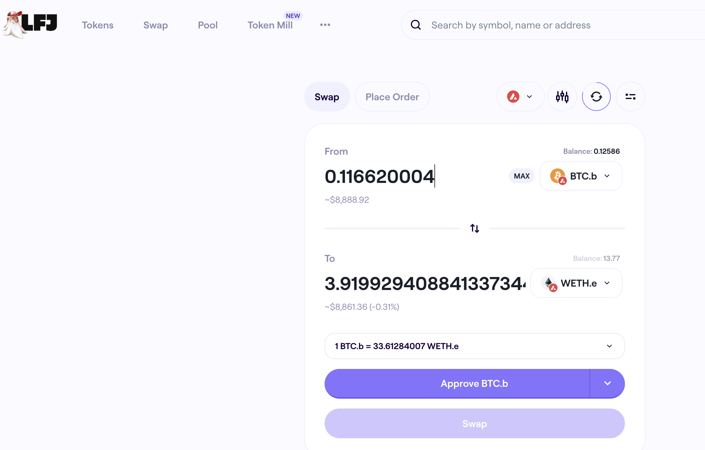
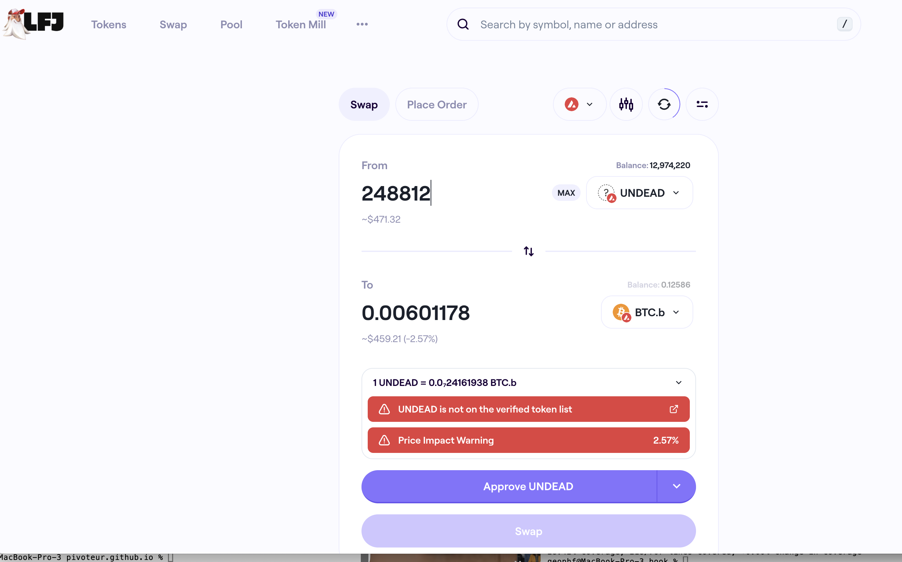
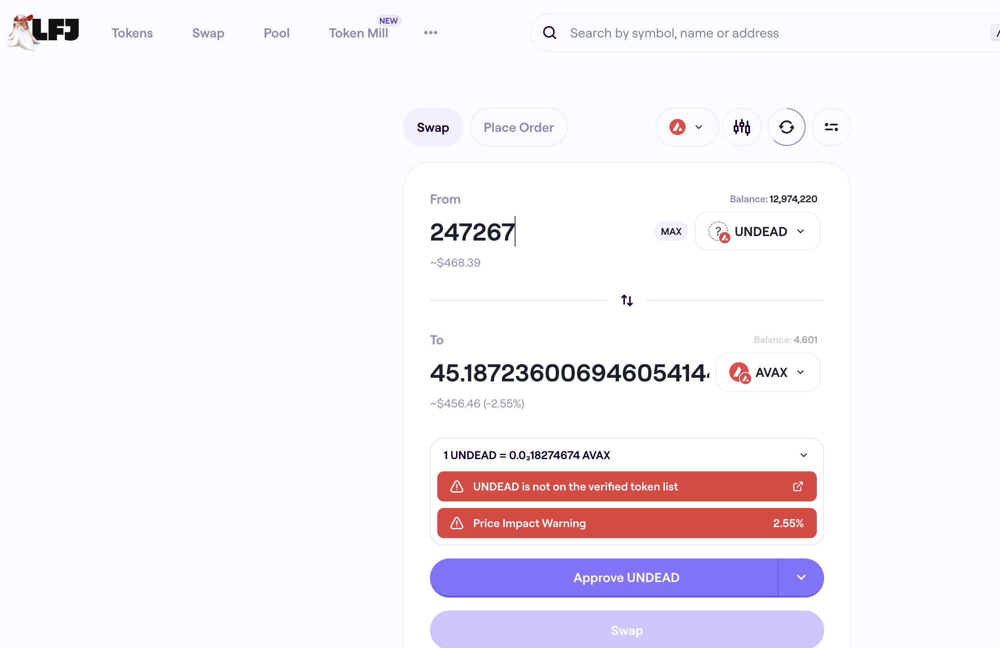

G'day, pivoteurs!

Yesterday, I was 

* able to close some pivots, including a big one, and:
* UNable to close some pivots, including a big one, and:

I'll report what and why, and the state of the protocol, including where we 
sit with pivots and automation.

Gonna be a fun day!

# Protocol Operational Health

## Testing and Code-coverage

First, before the pivot-report, let's cover the Pivot Protocol operational 
health, which include measures of testing and coverage. 

There are other metrics, such as auditing, architectural reviews, and 
automation efficacy, but I don't have a dogmatic way to measure those yet.

### Analysis

What do these reports mean?

* Integration tests show one dapp broken. FIXME! (down from two dapps broken: 
improvement!)
* Code-coverage shows coverage down 10% (bad) and 700 SLOC added yesterday, 
so ... chaos: up? FIXME!

That's what I see in these reports.

## O&M

The report on the results from yesterday's close-pivots (and NOT close-pivots) 
will show where the protocol sits TVL-wise, as well as pointing at where 
automation is working and also where automation is needed.

Let's get to that after lunch.

I also have to run the daily quotes.

... and I also have to file yesterday's close-pivot reports to the repository 
so I can run automation to compute today's pivots with these updated data. OOF!

*sigh* Life goes on, innit? 😅

## Updating yesterday's close-pivot data

"Updating the close pivots" looks like:

* I update the open-pivots, marking the ones closed.
* I enter a line in the close-pivot table (this takes about an hour for each 
entry)
* I update the pool status in the pool table
* I update the distributions table

12 tables updated.

# PIVOTS

With those tables updated, I run `dusk`

It recommends 5 close-pivots, however: none were viable today.

* Hedera Saucer swap-problems, mentioned since yesterday, persist.
* Price-movements for BTC+ETH, BTC+UNDEAD, and BTC+AVAX from this morning make 
the swaps now not profitable.

