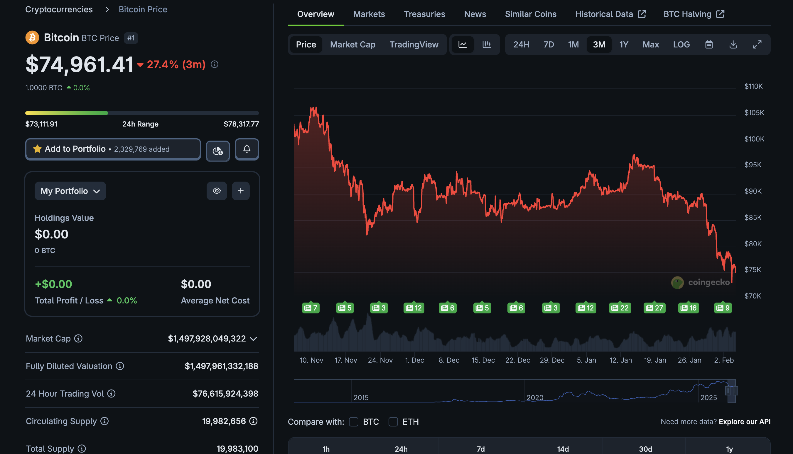
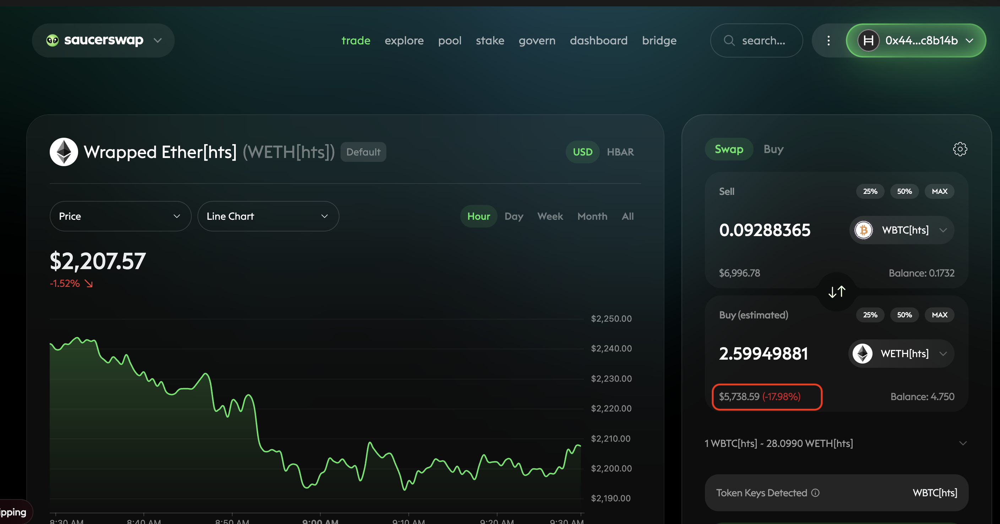
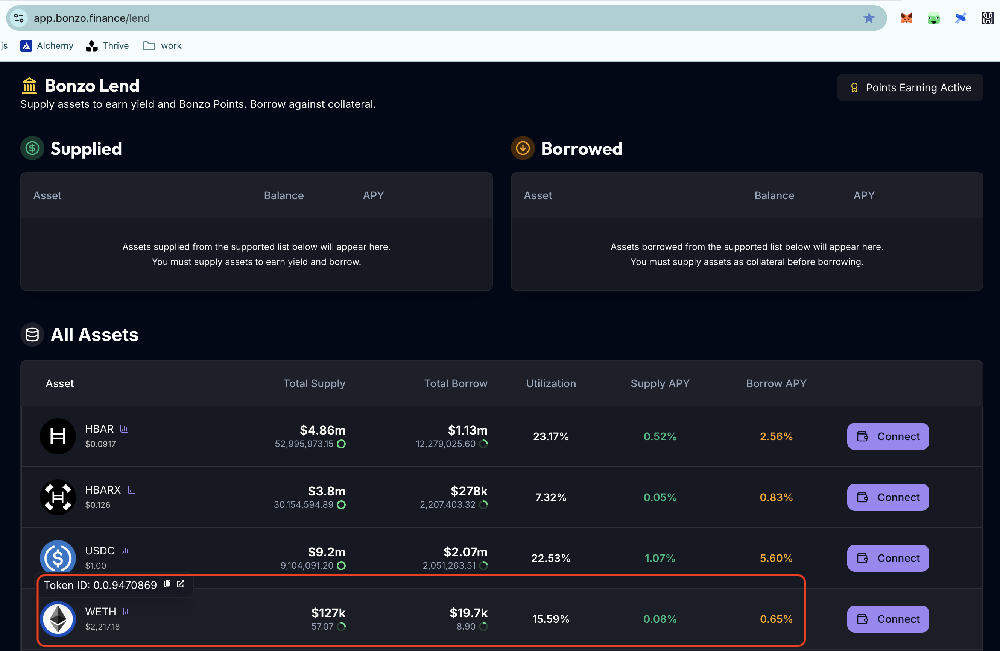
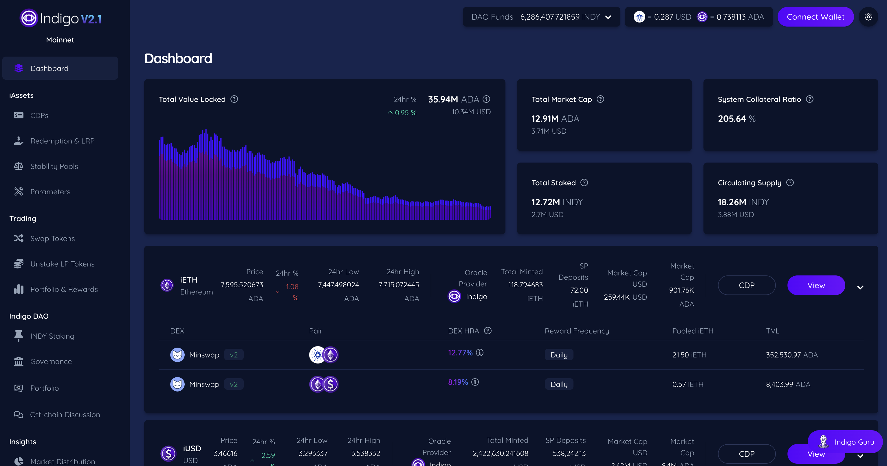

# BTC

G'day, pivoteurs!

I was today's-years-old when I realized that Bitcoin Treasury Companies have 
the TLA of BTC. #themoreyouknow.

$BTC is down. Am I worried? No. I'm pivoting. 

#PODL: "Pivot On for Dear Life!" 

# PIVOTS

## "When should I pivot, al geophf?"

[TFlowers87](https://x.com/TFlowers_87/status/2019052420999815193) states on
the twitters:

> Pivot like our lives depend on it.

My response to that is:

Pivot 'til the Sun goes down.
Pivot 'til the cows come home.
Pivot 'til both, neither, and either. 

## `dusk` report

`dusk` calls for 5 close-pivots.

Let's Яock И Яoll! 

## Hedera woes

I try to close the ETH-on-BTC pivot on @hedera @SaucerSwapLabs, however, 
slippage is 18%, making any attempt to close the pivot an outright loss.

Still.

### DEX on Hedera

Must I set up my own DEX on @hedera? I think I must, in order to make pivoting 
there viable.

### Money Market on Hedera

I was also about to write: "I also need to establish my own money market 
on @hedera."

BUT @bonzo_finance finally has $WETH as an asset.

@bonzo_finance: wen (hedera) $BTC?

### Indigo on Hedera and Avalanche

Finally, it'd be nice if @Indigo_protocol were on @hedera: I could make 
synthetic $BTC, $ETH.

Also on @avax

@Indigo_protocol: wen @avax? wen @hedera? Both are giving grants to establish 
on their blockchains.

Also, @Indigo_protocol: wen synthetic Gold and Silver? I have buyers.

