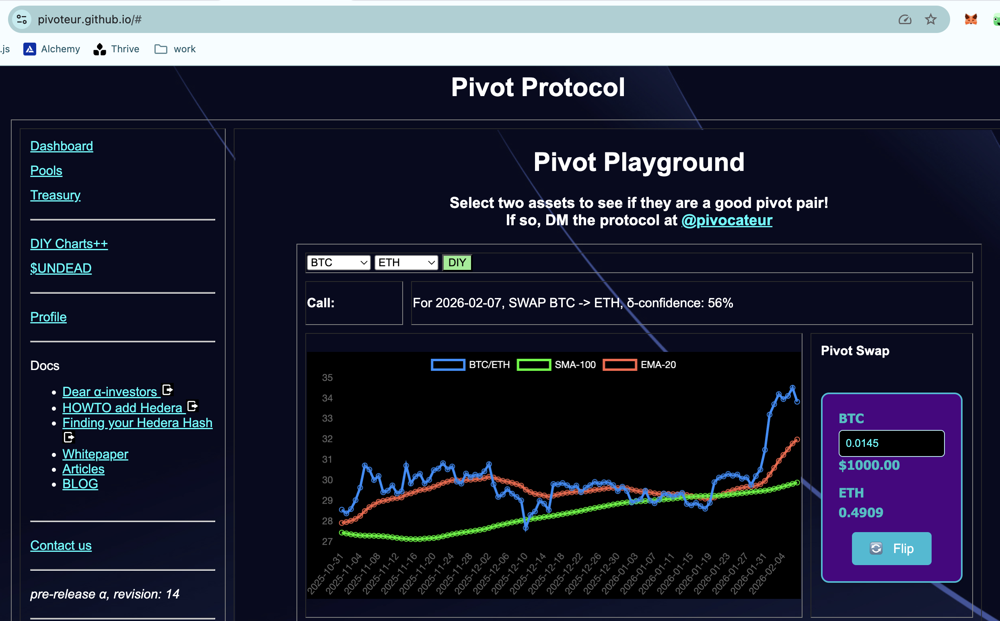
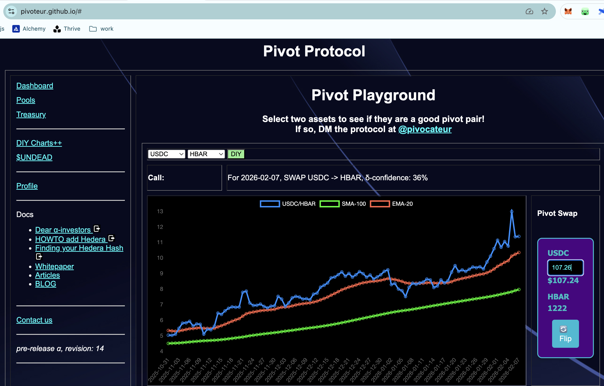
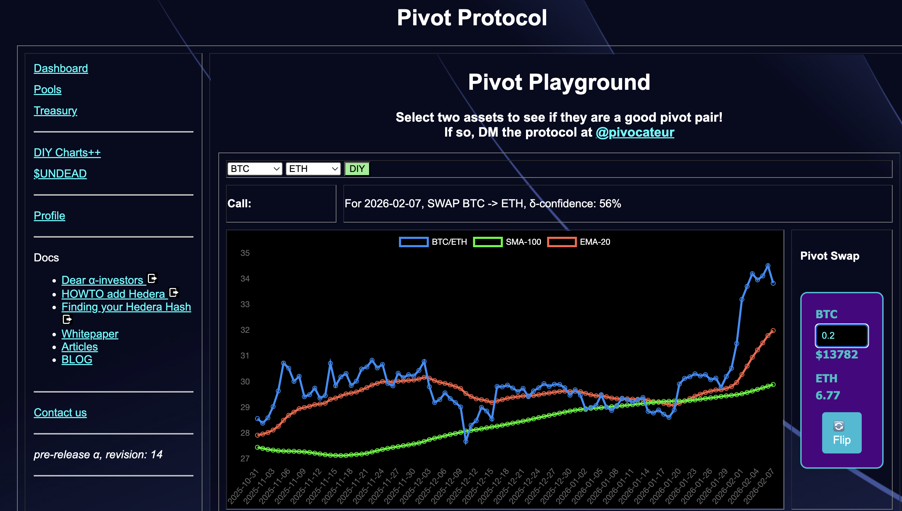
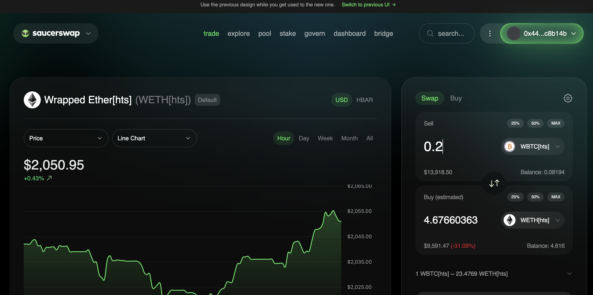

# Assets

G'day, pivoteurs!

As the markets recover, the Pivot Protocol regains ~$11k of TVL.

All assets are (still) secured. We suffered no loss of assets during the 
recent market-tumble.

# 💥💥💥ANNOUNCEMENT💥💥💥

Pivot Protocol, pre-release α, version 14, now has "Pivot Swap" on the DIY++ 
Chart-tab.

## Pivot Swap

Pivot Swap allows you to compute a 'reasonable swap' at today's market prices, 
so you can see how much you'd get for your own pivots. 

What is the aim of Pivot Swap? 

It's two-fold:

1. It gives the Pivot Protocol a degree of freedom from DEXen and blockchains, 
should the swaps be unfavorable due to slippage or other factors.

2. Stakers into the pivot pools earn trading-fees on swaps executed on Pivot 
Swap.

With Pivot Swap, losses are minimized.

### A small swap

For example, if I want to trade 107.26 $USDC to $HBAR to close a pivot

* Pivot swap returns 1,222 $HBAR; whereas:

* Saucer swap returns 1,208 $HBAR.

Not bad. Not bad at all, but the real savings come with larger trades with 
less liquidity

### A larger swap

A larger trade is if I were to close an ETH-on-BTC pivot.

0.2 $BTC swaps to:

* 6.77 $ETH on Pivot Swap ($14k)

* 4.68 $ETH on Saucer Swap ($9.5k) (31% slippage)

That's a difference of $4.5k on a $14k swap!

AND pivot pool stakers earn trading fees.

By Grabthar's Hammer! 😳💥💥

The above announcement of "Pivot Swap" for the Pivot Protocol and the benefits 
to the protocol and stakers are wound into a [new article on 
@LinkedIn](https://www.linkedin.com/feed/update/urn:li:activity:7425927793227554816/).

