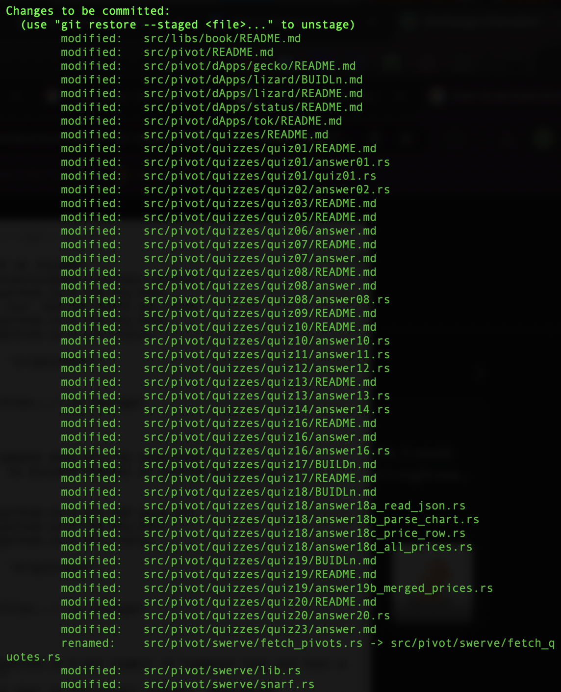

# Automation

G'day, pivoteurs!

From last night to this morning, this persona here (that'd be moiself (<<- 
that is French 😎)) has been working to pave the path toward automation. 

## ... but Javascript

I hate Javascript.

I hate Javascript with a passion.

I just want to do one. simple. thing.

Everyday I use Javascript, I just. want. to do. one. simple. thing.

And it takes all day, into the next day.

I don't have time to waste. I have time to create.

Javascript: do better.

