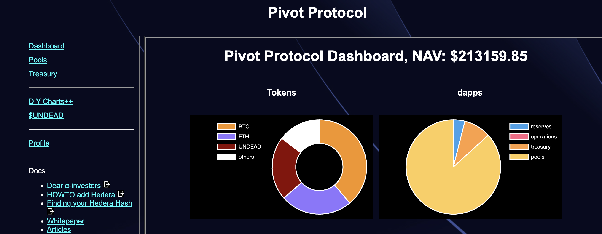
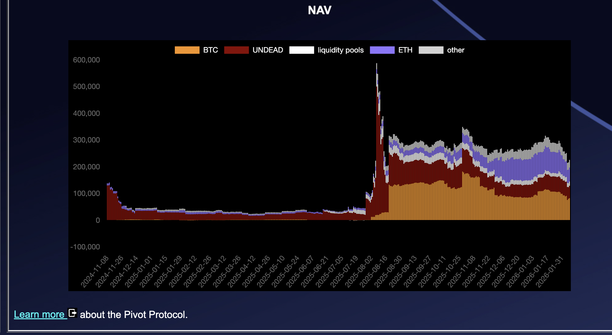
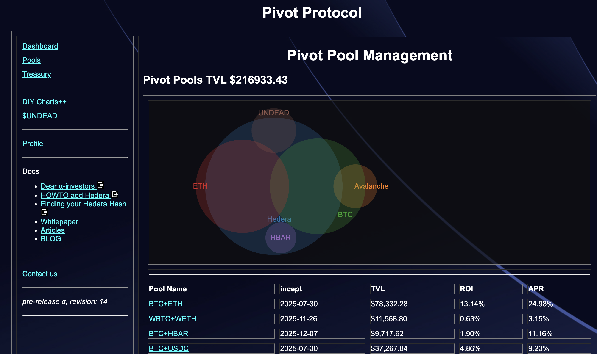
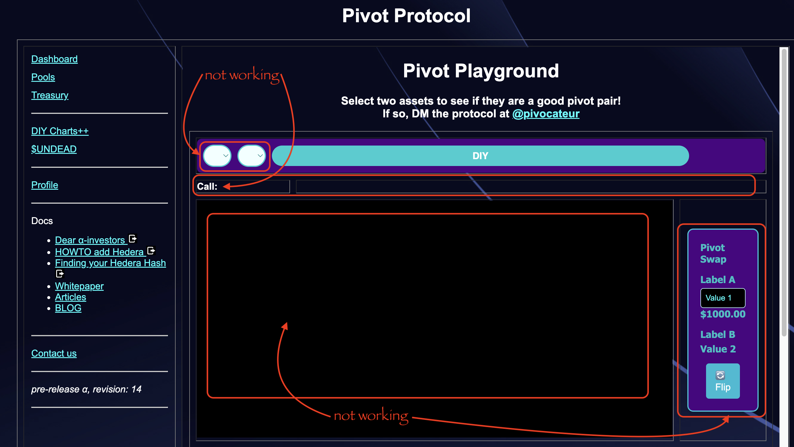
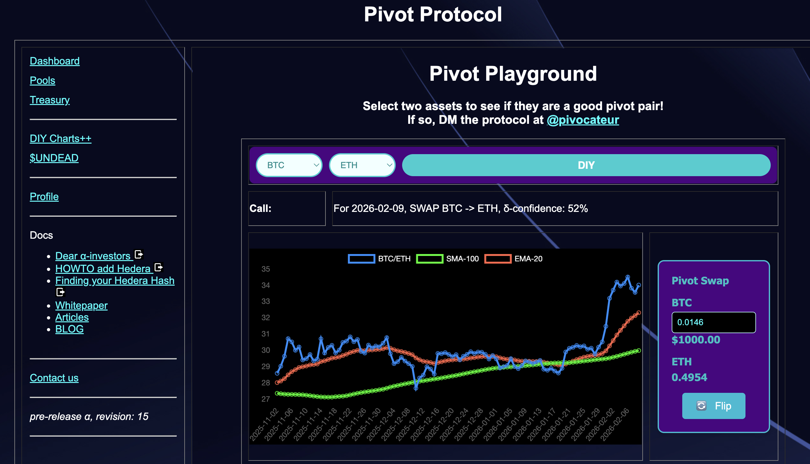

G'day, pivoteurs!

So, another day of massive code-changes, ...

... bit me in the deployment-derrière.

I don't have releases in git (yet) and I didn't do a blue-green deployment, 
so some functionality on the protocol, notably the DIY Charts++ tab, isn't 
working.

Working on it!

## Javascript woes

PLEASE NOTE that your stakes are safe and pivot arbitrage continues, ... it's 
just the presentation-layer that's not working at present.

*grumble* Javascript *grumble*

# Protocol back to full-operations

DIY charts++ are fixed, and now improved, charting only assets the protocol 
uses for pivot arbitrage. 

The [Pivot Protocol](https://pivoteur.github.io/#) is now back to 
full-operations.

