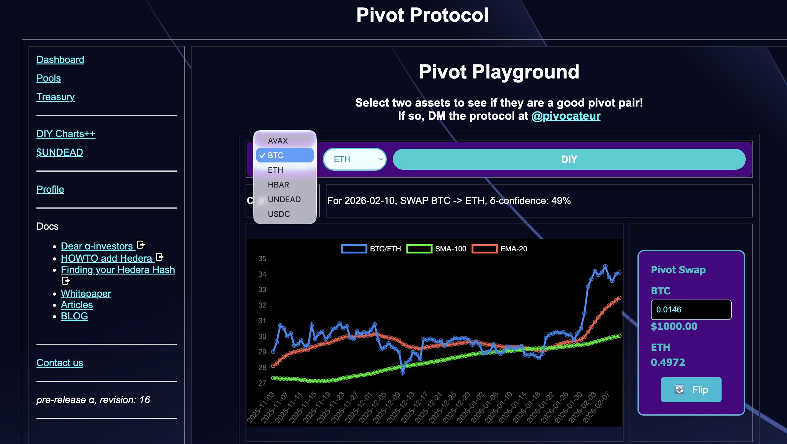
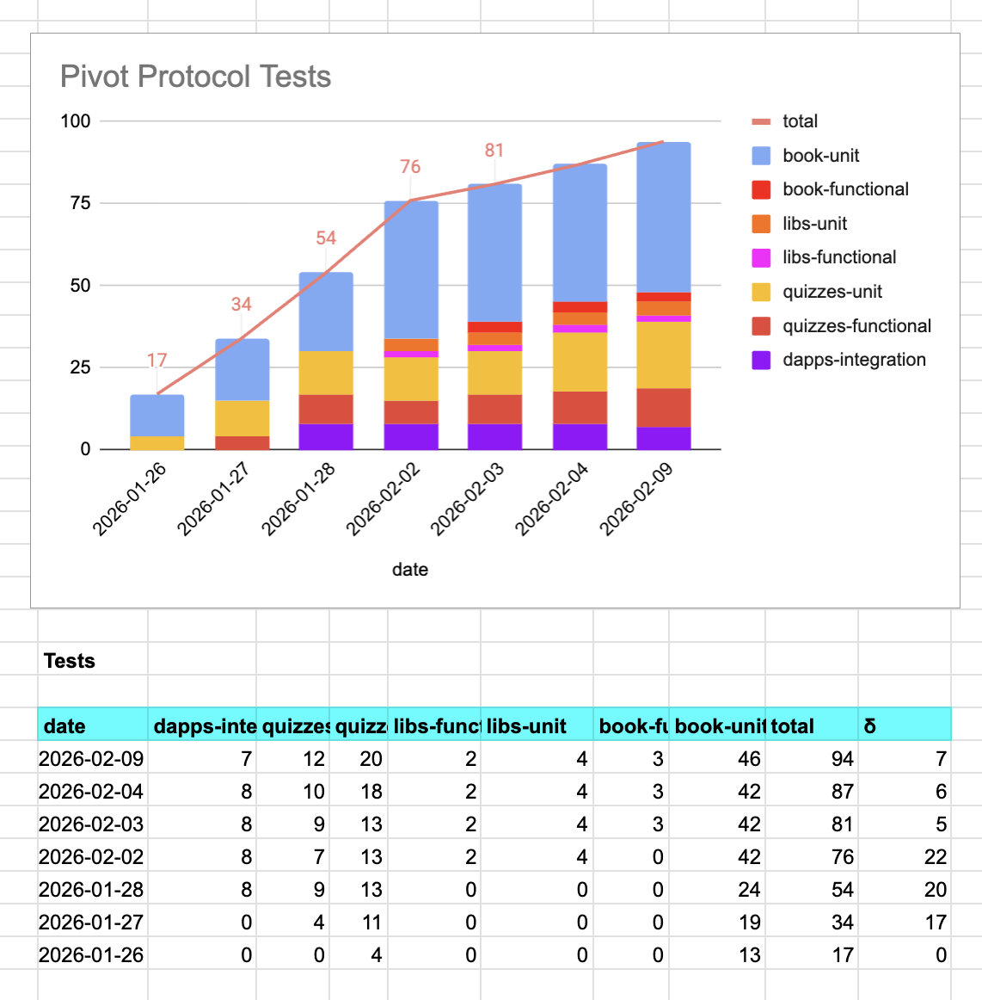
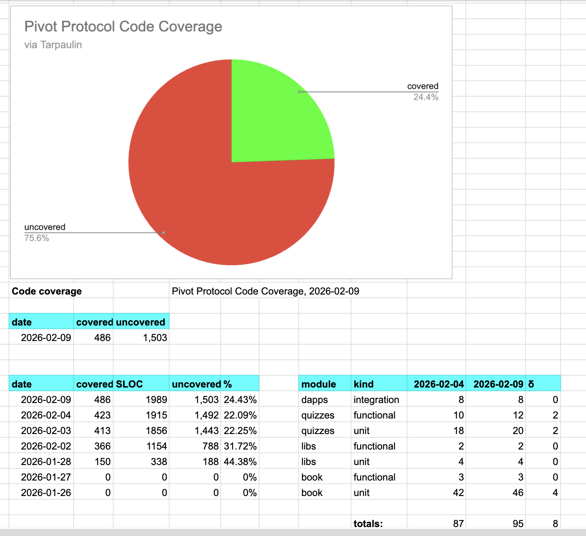
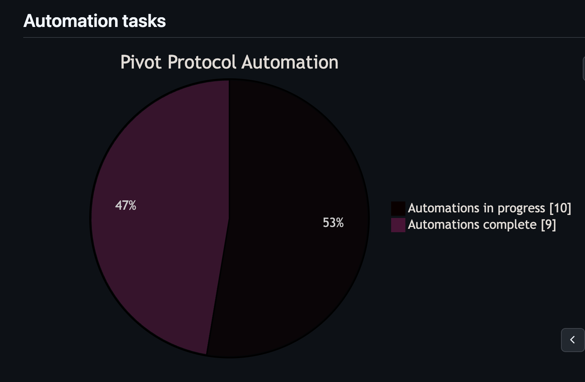
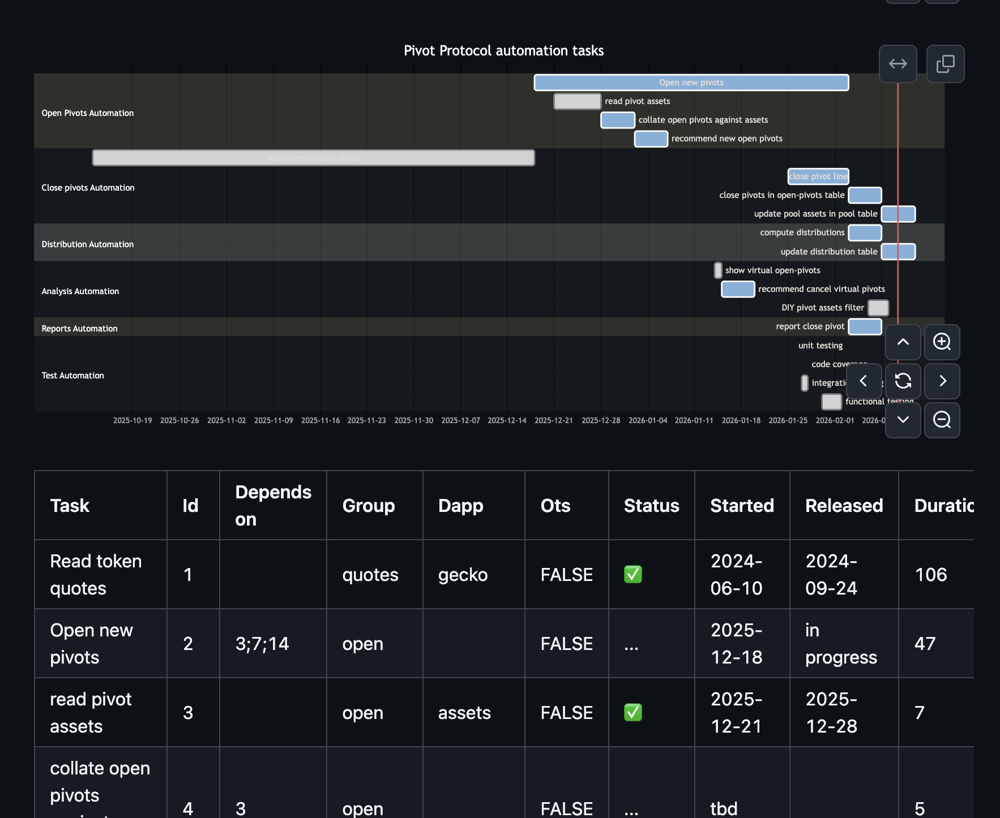

# Automation

G'day, pivoteurs.

Presenting `pools`

`pools` goes to the pivot-pool repository, parses the active pools and returns all pools assets being traded as a Javascript list.

This is necessary for DIY Charts++ asset-data.

## Pivot Protocol health

* All tests pass

* Code-coverage increasing (slightly)

* Automation-coverage just over 50% of workflow

* Automation plan-of-attack in progress 

# Employment administration

Created Pivot Technologies, LLC 
[NDA](https://docs.google.com/document/d/1PFjWqVg7ulLX8lwjt4KI6d2mQuEcxxBGf_RsRaQb-1c/edit?usp=sharing) and [Employment 
Agreement](https://docs.google.com/document/d/1nWXuRY8eyoZ4sdO0d_ESRxMhbRCQP-4motJihXWifes/edit?usp=sharing_).

That took longer than expected.

Now I can hire people.

