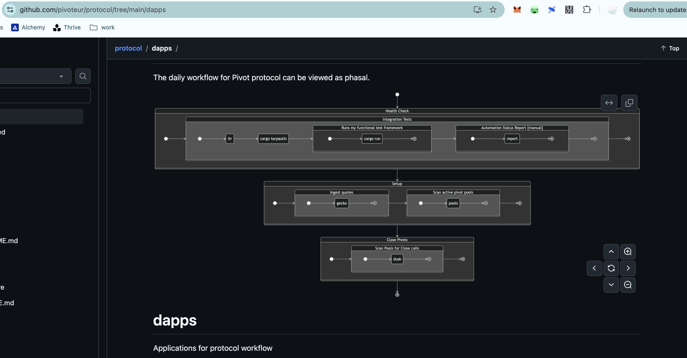

G'day, pivoteurs!

# AUTOMATION!

I'm [mapping out the automation 
needed](https://github.com/pivoteur/protocol/tree/main/dapps) to run the 
protocol smoothly. 

Apparently, there're quite a bit (more) moving pieces to the protocol's 
automation than what I anticipated, so it's good to have this start of a 
game-plan.

