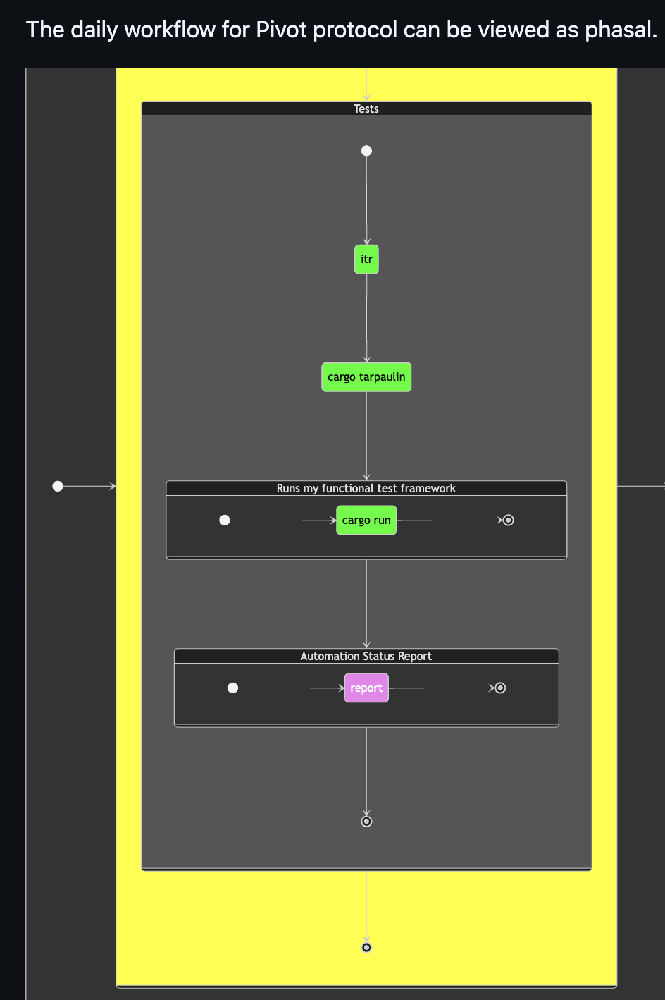
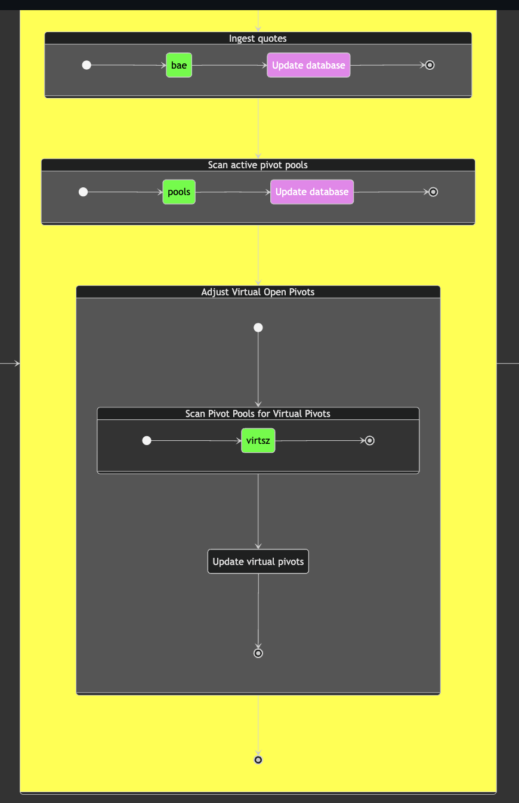
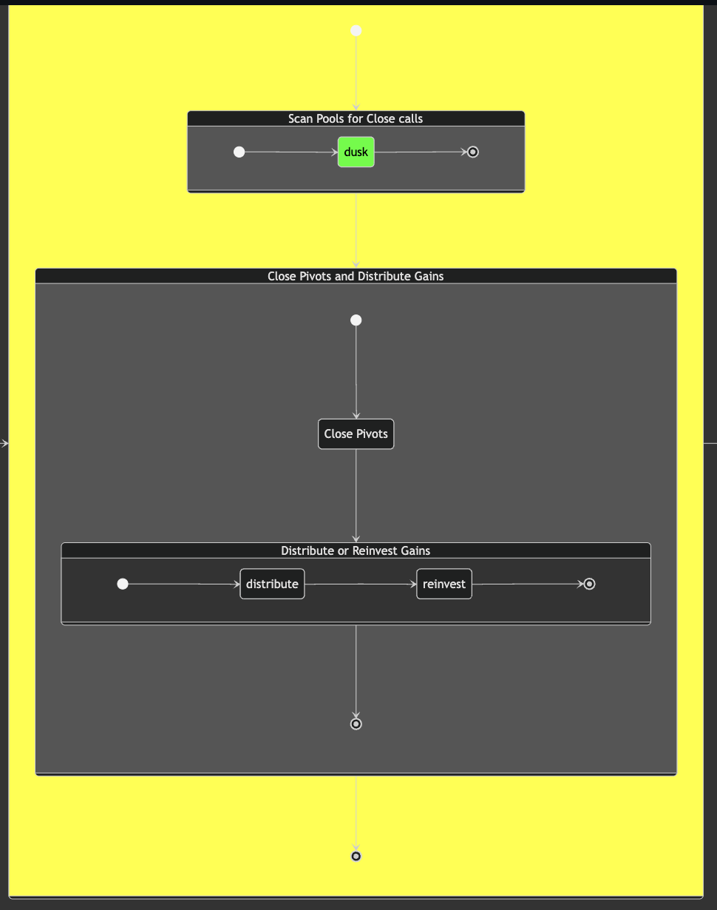

# Automation

G'day, pivoteurs!

I've fleshed out the day-to-day workflow of pivot arbitrage for the Pivot 
Protocol, breaking the workflow into 4 phases:

1. tests

2. setup

3. close pivots

4. open pivots

Each phase is subdivided into states. State colors mean:

* green: automated
* yellow: wip
* violet: manual
* black: not yet implemented

