# Synthetic Assets

G'day, Pivoteurs!

I'm launching an experiment with synthetic assets, starting with $iBTC from 
[@Indigo_protocol](https://app.indigoprotocol.io/earn).

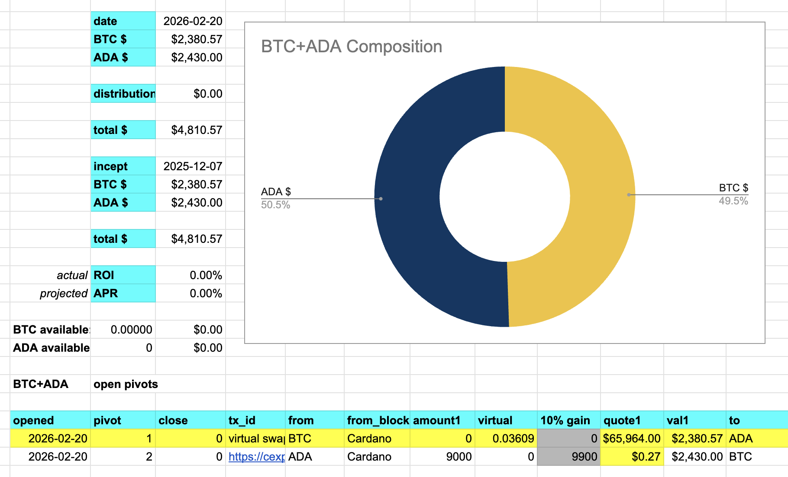
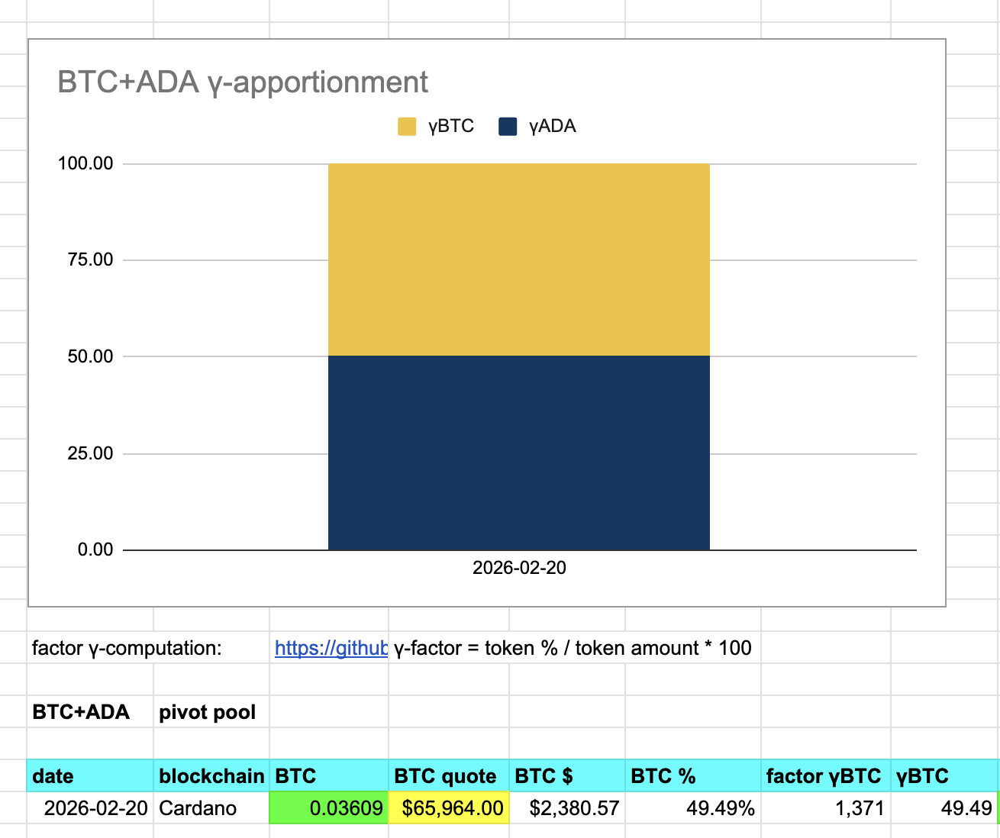

I've set up a pivot pool with (synthetic) $iBTC and am also staking the $iBTC 
into Indigo Protocol, earning both yields and arbitrage-gains from the protocol.

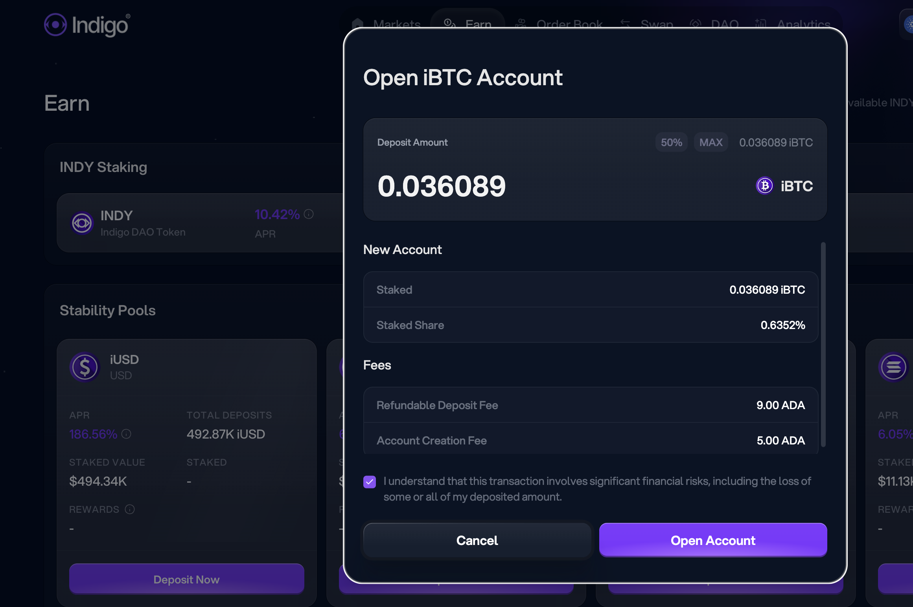

## Automated integration of synthetics

> DDD: 'data-driven development'

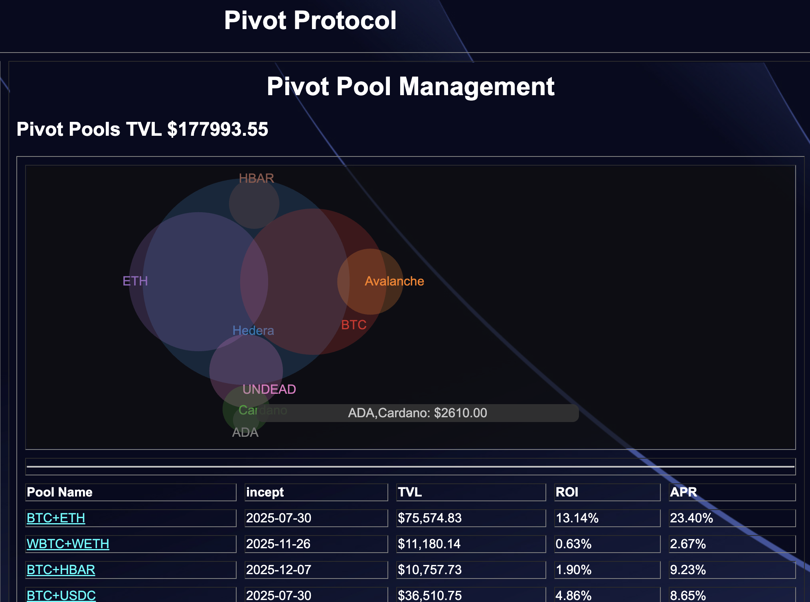
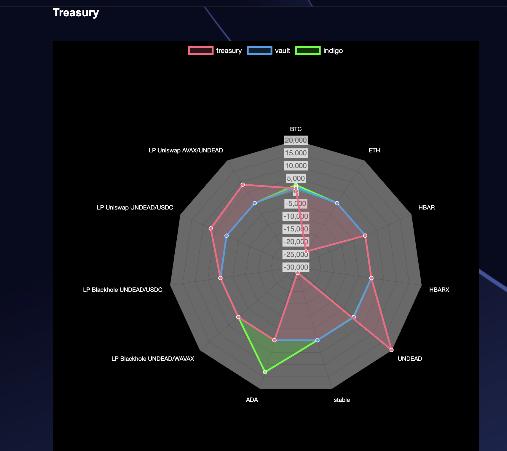
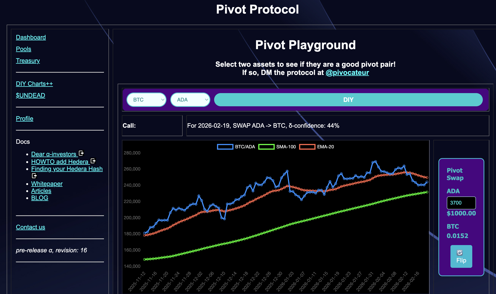
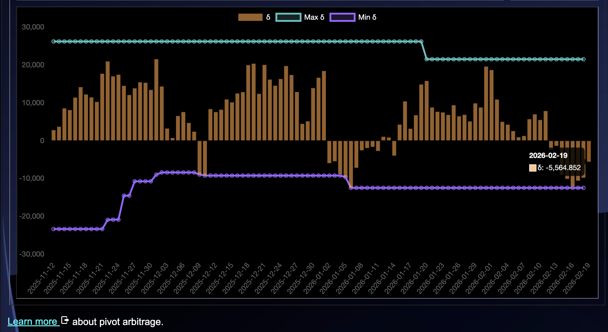

As I update the data-sets, the new synthetic-type and new pivot pool are 
(already) automatically integrated into the Pivot Protocol. 

## Synthetic research

Please note: pivoting on synthetics is highly experimental. $iBTC is not $BTC, 
and, in fact: $iBTC is actually nothing, as it's a synthetic.

So, these pools currently are research-only.

But what can I learn from them?

Make my own synthetics, maybe?

Sythetic gold? ... silver?

# LFJ blocc

In other news:

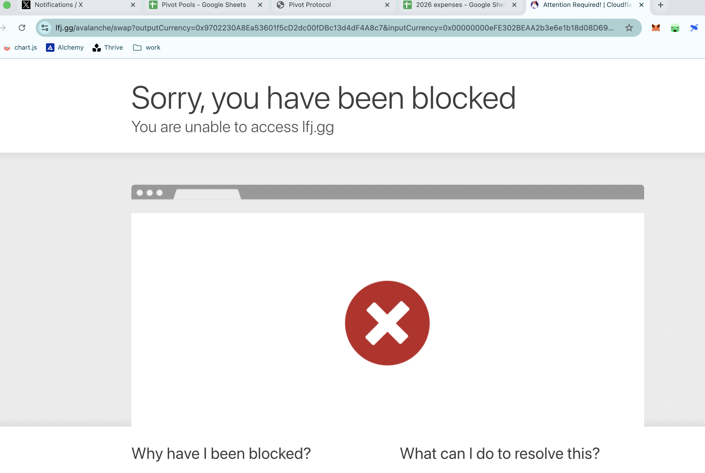

@LFJ_gg on @avax blocked me for pivoting.

* Not 100 pivots per day.
* Not 10 pivots per day.
* Not even 5 pivots per day, spread out over 20 hours each day.

@LFJ_gg, please unblock me, as you are blocking my investors' gains now.

# PIVOTS

I establish a new synthetic pool: $iUSD

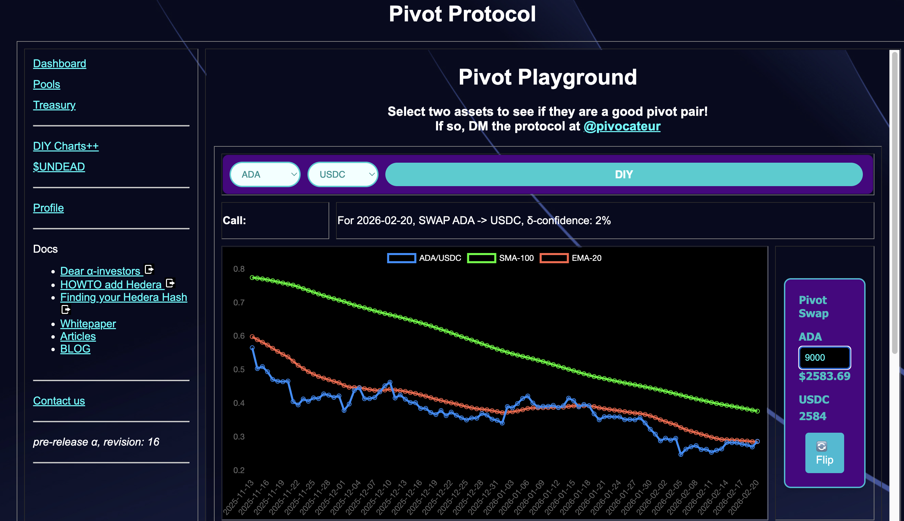
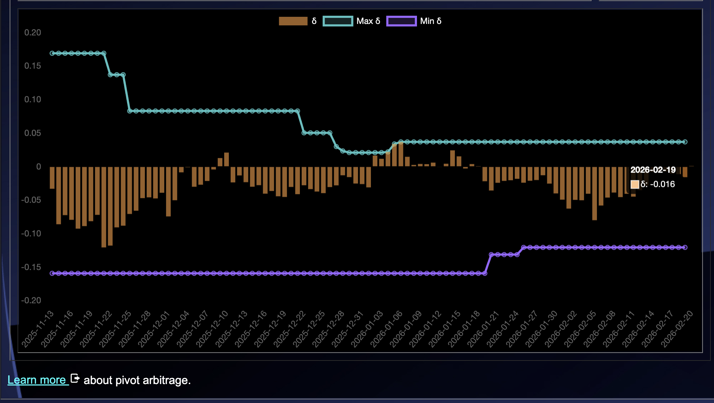

The δ is meh, so I open a pivot both ways.

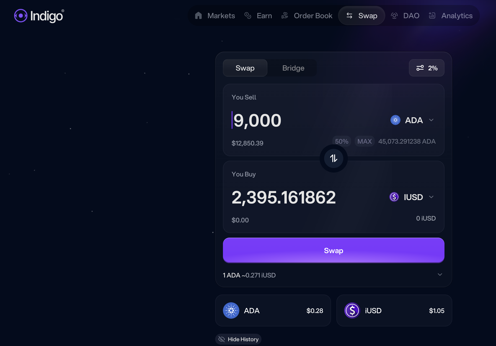
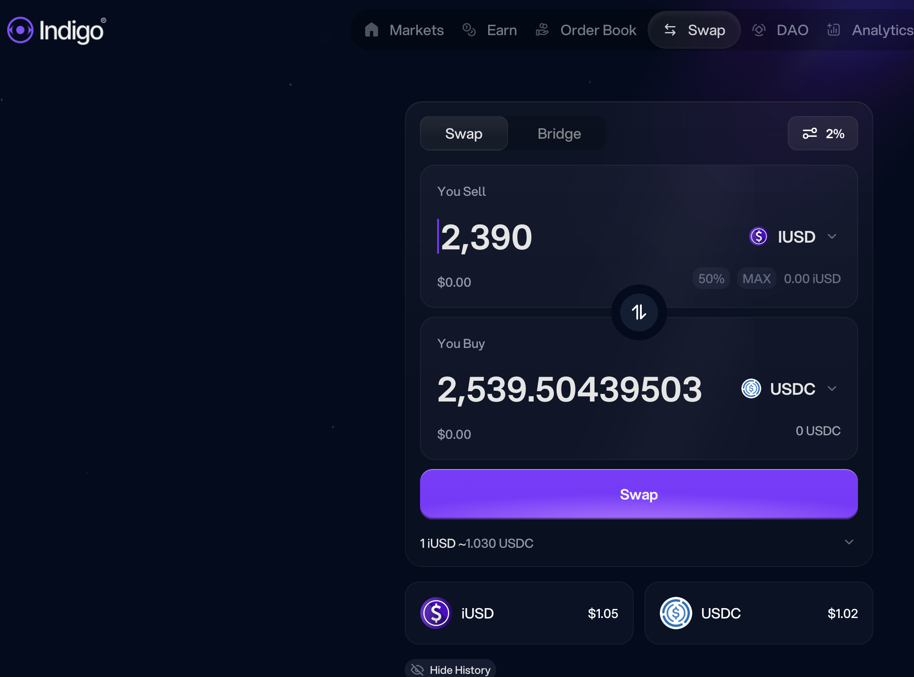

It appears I'm receiving less $iUSD than what's being traded, but in 
actuality, $iUSD is over peg by 5%, so the swap is comparable. 

