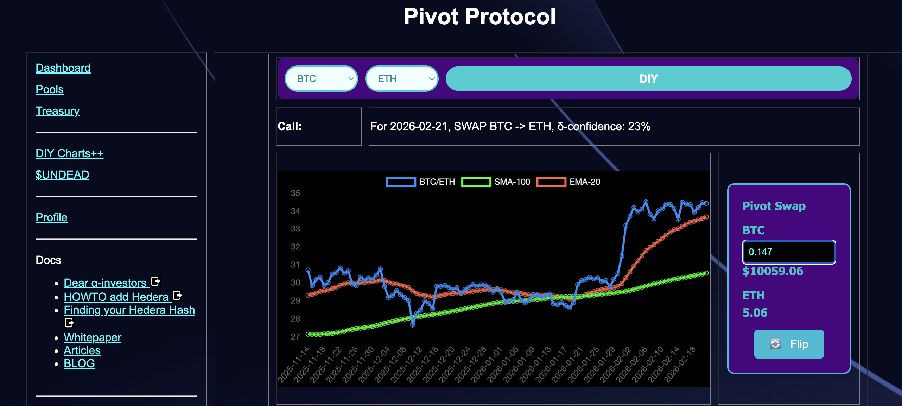
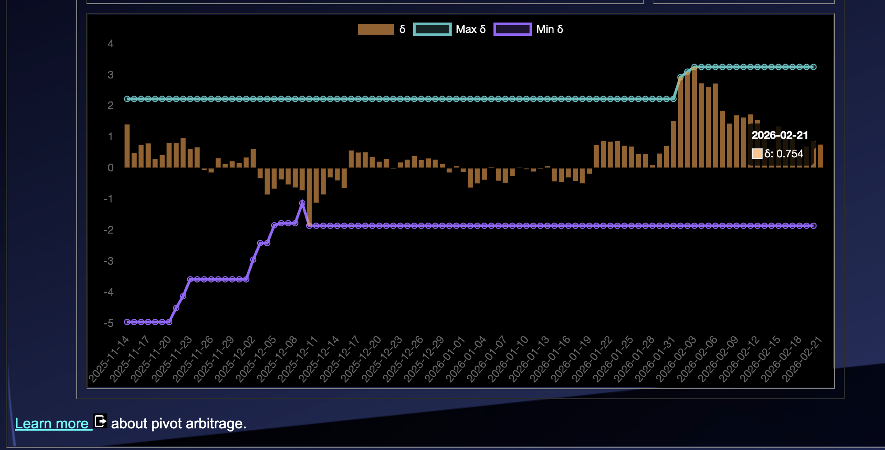
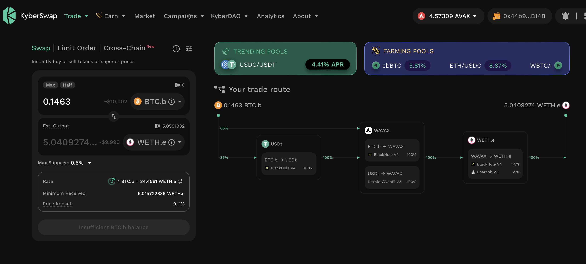
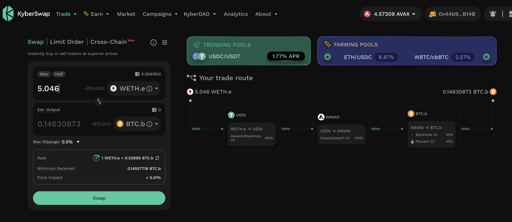
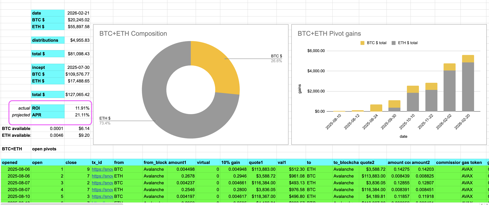
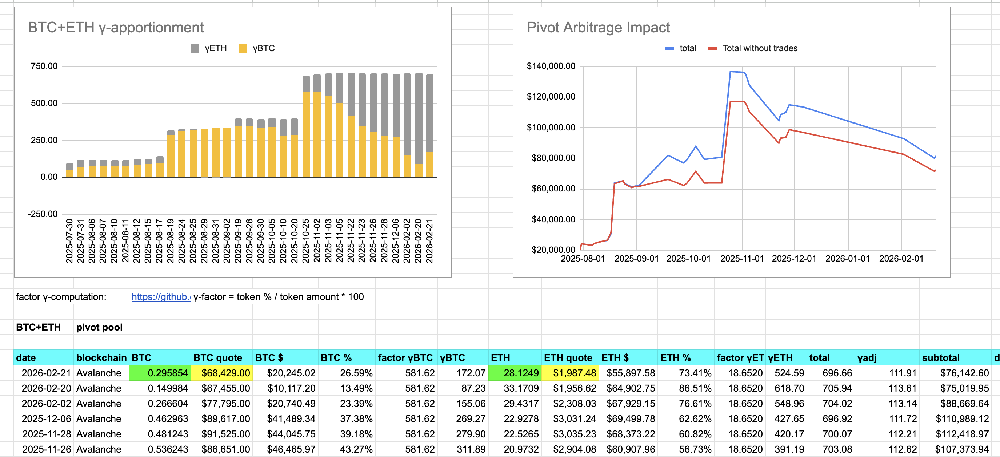

# PIVOTS

G'day, pivoteurs!

Continuing from yesterday's close ETH-on-BTC hedge, ...

## Open BTC+ETH pivots 

 
 

The positive δ calls to open an BTC-on-ETH pivot, which I do. 

 

I also open an ETH-on-BTC hedge. 

 

All BTC+ETH assets are now committed to pivots. 

The BTC+ETH pivot pool composition and γ-apportionment are as charted. 

 
 

### Serious question

Serious question, because I really wanna know:

Where else are you getting 11.9% ROI (to date), annualized to 21% returns on 
your $BTC and $ETH... paid in, here's the kicker: REAL yields of $BTC and $ETH?

