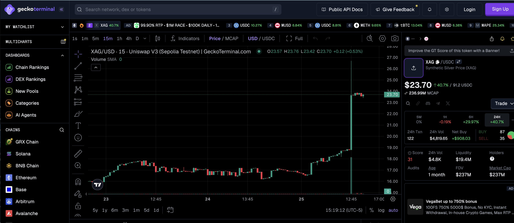
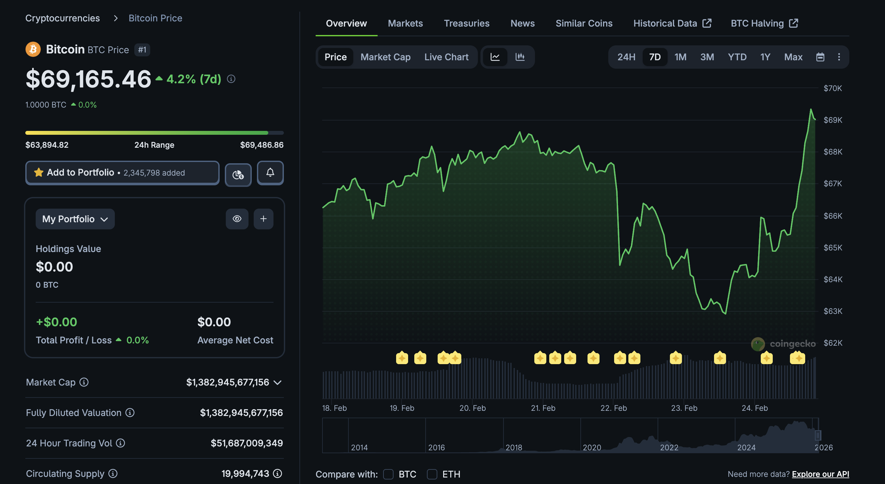
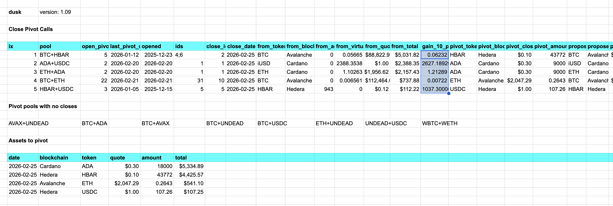
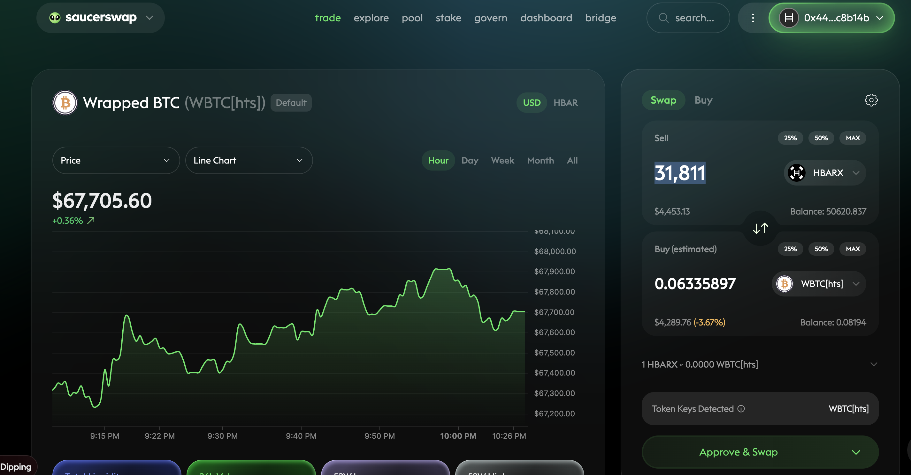
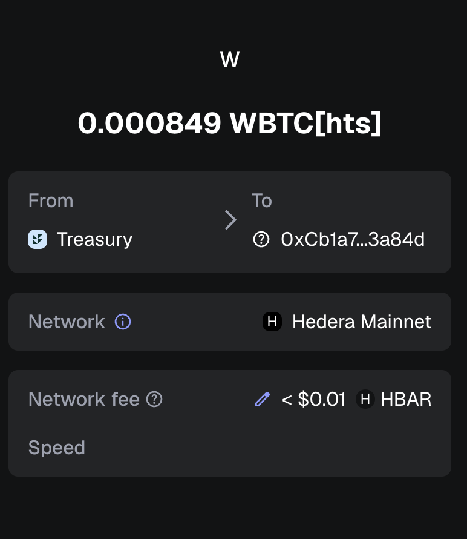
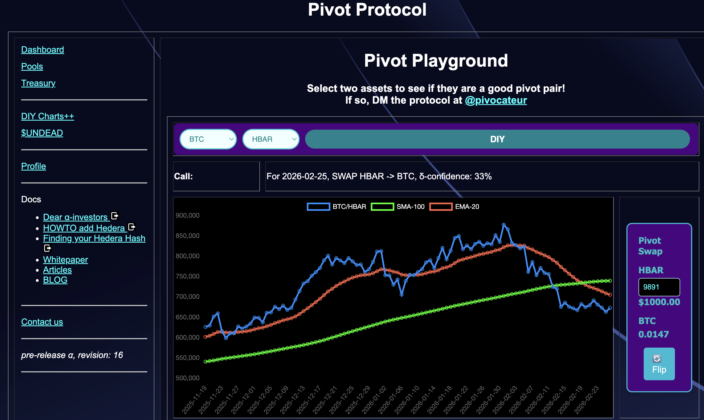
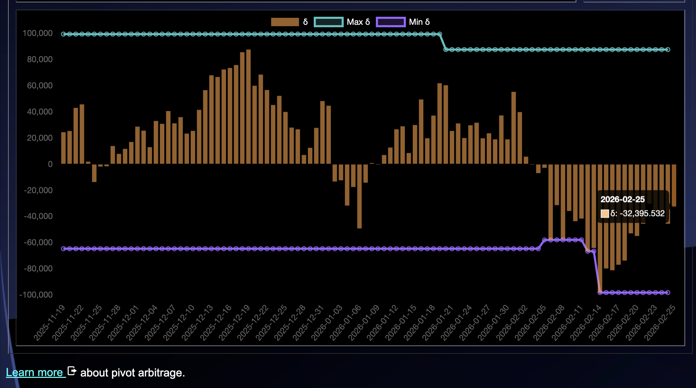
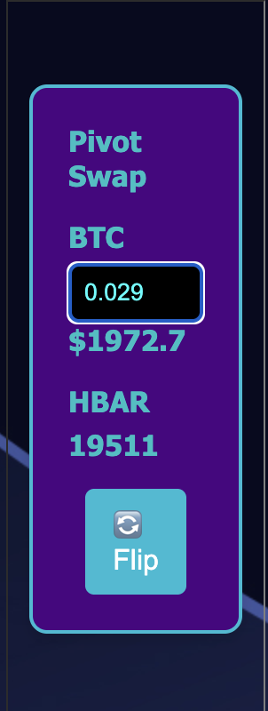
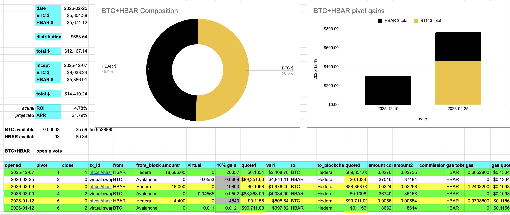
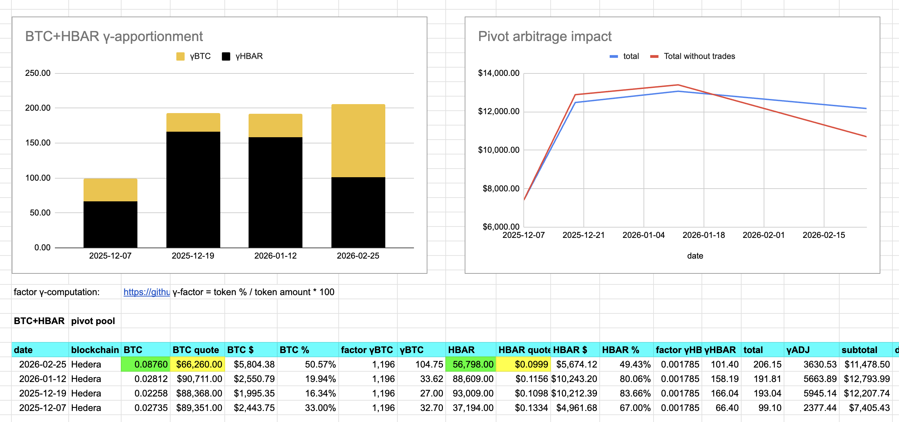

G'day, pivoteurs!

# Silver

Does anybody want to tell me what just happened with price of silver / $XAG on 
@binance, or nah? 

How is this relevant to pivot arbitrage?

I'm thinking of standing up a synthetic asset to $XAG and pivot it (vs $XAUT / 
gold or $ETH or the $USDC).

# Basketweavers

There are two kinds of people in this world.

a) $BTC dips 10%, 20%, 30%, ...60%, and they run around the socials screaming, 
"THE SKY IS FALLING! AND $BTC is GOING TO ZERO!"

b) somebody who has a stronger stomach for any endeavor above that of 
basket-weaving.

Which one are you?

# PIVOTS 

## BTC+HBAR 

 
 

Automation calls to close 2 BTC-on-HBAR pivots (which I manually confirm) for gains of: 

* actual ROI: 10.63% / 21.27% APR projected 
* or: 0.057 $BTC -> $HBAR -> 0.064 $BTC 
* or: $461.40 gain on 2 pivots totalling $5,031.82 

 

I reinvest and distribute the gains. 

## Open BTC+HBAR pivots 

 
 

The negative δ calls to open an HBAR-on-BTC pivot, which I do. 

 

I also open an BTC-on-HBAR hedge. 

 

All HBAR+BTC assets are now committed to pivots. 

The BTC+HBAR pivot pool composition and γ-apportionment are as charted. 

 
 

