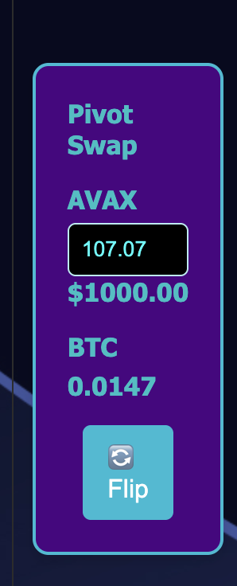

# PIVOTS

G'day, pivoteurs!

`dusk` has some recommendations for close pivots.

The first close-pivot recommendation is not viable due to slippage on 
@Cardano @Indigo_protocol.

# PivotEX

Investor τ asks:

> "Beginning to believe that in time @wagyugames  is going to need its own Dex 
for pivot."

I just invented a zero-slippage EX: PivotEX that @wagyugames will host when 
the Pivot Protocol goes live.

Above is a sample image of the α pre-release version of the PivotEX.

