# UNDEAD

G'day, pivoteurs!

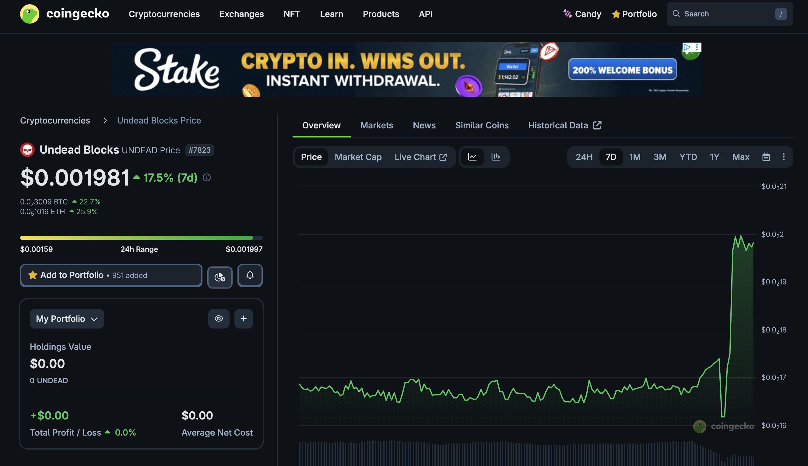

WHAT IN THE EVER-LUV'n...? $UNDEAD 

# PIVOTS

`dusk` reports multiple pivot-close opportunities.

## ETH+ADA

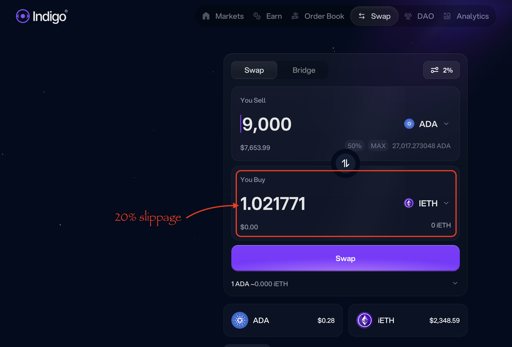

The first close-pivot: ETH-on-ADA is not viable due to slippage, so we give 
this first close pivot call a miss. 

## BTC+ETH on Hedera

BTC+ETH on @hedera 

Slippage is over 4%, making a close-pivot not viable.

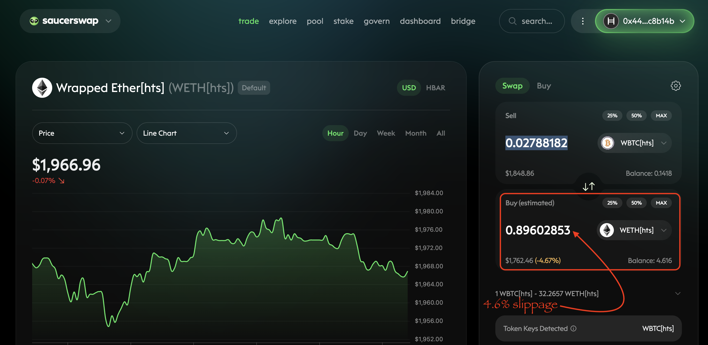

Giving this close-pivot call a miss. 

# Avalanche

## LFJ blocked my trades

I'm back to being blocked by @LFJ_gg on @avax.

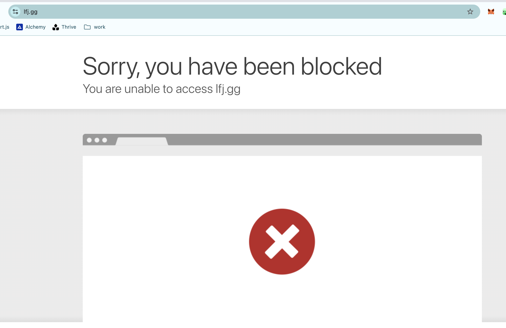

LFJ can you please unblock me? You are missing out on trades on Avalanche. 

## BTC+ETH 

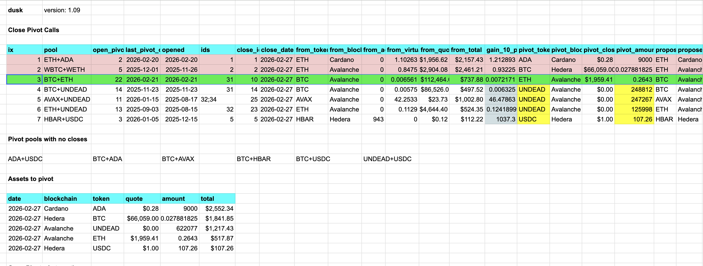 
 

Automation calls to close 1 BTC-on-ETH pivot (which I manually confirm) for gains of: 

* actual ROI: 18.88% / 49.22% APR projected 
* or: 0.0066 $BTC -> $ETH -> 0.0078 $BTC 
* or: $81.90 gain on a pivot totalling $737.88 

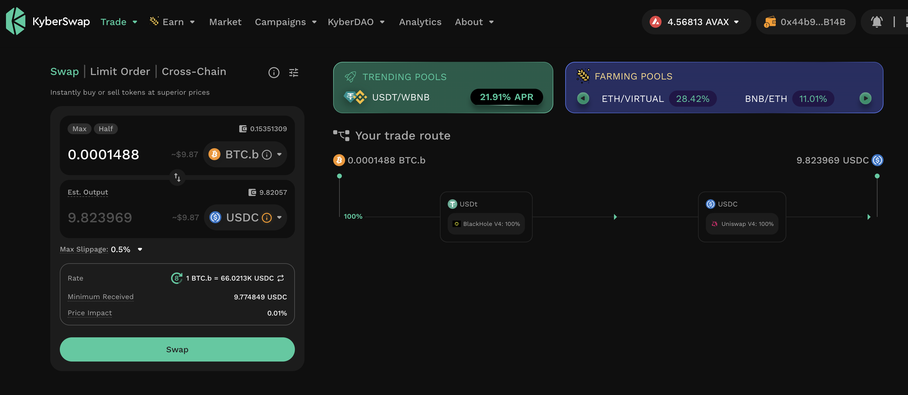 
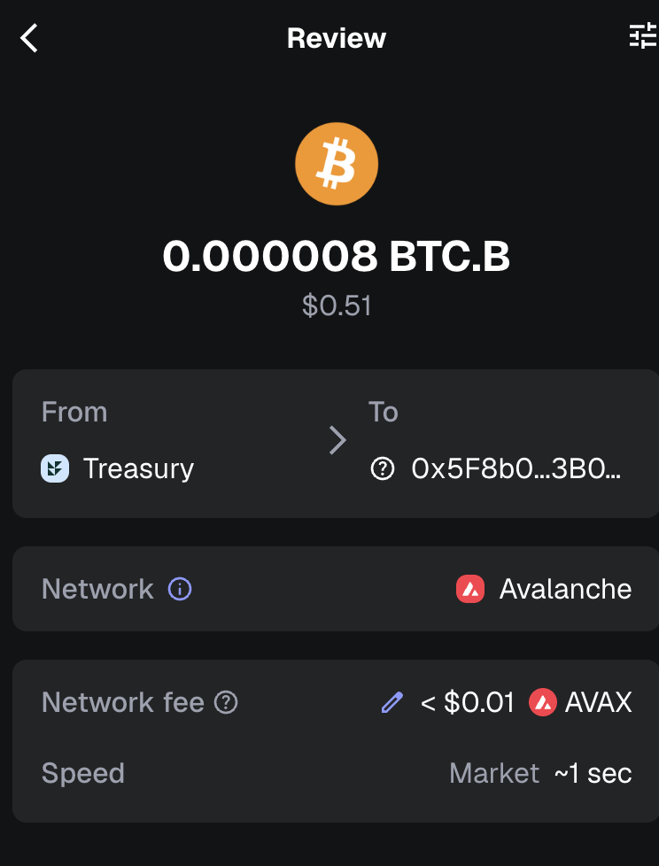 

I reinvest and distribute the gains. 

## Open BTC+ETH pivots 

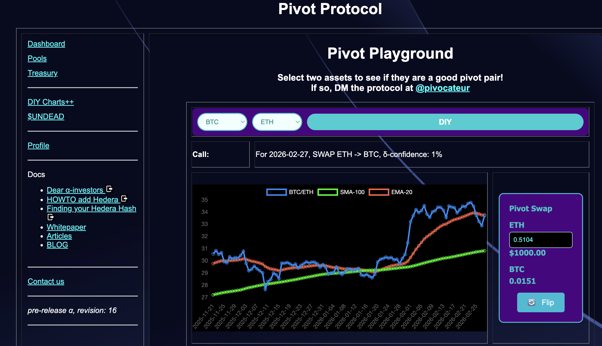 
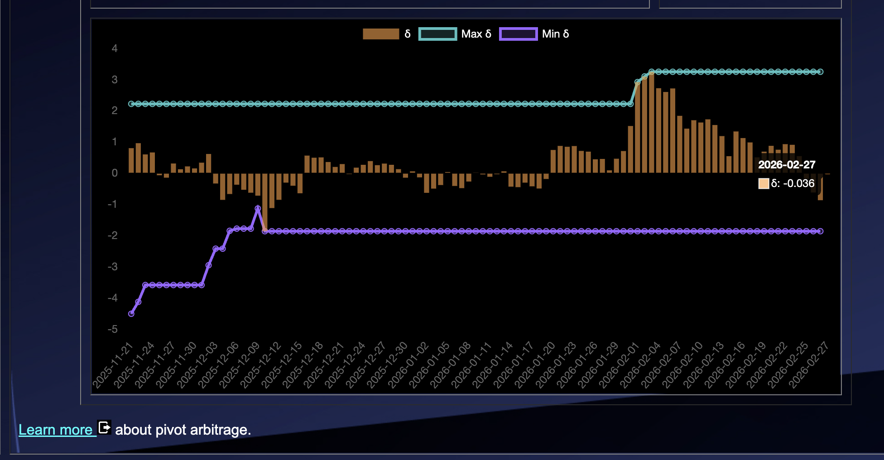 

The meh δ makes no call, but I open an ETH-on-BTC pivot, anyway. 

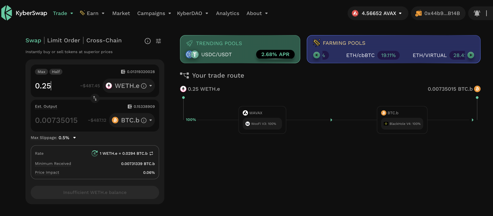 

All ETH+BTC assets are now committed to pivots. 

The BTC+ETH pivot pool composition and γ-apportionment are as charted. 

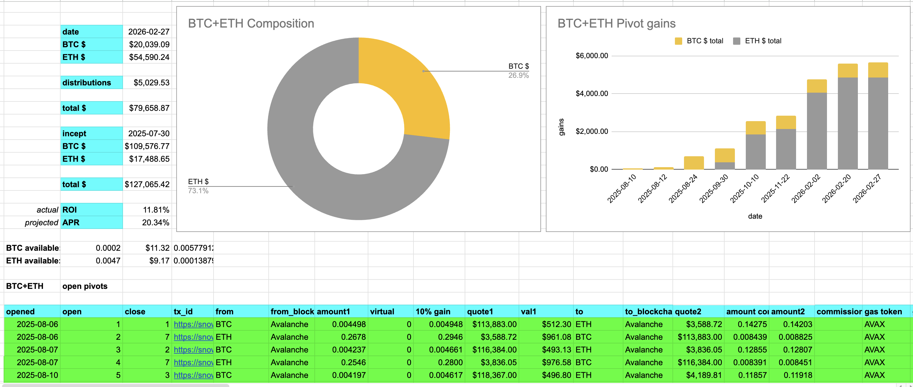 
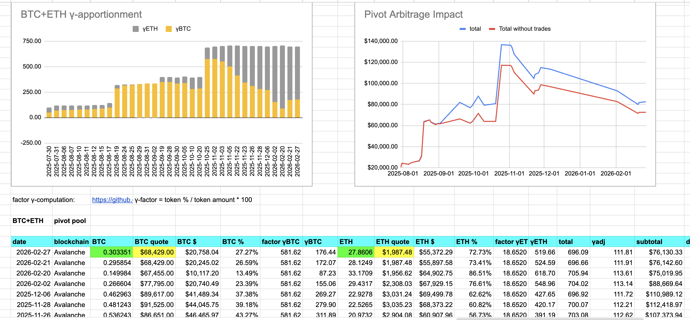 

