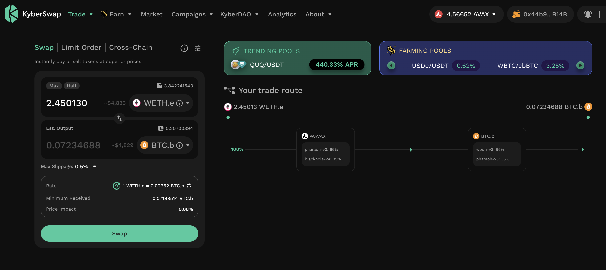
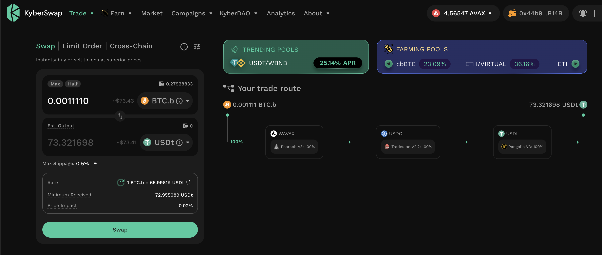
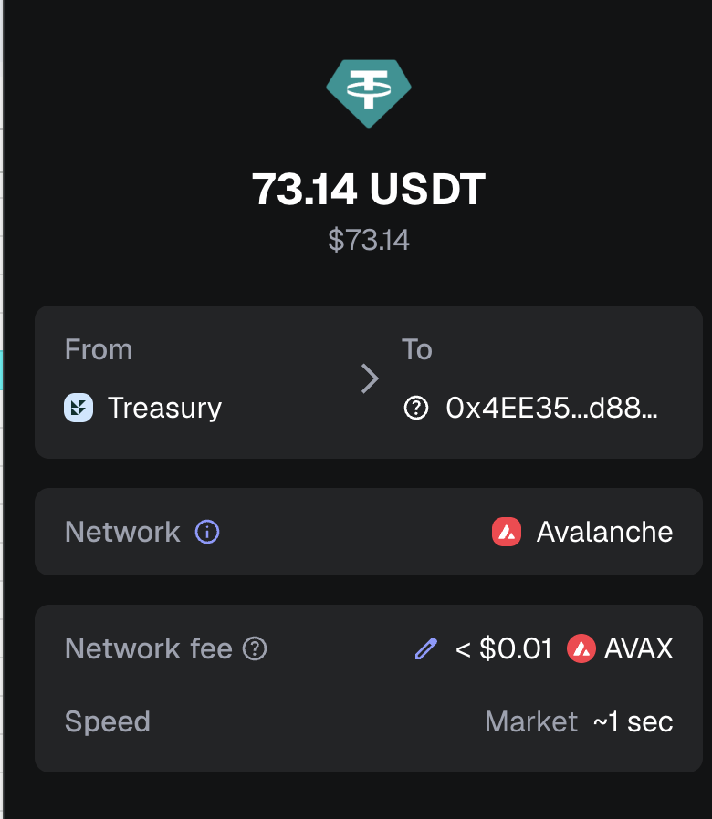

# Lace Broken

G'day, pivoteurs.

What's going on with @lace_io on Chrome? It suddenly stopped working. Anybody 
else experiencing this issue?

@lace_io: what remedial actions do I take to get the extension working again? 
I need this now. 

# PIVOTS 

## BTC+ETH 

 

Automation calls to close 1 BTC-on-ETH pivot (which I manually confirm) for gains of: 

* actual ROI: 14.68% / 765.32% APR projected 
* or: 0.0631 $BTC -> $ETH -> 0.0723 $BTC 
* or: $614.28 gain on a pivot totalling $6,957.89 

 
 

I reinvest and distribute the gains. 

