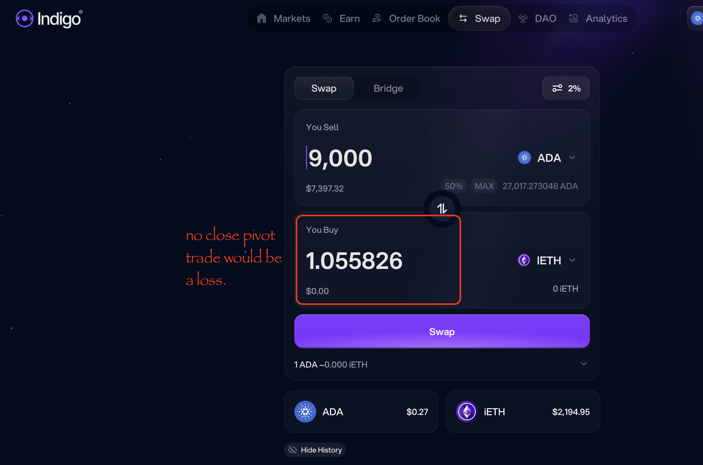
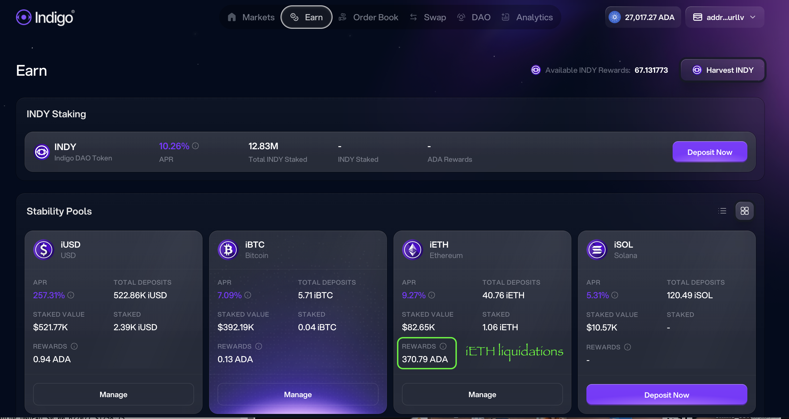

G'day, pivoteurs!

# PIVOTS

`dusk` reports close pivots.

The first one for sythetic ETH, is a no-go, as the trade would be a loss.

However, @Indigo_protocol liquidated some $iETH, distributing $ADA gains.

Let's look at that.

