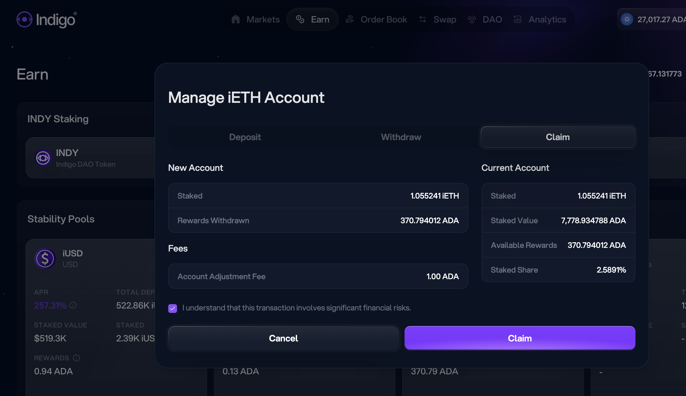
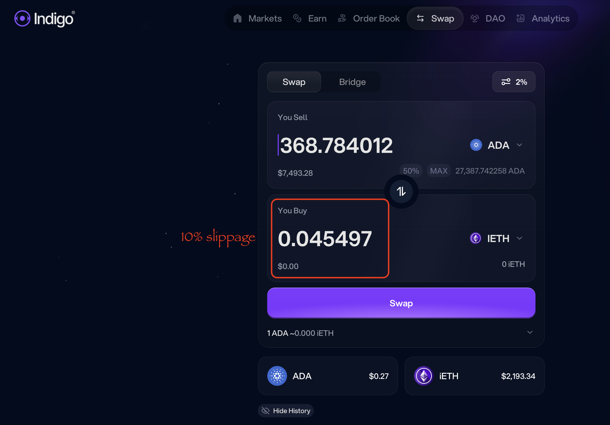
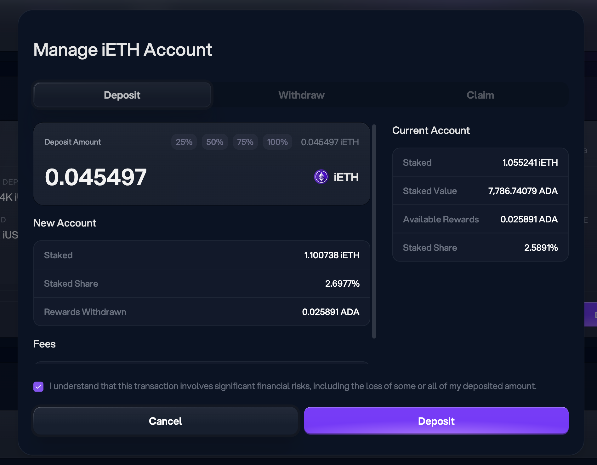

G'day, pivoteurs!

# PIVOTS

`dusk` reports close pivots.

The first one for sythetic ETH, is a no-go, as the trade would be a loss.

However, @Indigo_protocol liquidated some $iETH, distributing $ADA gains.

Let's look at that.

## Indigo

For Indigo, I collect

* 370.79 $ADA which turns into 
* 0.045 $iETH but I lost
* 0.047 $iETH in liquidation-conversion.

The culprit is the ADA/ETH swap, which has $10 in slippage on a $100-trade.

That's 10% slippage.

@Indigo_protocol: do you see why you've lost so much TVL?

