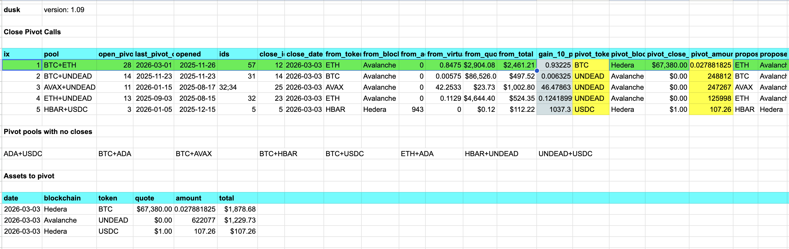
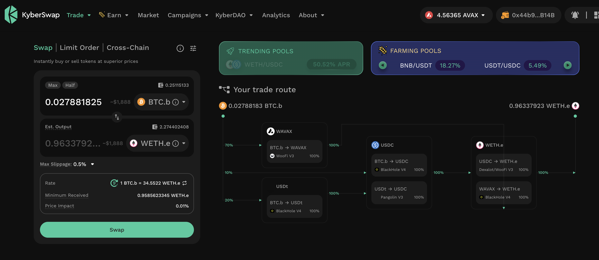
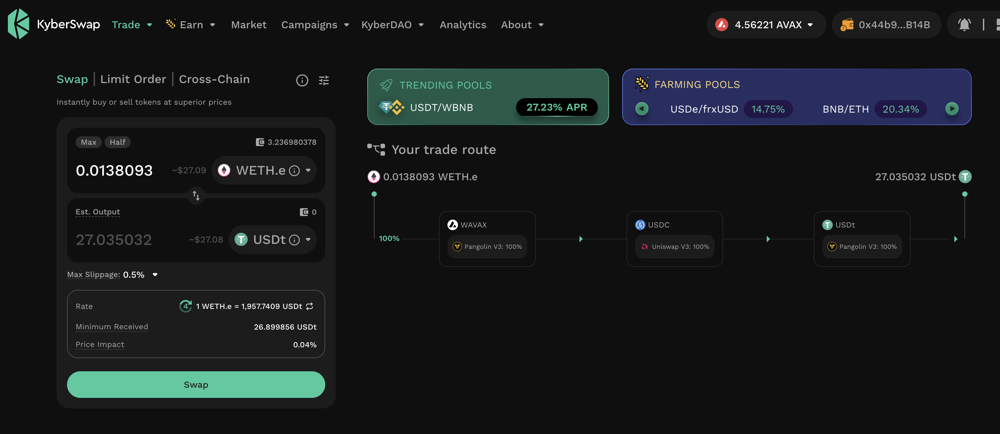
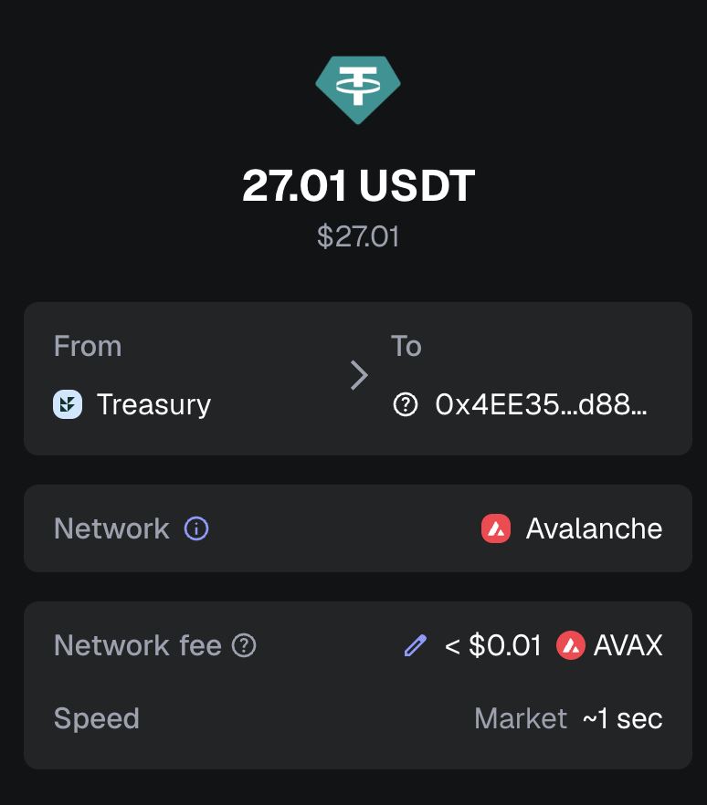
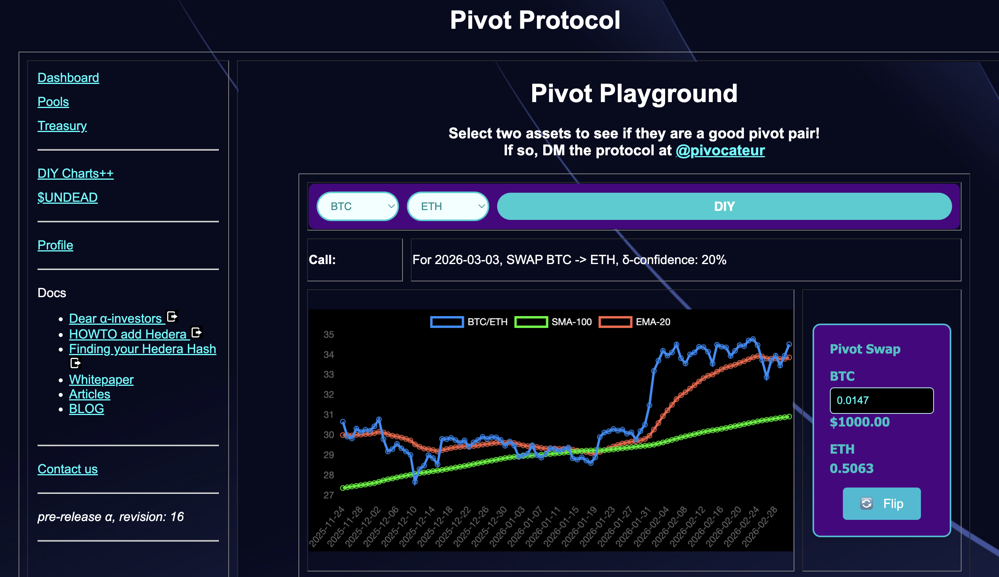
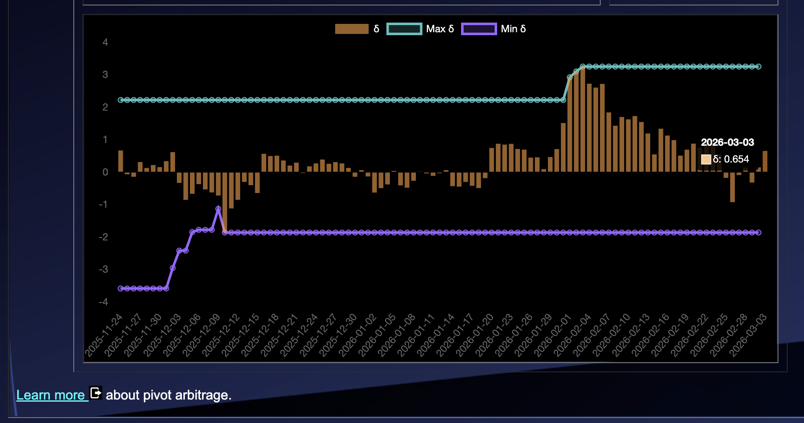
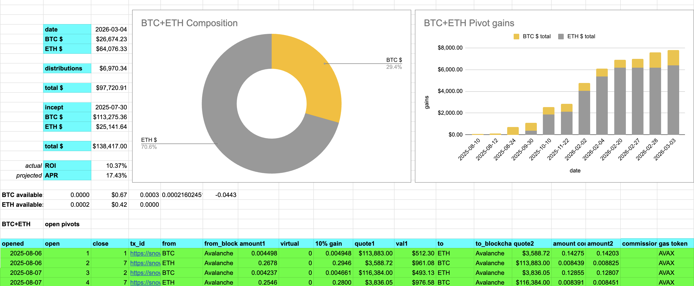
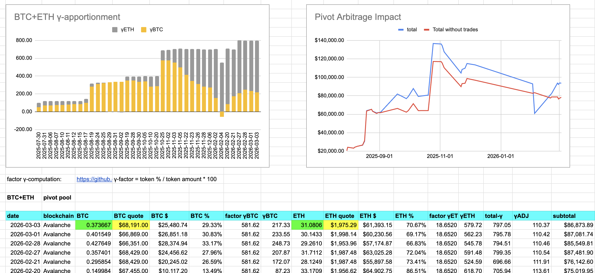

# PIVOTS 

## BTC+ETH 

 
 

Automation calls to close 1 ETH-on-BTC pivot (which I manually confirm) for gains of: 

* actual ROI: 13.58% / 51.09% APR projected 
* or: 0.8475 $ETH -> $BTC -> 0.9626 $ETH 
* or: $227.31 gain on a pivot totalling $2,461.21 

 
 

I reinvest and distribute the gains. 

## Open BTC+ETH pivots 

 
 

The positive δ calls to open an BTC-on-ETH pivot, which I do. 

 

All BTC+ETH assets are now committed to pivots. 

The BTC+ETH pivot pool composition and γ-apportionment are as charted. 

 
 

