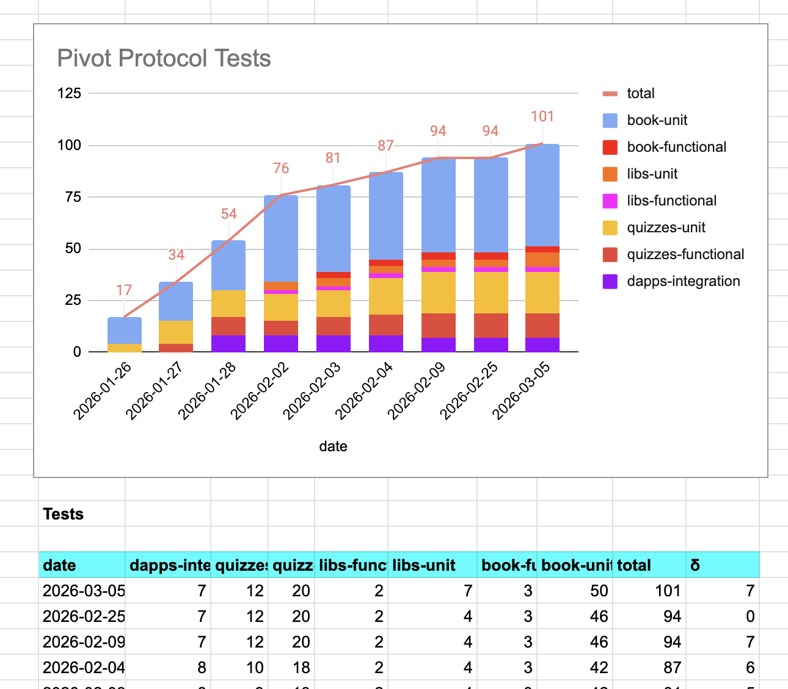
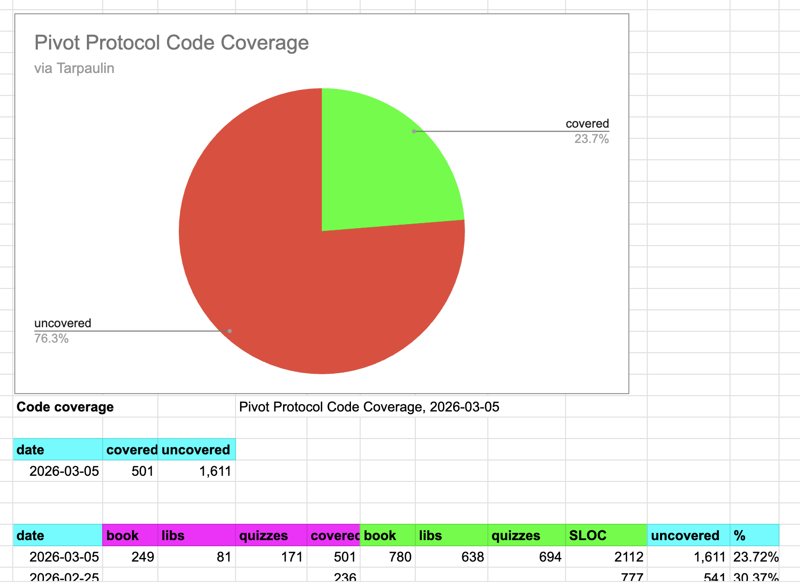

# Daylight Savings Time

G'day, pivoteurs!

Proof that God exists and he hates us all:

Daylight Savings Time.

"Spring forward; Fall back."

Remember to advance your clocks by one hour because God hates us.

We COULD set our clocks forward [Friday at 
4 pm](https://x.com/SwedishCanary/status/2029514178352832918) to stick one to 
The MAN! 

# `virtsz`

`virtsz`, the dapp that computes all assets in virtual pivots, broke for some 
weird reason.

I later found out that since I introduced synthetic assets, `virtsz` was 
choking on those synthetics.

`virtsz` is working again now.

# Tests

All unit tests, functional tests, and integration tests pass. 

## Code Coverage

New unit tests cover more code (as more code is added, so code-coverage has 
been steady to date). 

## Research vs operations

`virtsz` showing all assets in virtual pivots is a research-tool.

Research is an important aspect of the Pivot protocol, AND we need to automate 
the workflow, therefore I'm working on evolving `virtsz` to adjust all open 
pivot pools that have virtual pivots with today's quotes.

I've [scoped work to modify 
`virtsz`](https://github.com/pivoteur/protocol/issues/9), transitioning it 
from a research-tool to bringing it inline for production use. 

