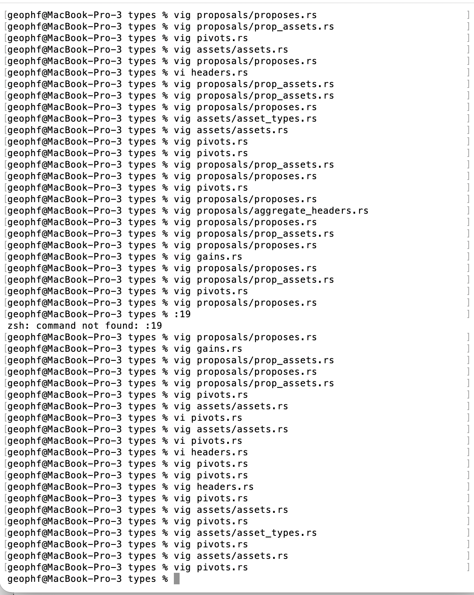
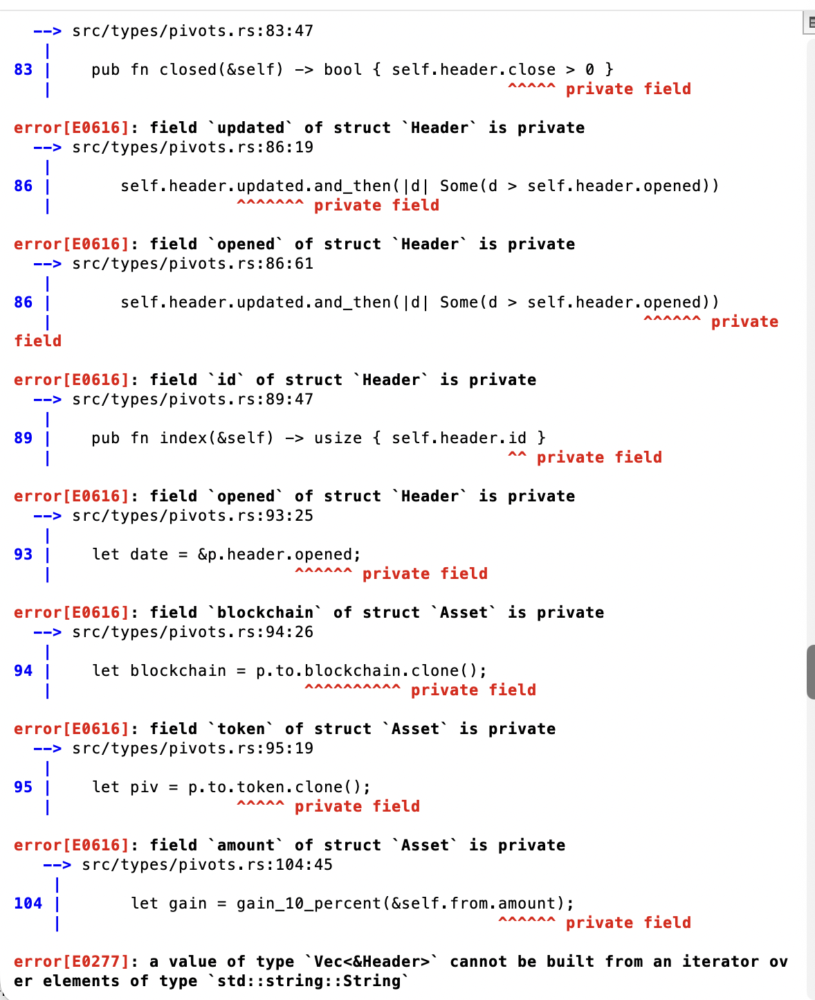

# Refactoring

G'day, pivoteurs!

It's been a busy three days.

`dusk` is reporting some erroneous results that I haven't been able to isolate, 
so I broke apart the pivot-algorithm, 861 SLOC, into 10 modules.

That refactoring was completed today.

Now begins consistency-checks and testing.
