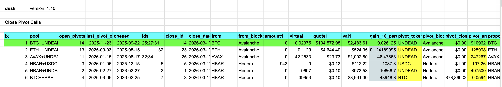
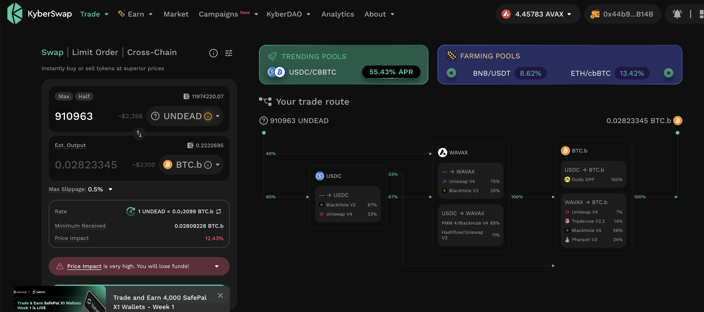
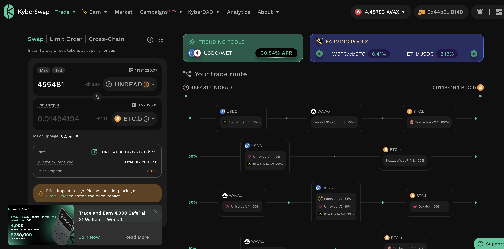
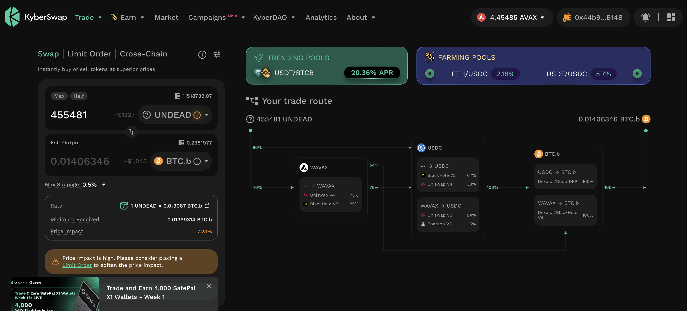
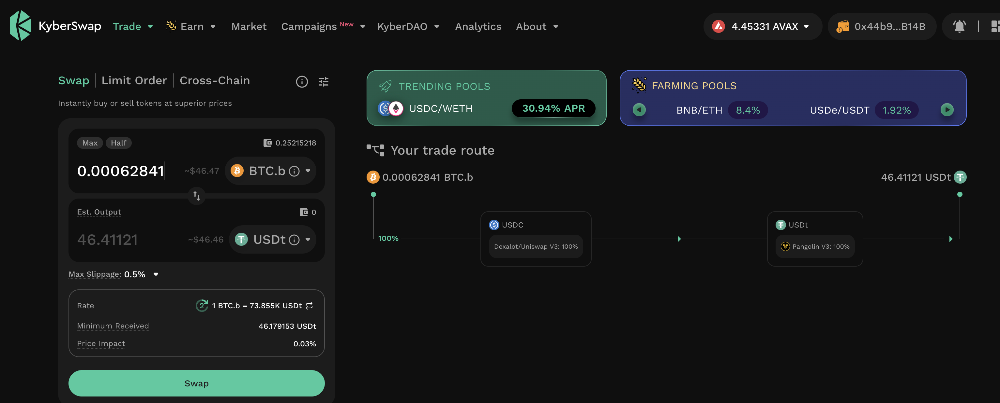

# `dusk`

G'day, pivoteurs!

After nearly a week where `dusk` was misreporting quotes (it quoted today's 
price of $BTC at $12M-per), I'm pleased to announce that `dusk` has been 
rewritten from the ground-up using first principals and is now comprehensively 
tests.

`dusk` is now operational

# Testing

By way of verifying `dusk`, I broke the process of pivoting (being 861 SLOC) 
into 10 separate modules. I then tested each module's consistency, adding 50 
new tests.

Put another way: code coverage has gone from 25% to 40% veracity, 
nearly *doubling* protocol assurance.

Wow! 

# `virtsz`

I've just (re)verified integration of `virtsz`.

`virtsz` recomputes all virtual pivots for all pivot pools. Up to now, I've 
only done 3 pivot pools revirtualizations in 3 years.

`virtsz` recomputed all 13 pivot pools in 10 minutes, so that's – what? 
167,000x – faster than me.

# `dusk`

`dusk` – the dapp that selects which pivots to close and is now reintegrated 
into the protocol – calls to close ~$10k-worth of pivots.

Let's get to it. 

# PIVOTS 

## BTC+UNDEAD 

 

Automation calls to close 3 BTC-on-UNDEAD pivots (which I manually confirm) for gains of: 

* actual ROI: 22.05% / 70.39% APR projected 
* or: 0.0238 $BTC -> $UNDEAD -> 0.0290 $BTC 
* or: $386.79 gain on 3 pivots totalling $2,483.61 

### Slippage

As the amount of $UNDEAD is too great for Kyber to swap with less than 10% 
slippage, I break the pivot into two separate swaps, bringing slippage 
down to 7%.

Even with 7% slippage, the ROI is above 22% on $BTC. 

 
 

I reinvest and distribute the gains. 
