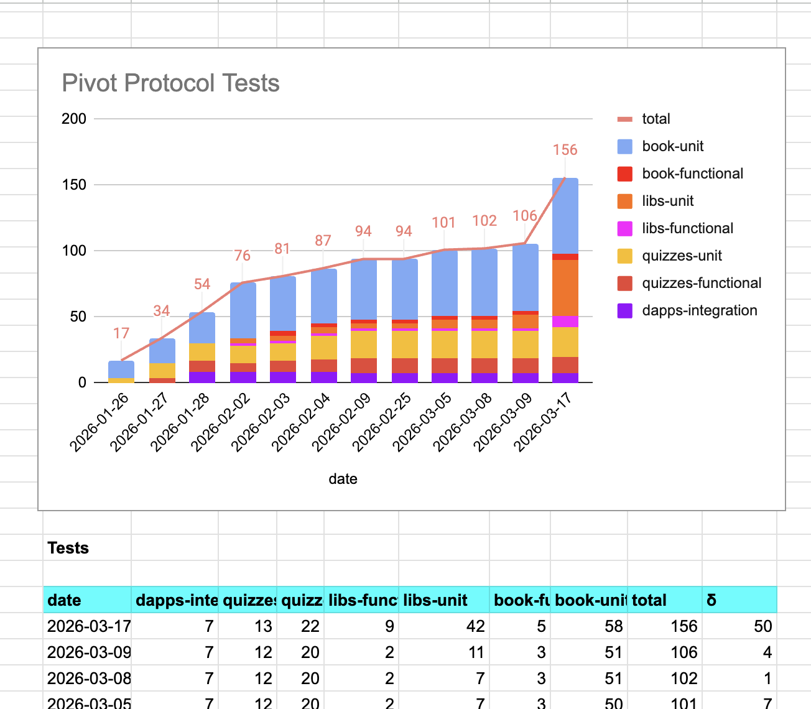
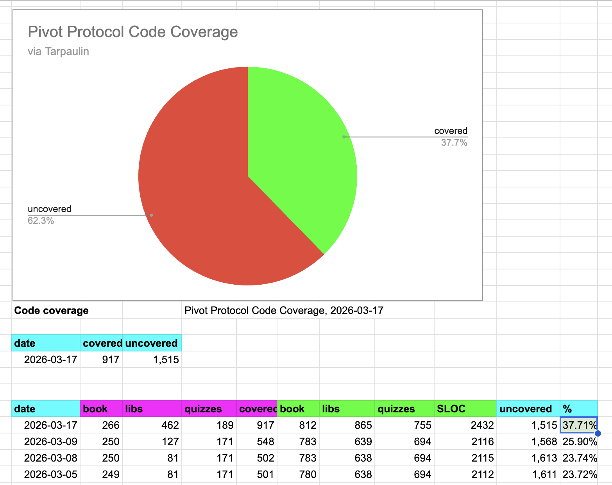

# `dusk`

G'day, pivoteurs!

After nearly a week where `dusk` was misreporting quotes (it quoted today's 
price of $BTC at $12M-per), I'm pleased to announce that `dusk` has been 
rewritten from the ground-up using first principals and is now comprehensively 
tests.

`dusk` is now operational

# Testing

By way of verifying `dusk`, I broke the process of pivoting (being 861 SLOC) 
into 10 separate modules. I then tested each module's consistency, adding 50 
new tests.

Put another way: code coverage has gone from 25% to 40% veracity, 
nearly *doubling* protocol assurance.

Wow! 
