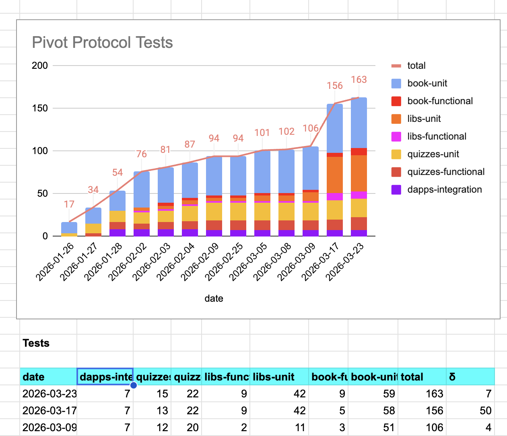
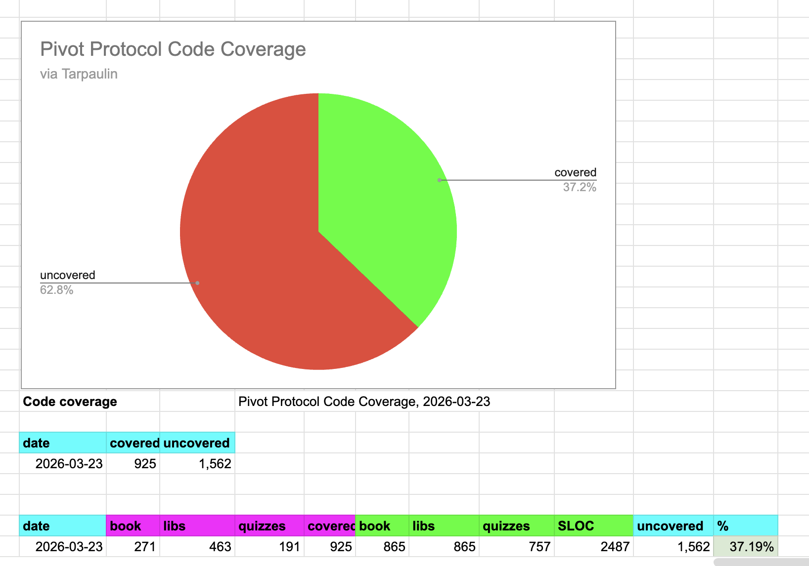

# Status

G'day, pivoteurs!

## Automation: proceeding apace.

## Test coverage: new functionality added and tested

## β-release:

We had a meeting yesterday where we reviewed the screens and functionality 
for the protocol. Launch will come soon after (very) thorough testing! 
