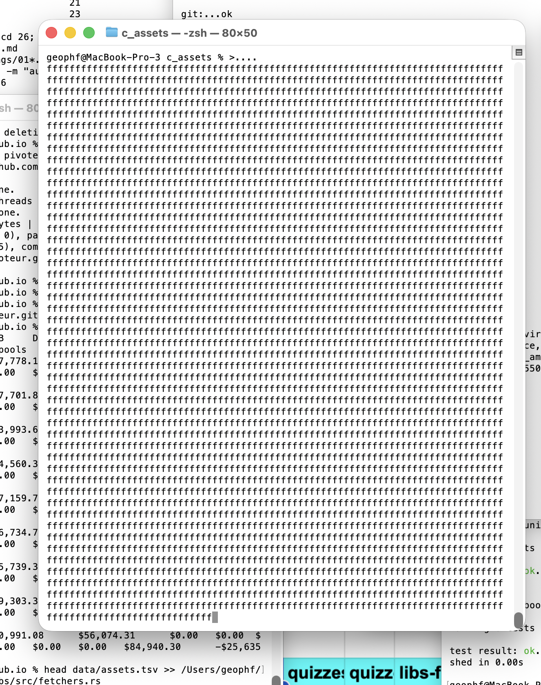
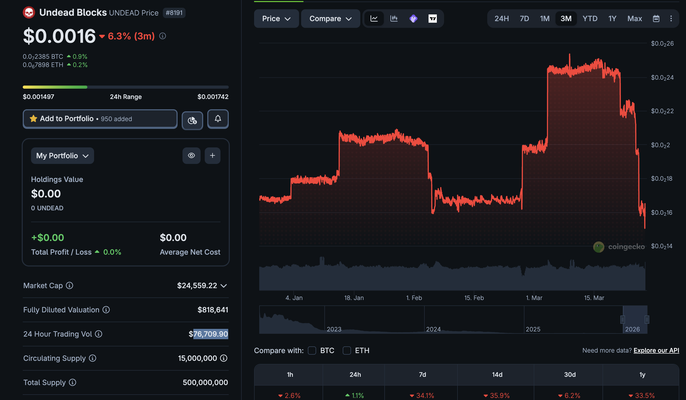

# Automation

G'day, pivoteurs.

* You: "So, how's the automation-work coming along for the Pivot Protocol?"
* Me: "Great! Great! I worked through the night, and here's what I was doing 
at 4:47 am this morning!"
* Also me: shows pic of work.

* You: "... um ..." 

# UNDEAD

"So, what's happening to $UNDEAD?"

I had a conversation with @wagyugames around Pivot Protocol-release 
and $UNDEAD came up in the discussion.

Certainly, few want to see their token go down, but I see this price-drop as

1. a pivot opportunity
2. a chance to buy $UNDEAD on sale.

I'm not going to tell anybody where they should invest their money.

I have no problem telling you what I'm doing.

If you knew the the staking rewards that $UNDEAD will provide when the Pivot 
Protocol goes live, this price is a nice investment opportunity for me, 
anyway. #NFA

