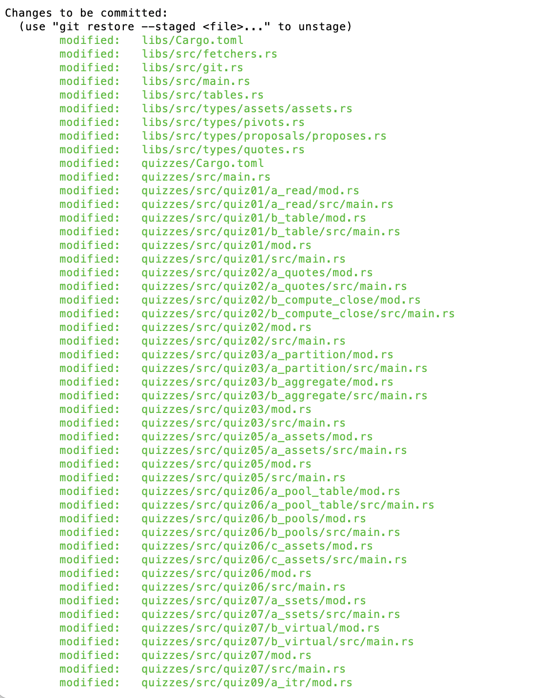
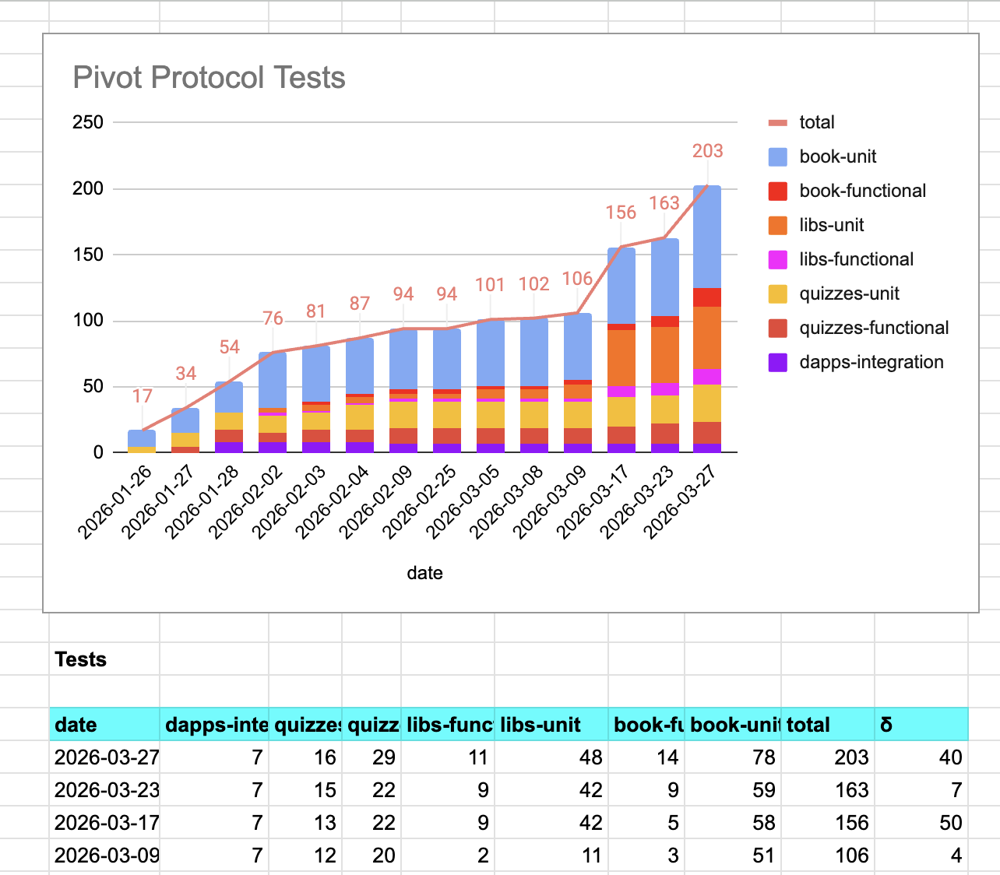
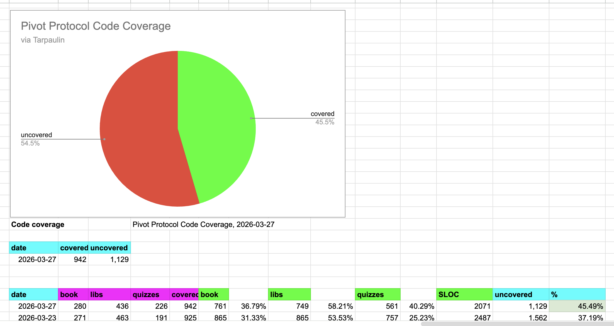

# `assets`

G'day, pivoteurs

I (re-)present `assets` which now computes Pivot protocol asset TVLs from the 
treasury and pivot pools.

This is the next step in protocol automation, anticipating release to 
production.

Code tested and covered. 

