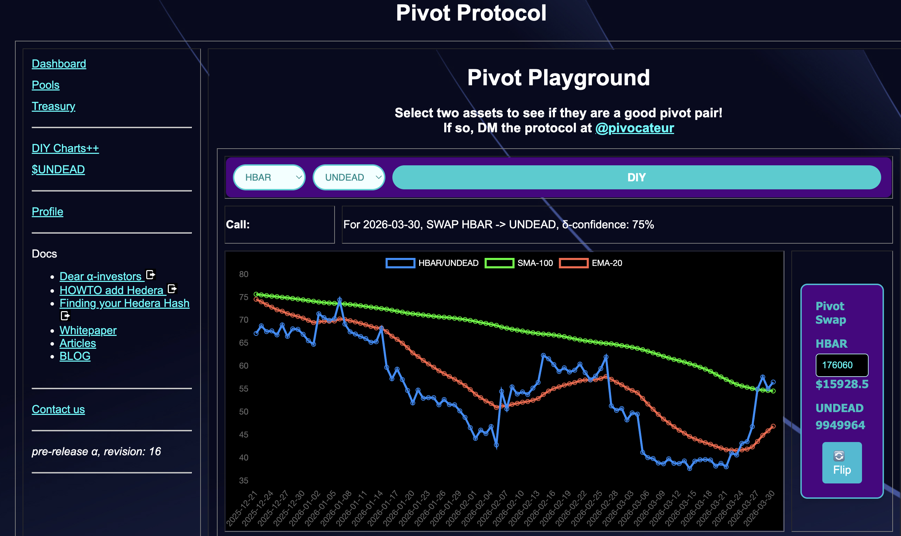
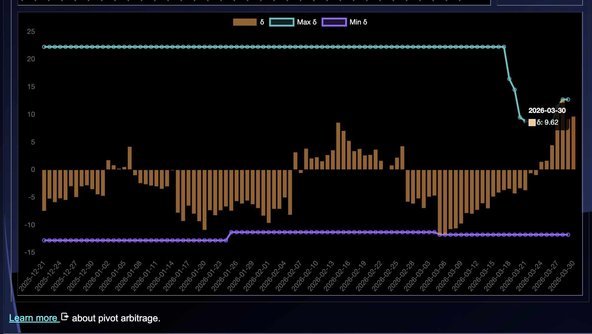
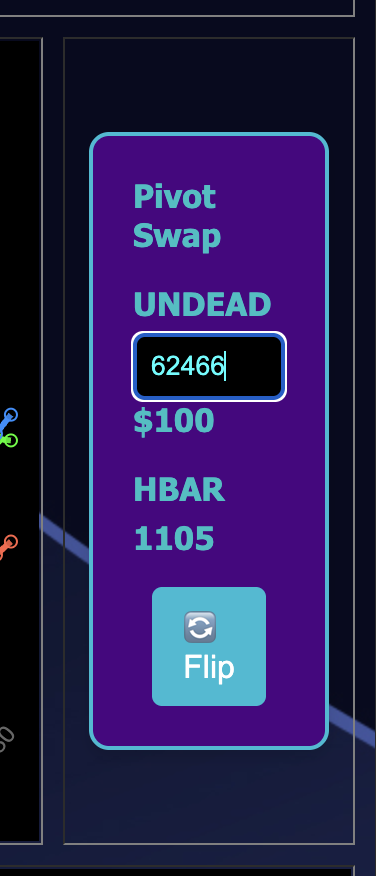
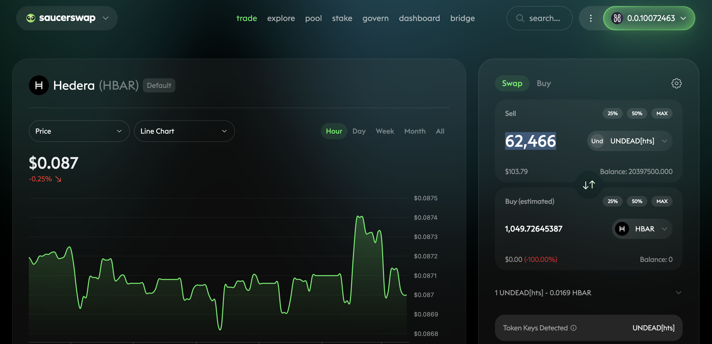
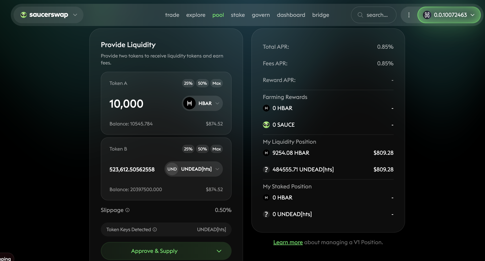

# Hedera

G'day, pivoteurs!

Today I've been working on strengthening the @hedera positions.

The HBAR+UNDEAD shows a strong bias for an HBAR-on-UNDEAD pivot, which I 
execute virtually, but the hedge has slippage, upwards of 50% for the full 
swap! 

Should I go for a (very) small swap?

## Fund Liquidity Pool

Doing 10 swaps of $100 each is fine if I'd direct a computer to automate those 
swaps, but all I've got right now is my two hands, and that doesn't scale well.

So, before I drive myself crazy doing microtransactions, I provide liquidity 
to the HBAR/UNDEAD LP on @SaucerSwapLabs. 

