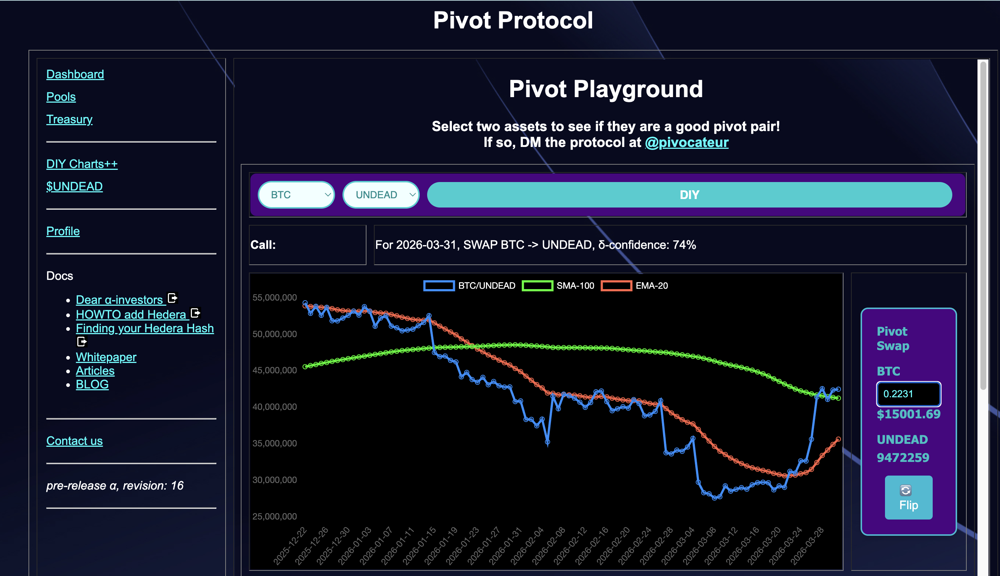
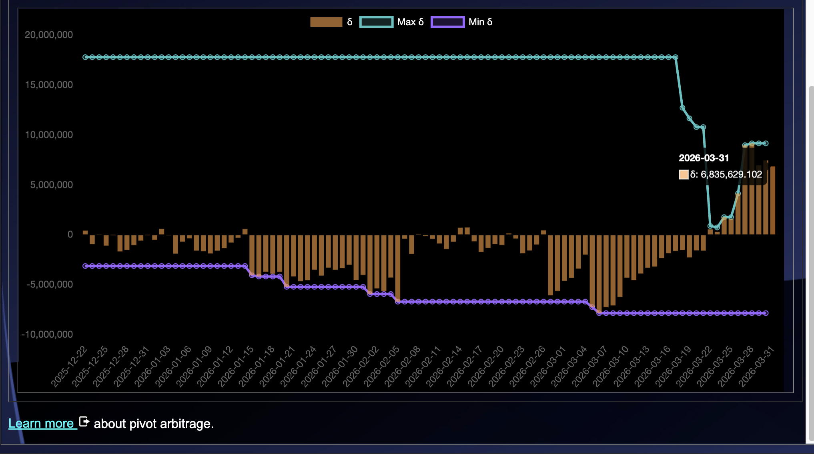
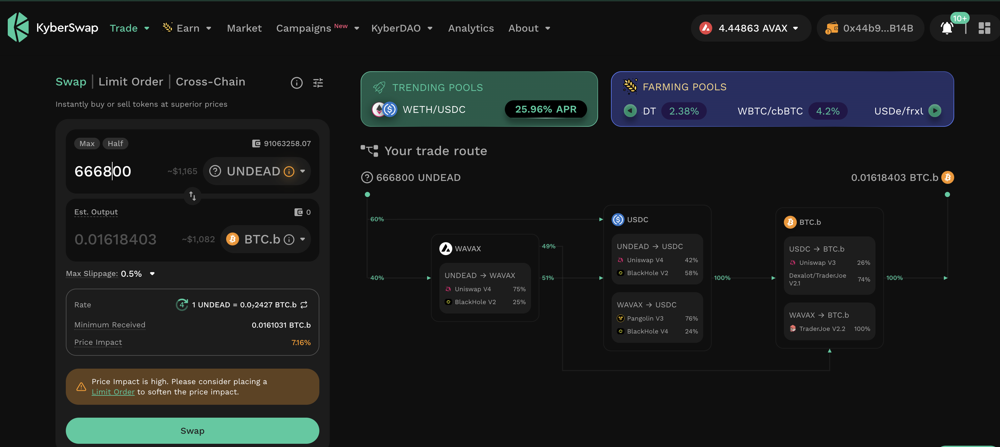

# PIVOTS

G'day, pivoteurs!

I've received some $UNDEAD to invest.

For the BTC+UNDEAD pool, a BTC-on-UNDEAD pivot is recommended, which I do 
virtually.

I also do a small UNDEAD-on-BTC hedge, as well. 

# `dusk`

I'm going to open more $UNDEAD pivots later.

Before I do that, let's check `dusk` for close-pivot opportunities. 

There are some. There are some, indeed! 

Let's explore.
