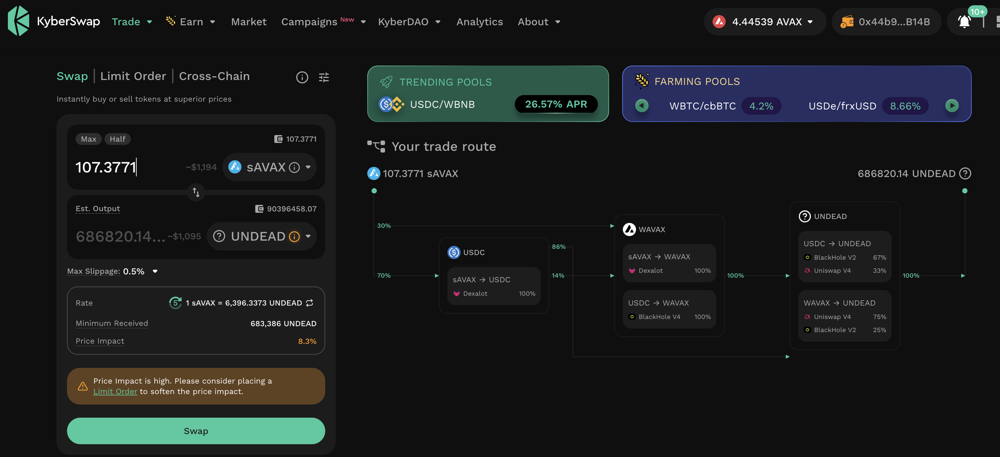

# PIVOTS

G'day, pivoteurs!

I've received some $UNDEAD to invest.

For the BTC+UNDEAD pool, a BTC-on-UNDEAD pivot is recommended, which I do 
virtually.

I also do a small UNDEAD-on-BTC hedge, as well. 

# `dusk`

I'm going to open more $UNDEAD pivots later.

Before I do that, let's check `dusk` for close-pivot opportunities. 

There are some. There are some, indeed! 

Let's explore.

## AVAX+UNDEAD

`dusk` says to close an UNDEAD-on-AVAX pivot for gains of:

* actual ROI: 29.83% / 145.17% APR projected

Or ~157k $UNDEAD / $250.00 gained in this pivot, folks!

WOW!

I'll do the distributions on the gains later today.

# HOWTO automate closing pivots

Steps to automate closing a pivot:

1. trade the pivot amount
2. Get back what was actually swapped-to (not computed)
3. Close the open pivot with the close pivot id
4. Report gains as ROI and APR
5. Distribute gains

