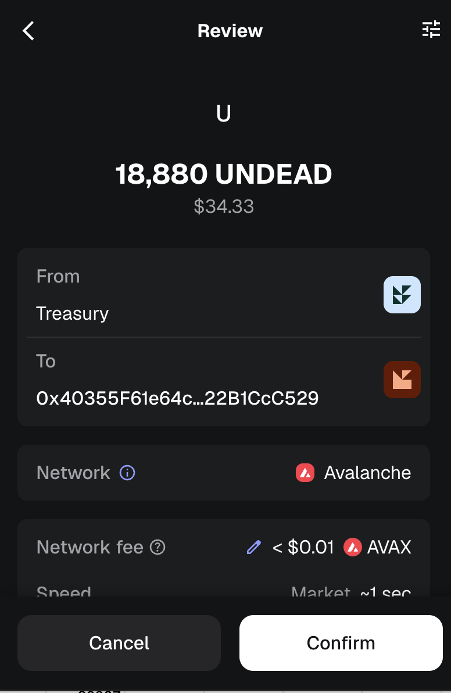

# UNDEAD reserve

G'day, pivoteurs!

We're received an influx of $UNDEAD as investment.

THANK YOU!

To make sure our investors' funds are covered, I've established an "UNDEAD 
reserve." It is used when investors wish to withdraw funds.

This covers the investments, no matter the $UNDEAD quote.
