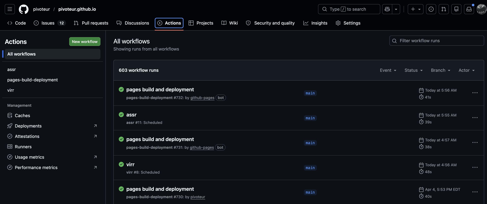
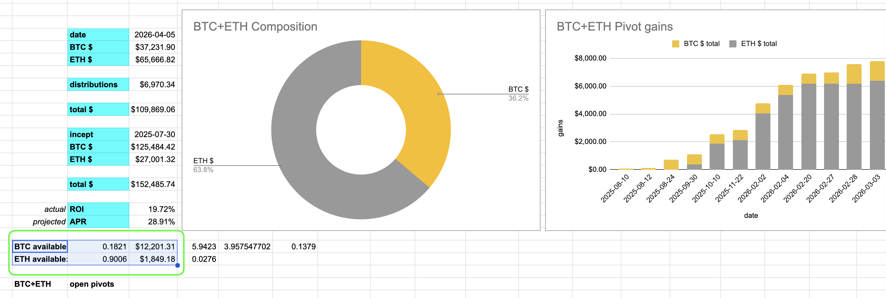

# Automation

G'day, pivoteurs!

The automation-work done by @ParisBrand32180 has been extremely useful, but has 
also pointed out the need for even more automation.

Let's enumerate the immediate needs (🧵)

## `virtsz`

First off:

* `virtsz` automatically adjusts virtual pivots, but it doesn't do anything 
with available assets in a pool. The next version needs to commit all 
available assets to virtual pivots, automatically. 

