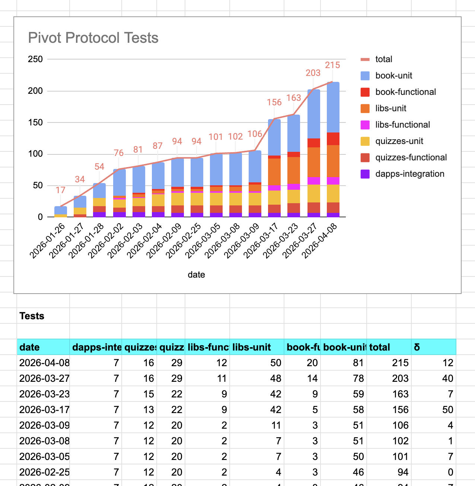
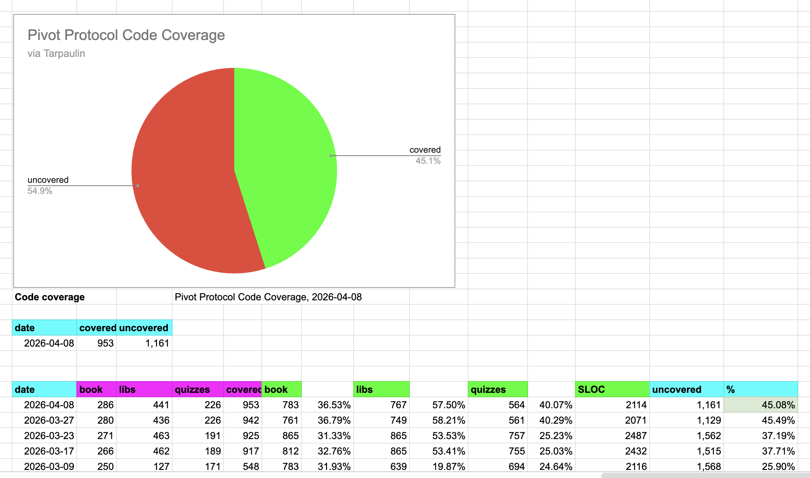

# Automation

G'day, pivoteurs!

@ParisBrand32180 developed a minimal version of `dusk` with the `--min`-flag 
that outputs only the close-pivot call table and no meta-information around 
that.

This will allow us to automate close pivots eventually; with all surrounding 
infrastructure in place.

# β release

The β-release proceeds apace. Staking and unstaking has been tested. We're 
going to be testing a close pivot tomorrow and see how the protocol handles 
the distributions from the pivot-gains.

Step-by-step we approach a stable first production release!

# Testing

Code coverage and testing continues apace: I've added more testing to tables 
and stream utilities. 
